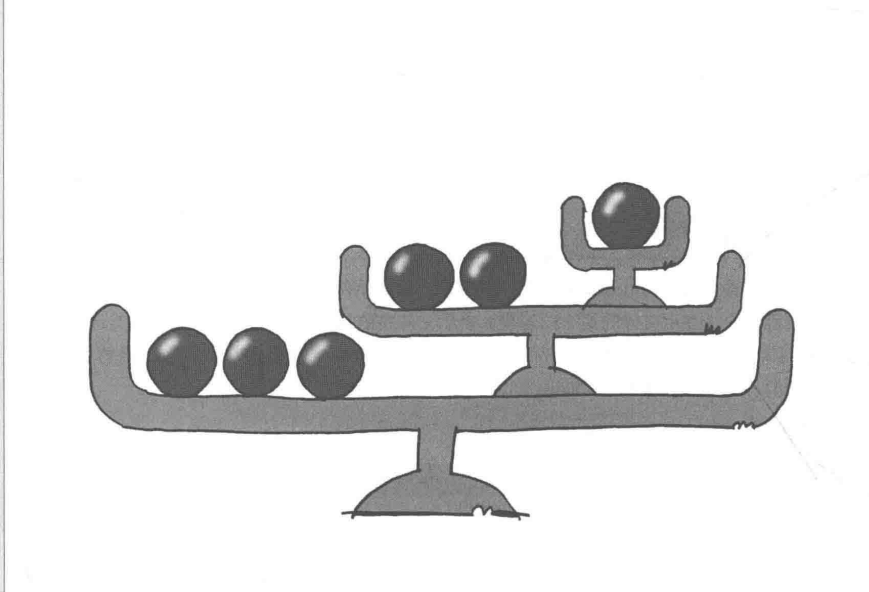
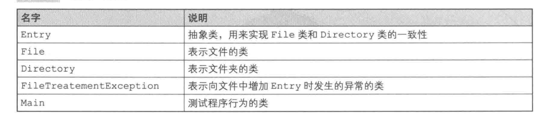
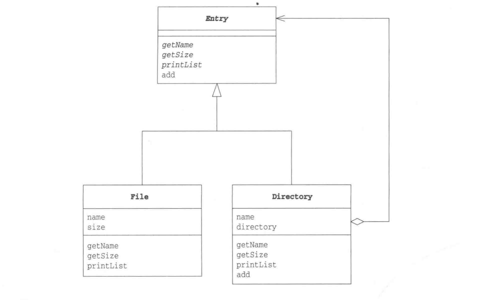
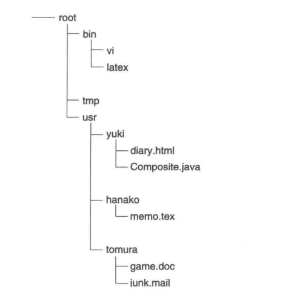
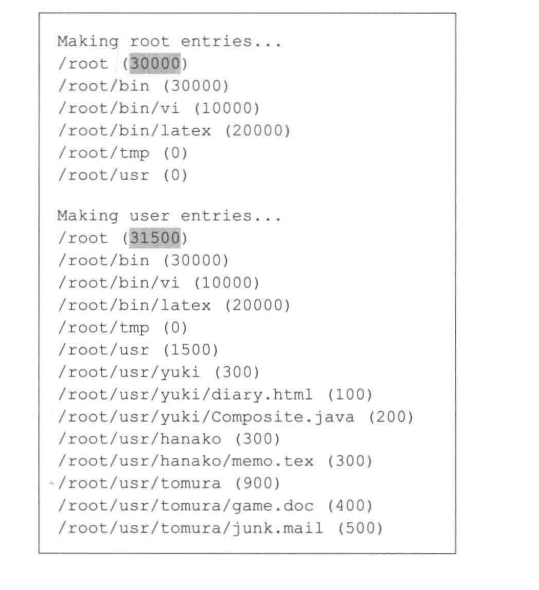

### Composite模式
容器与内容的一致性


文件夹是一种容器结构、递归结构
文件夹与文件是不同类型的对象、但都"可以被放入到文件夹中"
文件夹和文件也被称为“目录条目”(directory entry), 目录条目中，文件夹和文件背被当做同一种对象看待(一致性)

将文件夹和文件当做目录条目看待，将容器和内容作为同一种东西看待，可以方便处理问题

Composite模式就是创造容器结构、递归结构，使容器与内容具有一致性。Composite：“混合物”“复合物”

##### 示例程序
File、Directory，父类Entry(目录条目)统一起来



**Entry类**
getName：获取名字，由子类实现
getSize: 获取大小，由子类实现
add: 放入文件或文件夹，只有Directory中有
printList: 显示文件夹内容“一览”，不带参数的和带参数的

```java
public abstract class Entry{
    public abstract String getName();  // 获取名字
    public abstract int getSize();  // 获取大小
    public Entry add(Entry entry) throws FileTreatmentException{  // 加入目录条目
        throw new FileTreatmentException();
    }

    public void printList(){  // 显示目录条目一览，public
        printList("");
    }

    protected abstract void printList(String prefix);  // 为一览加上前缀，并显示目录条目一览，显示代表类的文字，protected

    public String toString(){
        return getName() + " (" + getSize() + ")";
    }
}
```

**File类**

```java
public class File extends Entry{
    private String name;
    private int size;
    public File(String name, int size){
        this.name = name;
        this.size = size;
    }

    public String getName(){ // 返回名字
        return name;
    }

    public int getSize(){ // 返回大小
        return size;
    }

    protected void printList(String prefix){ // 加前缀打印
        System.out.println(prefix + "/" + this);
    }
}
```

**Directory类**

```java
public class Directory extends Entry{
    private String name;  // 文件夹的名字
    private ArrayList directory = new ArrayList(); // 文件夹中目录条目的集合
    public Directory(String name){ // 构造函数，传入名字
        this.name = name;
    }

    public String getName(){    // 获取名字
        return name;
    }

    // getSize方法的递归调用与Composite模式的结构是相对应的
    public int getSize(){ // 获取大小，无论Directory下使File还是Directory都可以通过getSize()获取大小，递归调用。“容器与内容的一致性”
        int size =  0;
        Iterator it = direcdtory.iterator();
        while(it.hasNext()){
            Entry entry = (Entry)it.next();
            size += entry.getSize();
        }
        return size;
    }

    public Entry add(Entry entry){  // 增加目录条目
        directory.add(entry);
        return this;
    }

    protected void printList(String prefix){ // 递归调用
        System.out.println(prefix + "/" + this);
        Iterator it = directory.iterator();
        while(it.hasNext()){
            Entry entry = (Entry)it.next();
            entry .printList(prefix + "/" + name); // 不必判断是File还是Directory
        }
    }
}
```

**FileTreatMentException类**
文件调用add方法抛出的异常

```java
public class FileTreatmentException extends RuntimeException{
    public FileTreatmentException(){

    }

    public FileTreatmentException(String msg){
        super(msg);
    }
}
```

**Main类**


```java
public class Main{
    public static void main(String[] args){
        try{
            System.out.println("Making root entries...");
            Directory rootdir = new Directory("root");
            Directory bindir = new Directory("bin");
            Directory tmpdir = new Directory("tmp");
            Directory tmpdir = new Directory("usr");
            rootdir.add(bindir);
            rootdir.add(tmpdir);
            rootdir.add(usrdir);
            bindir.add(new File("vi", 10000));
            bindir.add(new File("latex", 20000));
            rootdir.printList();

            System.out.println("");
            Sytem.out.println("Makin user entries...");
            Directory yuki = new Directory("hanako");
            Directory tomura = new Directory("tomura");
            usrdir.add(yuki);
            usrdir.add(hanako);
            usrdir.add(tomura);
            yuki.add(new File("diary.html", 100));
            yuki.add(new File("Composite.java", 200));
            hanako.add(new File("memo.tex", 300));
            tomura.add(new File("game.doc", 400));
            tomura.add(new FIle("junk.mail", 500));
            rootdir.printList();
        }catch (FileTreatmentException e){
            e.printStackTrace();
        }
    }
}
```


##### Composite登场的角色
+ Leaf(树叶)
表示“内容”的角色，无法放入其他对象，File

+ Composite(复合物)
可以在其中放入其他Leaf和Composite角色，Directory

+ Component
使Leaf和Composite具有一致性，Entry

+ Client
使用Composite，Main

可以把Composite角色与它内部的Component(Leaf或Composite)当做父子关系，使用getChild方法获取孩子

##### 拓展
***“容器与内容具有一致性”，也可称为"多个和单个的一致性"：将多个对象结合，当做一个对象处理***

测试：
Test1: 测试输入数据来自键盘输入时的程序行为
Test2：测试输入数据来自文件时的程序行为
Test3：测试输入数据来自网络时的程序的行为
可以三者统一为“输入测试”，就可以使用Composite
可以将其他几个测试结合为“输出测试”，将输入测试与输出测试结合为“输入输出测试”

测试场景使用了Composite模式
+ Kent Beck Testing Framework 入门
http://objectclub.jp/community/memorial/homepage3.nifty.com/masarl/article/testing-framework.html

+ Simple Smalltalk Testing:With Patterns(by kent Beck)
http://swing.fit.cvut.cz/projects/stx/doc/online/english/tools/misc/testfram.html


***Add方法应该放在哪里***
示例程序中，Entry定义add方法并处理异常
各种add方法的定义位置和实现方法：
+ 定义在Entry类中、报错
使用add方法的只有Directory类，会重写add
File也继承Entry的add方法，虽然也可以掉，但抛出异常

+ 定义在Entry中，什么都不做

+ 声明在Entry中，不实现
子类需要add方法就根据需要实现，不需要就简单报错

+ 只定义在Directory类中
添加时需要将它们cast为Directory

***到处都存在递归结构***
视窗系统、文章列表、计算机命令合并为宏命令都是递归结构
树结构数据结构都使用Composite模式

##### 相关设计模式
+ Command模式
使用Command模式编写宏命令时使用了Composite模式
+ Visitor模式
使用Visitor模式访问Composite模式中递归结构
+ Decorator模式
Composite通过Component角色使容器(Composite角色)和内容(Leaf角色)具有一致性
Decorator模式使装饰框和内容具有一致性

##### 本章所学
容器内容一致性，递归结构Composite

##### 练习题
+ 除文件系统外，哪些地方使用了Composite模式
+ 为示例程序Entry的实例增加一个获取完整路径的功能
"/root/usr/yuki/Composite.java"
应该修改示例程序哪些类，应该怎样修改