### Decorator模式
蛋糕奶油蛋糕、草莓蛋糕、生日蛋糕核心都是蛋糕，涂上奶油或者草莓装饰后，味道就更甜美，目的更明确

不断地为对象添加装饰的设计模式称为Decorator模式

给文字加边框：
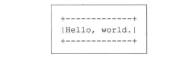
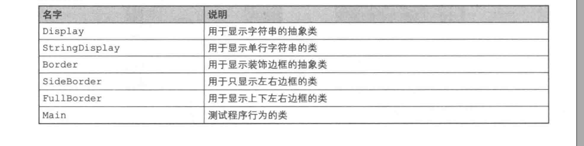
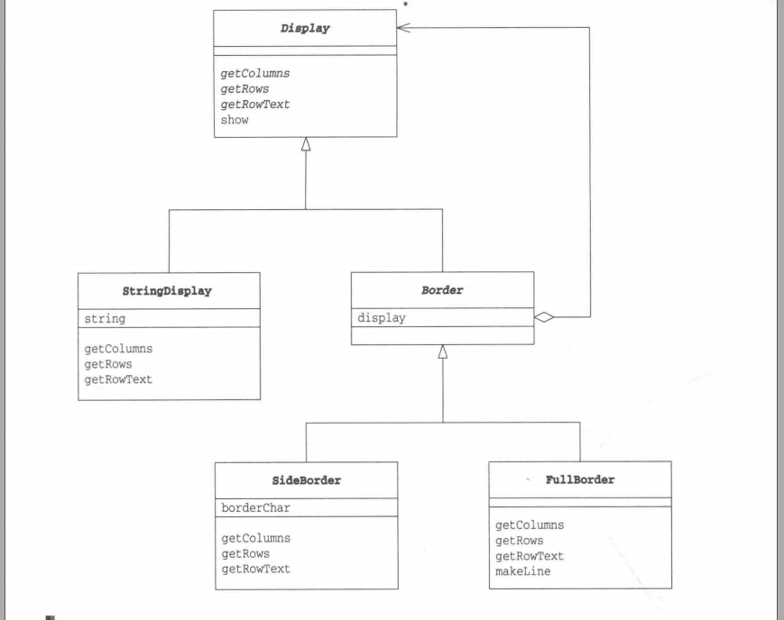

***Display类***
显示多行字符串抽象类

```java
public abstract int getColumns() // 获取横向字符数
public abstract int getRows(); // 获取纵向行数
public abstract String getRowText(int row); // 获取第row行的字符串

public final void show(){   // 全部显示
    for(int i = 0; i < getRows(); i++){
        System.out.println(getRowText(i)); // 这里调用了getRows()和getRowText()抽象方法，是Template Method模式
    }
}
```

***StringDisplay类***

```java
// 只显示一行字符串，就相当于生日蛋糕中的核心蛋糕
public class StringDisplay extends Display{
    private String string;  // 要显示的字符串
    public StringDisplay(String string){ // 通过参数传入要显示的字符串
        this.string  = string;
    }

    public int getColumns(){    // 字符数
        return string.getBytes().length;
    }

    public int getRows(){ // 行数是1
        return 1;
    }

    public String getRowText(int row){ // 仅当row为0时有返回值
        if(row == 0){
            return string;
        }else{
            return null;
        }
    }
}
```

***Border类***

```java
// 通过继承，装饰边框与被装饰物具有了相同的方法，与Display具有一致性
public abstract class Border extends Display{
    protected Display display; // 表示被装饰物，不仅限于StringDisplay，也可能是其他的装饰边框(Border类的子类实例)
    protected Border(Display display){ // 在生成实例时通过参数指定被装饰物
        this.display = display;
    }


}
```

***SideBorder类***
```java
// 用指定字符装饰左右两侧，如: |被装饰物|
// display可见性是protected
public class SideBorder extends Border{
    private char borderChar;  // 表示装饰边框的字符
    public SideBorder(Display display, char ch){ // 通过构造函数指定Display和装饰边框字符
        super(display);
        this.borderChar = ch;
    }

    public int getColumns(){ // 字符数为字符串字符数加上两侧边框字符串数
        return 1 + display.getColumns() + 1;
    }

    public int getRows(){ // 行数即被装饰物的行数
        return display.getRows();
    }

    public String getRowText(int row){ // 指定的那一行的字符串为被装饰物的字符串加上两侧的边框的字符
        return borderChar + display.getRowText(row) + borderChar;
    }
}
```

***FullBorder类***
```java
// 在字符串上下左右都加上装饰边框
public class FullBorder extends Border{
    public FullBorder(Display display){
        super(display);
    }

    public int getColumns(){ // 字符数为被装饰物的字符数加上两侧边框字符数
        return 1 + display.getColumns() + 1;
    }

    public int getRows(){ // 行数为被装饰物的行数加上上下边框的行数
        return 1 + display.getRows() + 1;
    }

    public String getRowText(int row){ // 指定的那一行的字符串
        if(row == 0){ // 下边框
            return "+" + makeLine('-', display.getColumns()) + "+"; // 下边框
        }else if(row == display.getRows() + 1){ // 上边框
            return "+" + makeLine('-', display.getColumns()) + "+";
        }else { // 其他边框
            return "|" + display.getRowText(row - 1) + "|";
        }
    }

    // 连续地显示某个指定的字符，是一个工具方法(为了防止FullBorder类外部使用该方法，可见性private)
    private String makeLine(char ch, int count){ // 生成一个重复count次字符ch的字符串
        StringBuffre buf = new StringBuffer();
        for(int i = 0; i < count; i++){
            buf.append(ch);
        }
        return buf.toString();
    }
}
```

***Main类***
b1-b4
b1: 将“Hello，world.”不加装饰地直接显示出来
b2: 在b1的两侧加上装饰边框'#'
b3: 在b2的上下左右加上装饰边框
b4: 为"你好，世界。"加上多重边框
```java
public class Main{
    public static void main(String[] args){
        Display b1 = new StringDisplay("Hello, world.");
        Display b2 = new SideBorder(b1, '#');
        Display b3 = new FullBorder(b2);
        b1.show();
        b2.show();
        b3.show();
        Display b4 = new SideBorder(
            new FullBorder(
                new FullBorder(
                    new SideBorder(
                        new FullBorder(
                            new StringDisplay("你好, 世界。")
                        ),
                        '*'
                    )
                )
            ),
            '/'
        );
        b4.show();
    }
}
```

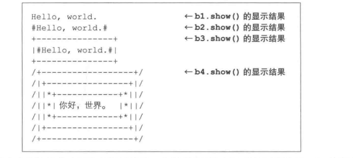
对象图

##### Decorator模式中的角色
+ Component
增加功能时的核心角色，Display

+ ConcreteComponent，实现角色定义的接口，StringDisplay

+ Decorator(装饰物)
内部保存被装饰对象，Border

+ ConcreteDecorator(具体装饰物)
SideBorder类、FullBorder

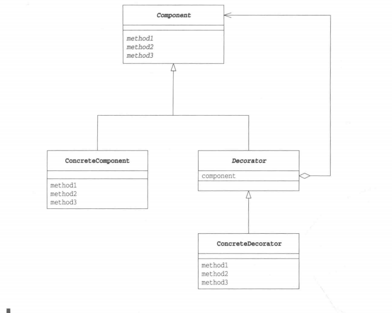

##### 拓展

***接口(API)的透明性***
装饰边框与被装饰物具有一致性

装饰物被边框装饰起来了，接口也不会被隐藏，其他类依然可以调用getColumns、getRows、getRowText和show。这就是接口的“透明性”

Decorator模式也有类似Composite模式中的递归结构，装饰边框里的“被装饰物”又是别的物体的“装饰边框”

使用的目的不一样：Decorator模式主要目的是通过添加装饰来增加对象的功能

***在不改变被装饰物的前提下增加功能***
装饰越多，功能则越多。实现了不修改被装饰的类即可新增加功能

Decorator模式使用了委托。对“装饰边框”提出的要求(调用装饰边框方法)转交(委托)给“被装饰物”处理

***动态增加新功能***
使用委托，类之间形成弱关联关系。不用改变框架代码，就可以生成一个与其他对象具有不同关系的新对象

***只需要一些装饰物即可添加许多功能***
添加装饰边框就可以在已有类基础上组成新的对象
Decorator模式就是可以应对多功能对象的需求的一种模式。

***java.io包与Decorator模式***
Reader reader = new FileReader("datafile.txt");
Reader reader = new BufferedReader(new FileReader("datafile.txt")); // 将文件读到了FileReader类实例中

Reader reader = new LineNumberReader(new BufferedReader(new FileReader("datafile.txt")));// 管理行号
LineNumberReader和BufferedReader都可以接受Reader类的子类实例作为参数

Reader reader = new LineNumberReadere(new FileReader("datafile.txt")); // 只管理行号，不进行缓存处理

// 从网络中读取数据
java.net.Socket socket = new Socket(hostname, portnumber);

Reader reader = new LineNumberReader(new BufferedReader(new InputStreamReader(socket.getInputStream)));

***导致增加许多很小的类***
缺点是会导致程序中增加许多功能类似的很小的类

##### 相关的设计模式
+ Adapter 模式
Decorator模式可以在不改变被装饰物的接口前提下，为被装饰物添加边框
Adapter适用于适配两个不同的接口

+ Stragety
Decorator模式可以像改变被装饰物的边框或是为被装饰物添加多重边框那样，来增加类的功能
Strategy模式通过整体地替换算法来改变类的功能

##### 延伸：继承和委托中的一致性
“一致性”：“可以将不同的东西当做同一种东西看待”

***继承-父类和子类的一致性***
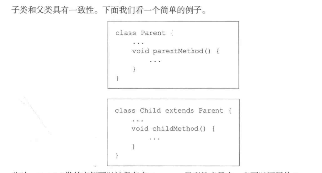
Parent obj = new Child();

***委托-自己和被委托对象的一致性***
委托让接口具有透明性时，自己和被委托对象具有一致性

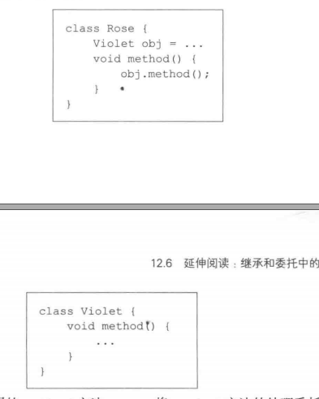
Rose将method方法委托给Violet，两个类弱关联

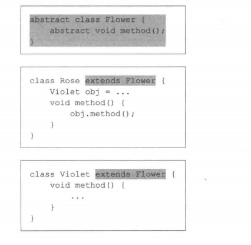
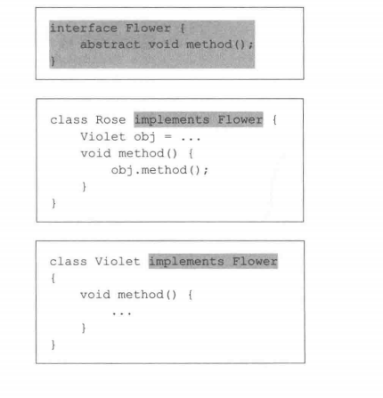
委托和被委托这具有共通性-实现同一个接口

被委托对象是具体类实例还是接口实例根据需求不同，做法也不痛

##### 本章所学
保持透明性的接口（API）前提下，增加功能。还有委托

##### 练习题
+ 请在本章的示例程序中增加一个UpDownBorder类，用于为字符串装饰上下两条边框。UpDownBorder类的使用方法如代码所示
```java
public class Main{
    public static void main(String[] args){
        Display b1 = new StringDisplay("Hello, world.");
        Display b2 = new UpDownBorder(b1, '-');
        Display b3 = new SideBorder(b2, '*');
        b1.show();
        b2.show();
        b3.show();
        Display b4 = new FullBorder(
            new UpDownBorder(
                new UpDownBorder(
                new SideBorder(
                    new SideBorder(
                        new StringDisplay("你好, 世界。"),
                        '*'
                    ),
                    '='
                ),
                '|'
            ),
            '|'
         )
        );
        b4.show();
    }
}
```

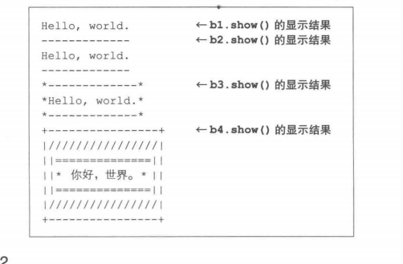

+ 为示例程序编写一个可以显示多行字符串MultiStringDisplay类，它在Decorator模式中扮演ConcreteComponent角色。MultiStringDisplay类的使用方法：
```java
public class Main{
    public static void main(String[] args){
        MultiStringDisplay md = new MultiStringDisplay();
        md.add("早上好。")
        md.add("下午好。");
        md.add("晚安，明天见。");
        md.show();

        Display d1 = new SideBorder(md, '#');
        d1.show();

        Display d2 = new FullBorder(md);
        d2.show();
    }
}
```
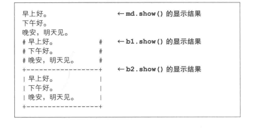