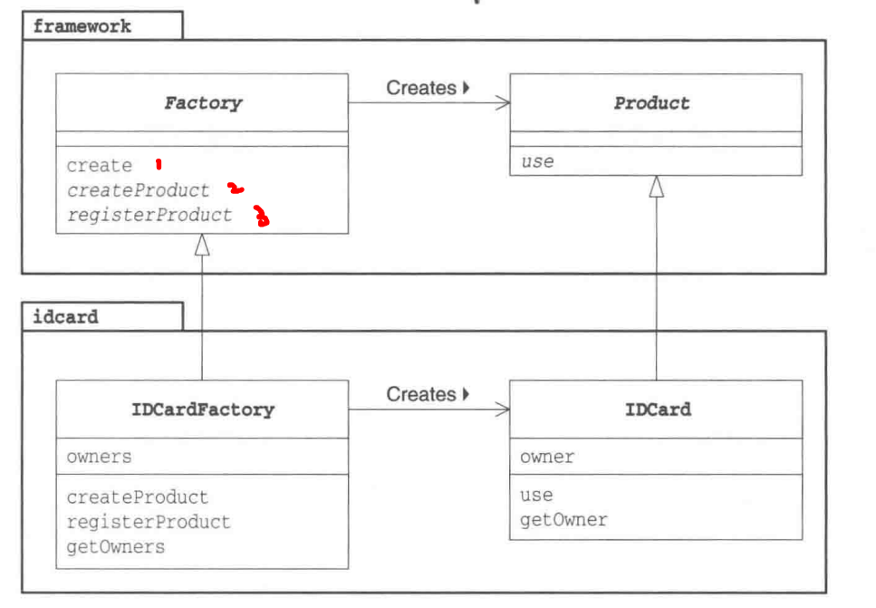
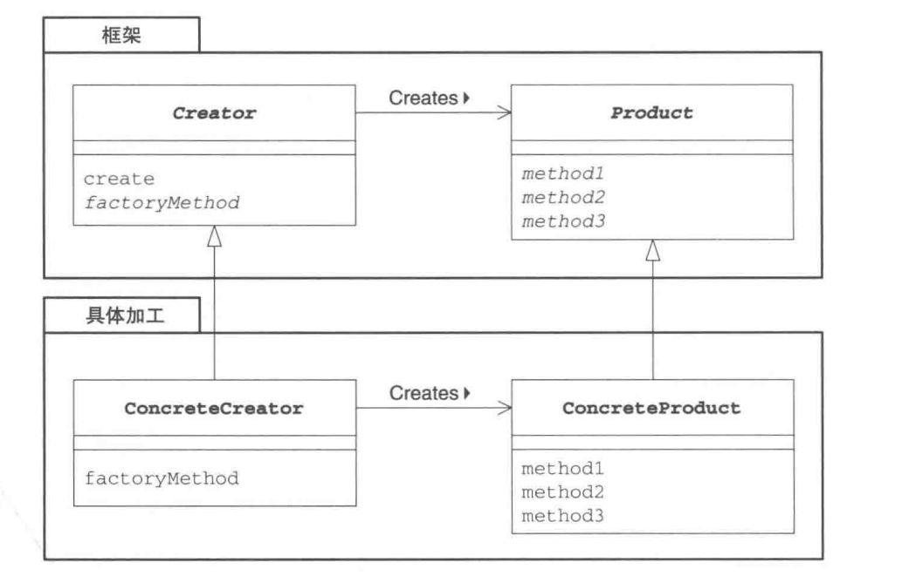

# 工厂方法
将Template Method用于生成实例
Factory Method中父类决定实例的生成方式，不决定所生成的具体类
将生成实例的框架(Framework)和实际负责生成实例的类结构

### 示例程序-制作身份证(ID卡)
+ 生成实例的框架(framework包)
+ 加工处理(idcard包)


```java
// Product类
package framework;
public abstract class Product{
    public abstract void use();
}
```

```java
// Factory类，只要是Factory Method模式一定用到Template Method

package framework;
public abstract class Factory{
    public final Product create(String owner){
        Product p = createProduct(owner);
        registerProduct(p);
        return p;
    }
    // 这里使用模板方法去生成实例
    protected abstract Product createProduct(String owner);

    protected abstract void registerProducdt(Product product);
}
```

```java
// IDCard类 
package idcard; // 包名的不同体现了与框架的分离
import framework.*;
public class IDCard extends Product{
    private String owner;
    IDCard(String owner){
        System.out.println("制作" + owner + "的ID卡。");
        this.owner = owner; 
    }

    public void use(){
        System.out.println("使用" + owner + "的ID卡");
    }

    public void getOwner(){
        return owner;
    }
}
```

```java
// IDcardFactory类
package idcard;
import framework.*;
import java.util.*;
public class IDCardFactory extends Factory{
    private List owners = new ArrayList();
    protected Product createProduct(String owner){
        return new IDCard(owner);
    }

    protected void registerProduct (Product product){
        owners.add((IDCard)producdt).getOwner();
    }

    public List getOwners(){
        return owners;
    }
}
```

```java
import framework.*;
import idcard.*;
public class Main{
    public static void main(String[] args){
        Factory factory = new IDCardFactory();
        Product card1 = factory.create("小明");
        Product card2 = factory.create("小红")
        Product card3 = factory.create("小刚");
        card1.use();
        card2.use();
        card3.use();
    }
}
```


### Factory Method中的juese

ConcreteCreator角色和ConcreteProduct角色是平行的
Creator: 不用new生成实例而使用生成实例的专用方法生成实例，可以防止父类与其他具体类耦合


### 拓展
“框架”与“具体加工”
如果新增电视机产品，就只需要增加Television和TelevisionFactory

framework包中的内容没有出现具体类的信息。这就是父类和子类解耦。
> createProduct()生成实例的三种方式
1. 声明为抽象方法，子类必须首先
2. 默认实现
public Product createProduct(String onwer){
    return new Product(owner); // 这里不能将Product声明为抽象类
}
3. 抛出异常
public Product createProduct(String owner){ // 子类不实现就抛出异常
    thrown new FactoryMethodRuntimeException();
}

### Template Method和Factory Method都需要理解父类中定义的处理框架和抽象方法

### 相关设计模式
+ Template Method
+ Single 模式，Single可以看做Concrete
+ Composite模式，可以将Composite用于Product角色
+ Iterator，iterator方法生成Iterator实例，会用到FactoryMethod
