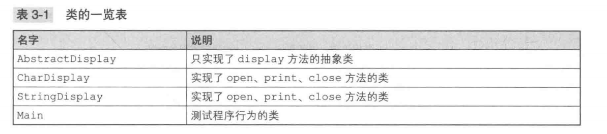
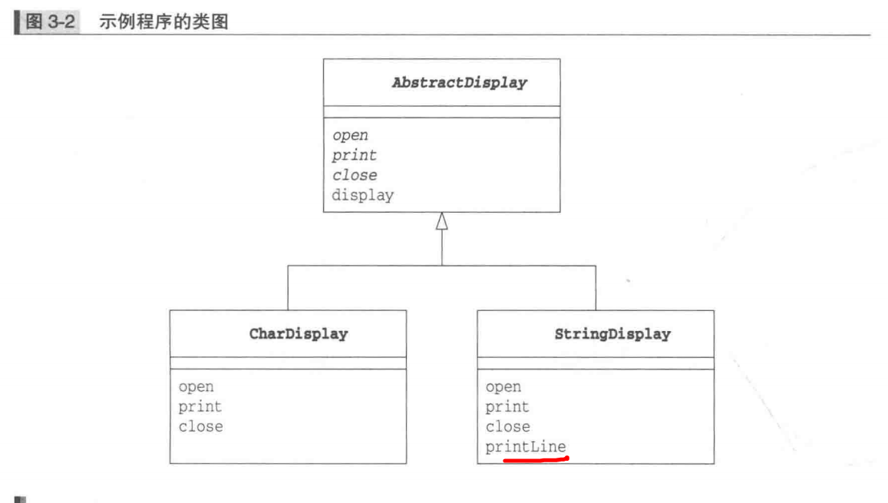
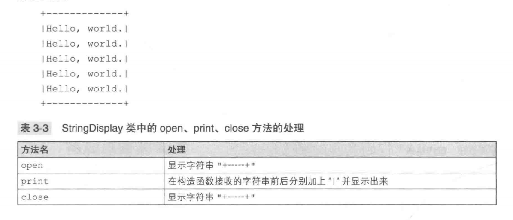

### Template Method
##### 模板方法定义在父类中，父类中只知道如何调用这些方法，具体实现在子类中

父类中定义处理流程的框架，在子类中实现具体处理的模式叫做Template Method模式




AbstractDisplay类
```java
public abstract class AbstractDisplay{
    public abstract void open();
    public abstract void print();
    public abstract void close();
    public final void display(){
        open();
        for(int i = 0; i < 5;i ++){ // 循环五次调用print()
            print();
        }
        close();
    }
}
```

StringDisplay类


```java
public class StringDisplay extends AbstractDisplay{
    private String string;
    private int width;
    public CharDisplay(String string){
        this.string = string;
        this.width = string.getBytes().length;
    }

    public void open(){
        printLine();
    }

    public void print(){
       System.out.print("|" + string + "|");
    }

    public void close(){
        printLine();
    }

    private void printLine(){
        System.out.print("+");
        for(int i = 0; i < width; i++){
            System.out.print("-");
        }
        System.out.println("+");
    }
}
```

Main类
```java
public class Main{
    public static void main(String[] args){
        AbstractDisplay d1 = new CharDisplay("H");
        AbstractDisplay d2 = new StringDisplay("Hello, World.");
        AbstractDisplay d3 = new StringDisplay("你好，世界。");
        d1.display();
        d2.display();
        d3.display(); // 显示结果视具体实现而定
    }
}

```
##### 优缺点
优点: 在父类模板方法中编写了算法，而无需在子类中各个实现。
否则将会出现多个功能类似的类，不便于代码的修改维护。

##### 拓展
+ 父类子类之间的协作: 子类在实现父类的模板方法时，一定要知道父类中这些抽象方法的调用时机，父类和子类是紧密联系共同工作的
+ 父类与子类的一致性: 子类方法的调用是通过向上转型为父类实现的。

##### 相关设计模式
+ Factory Method模式
Factory Method是将Template Method用于生成实例的一个典型
+ Strategy模式
Template Method使用继承改变程序行为
Strategy模式使用委托改变程序行为，Strategy模式适用于替换整个算法

##### 延伸
###### 父类对子类的要求
理解类的层次时，通常是站在子类角度进行思考
+ 在子类中可以使用父类中定义的方法
+ 可以通过在子类中增加方法实现新的功能
+ 在子类中重写父类的方法可以改变程序的行为

如果站在父类角度思考
+ 期待子类会实现抽象方法
+ 要求子类去实现抽象方法
也就是说子类具有实现在父类中所声明的抽象方法的责任。称为“子类责任”

###### 抽象类的意义
由于在抽象方法中并没有编写具体的实现，所以我们无法知道在抽象方法中到底进行了什么样的处理。但是我们可以决定抽象方法的名字，然后通过调用使用了抽象方法的模板方法去编写处理。虽然具体的处理内容是子类决定的，不过在抽象类阶段确定处理流程非常重要
###### 父类与子类的协作
更多的方法实现在父类，子类会更轻松
+ 降低了子类的灵活性
+ 如果父类中实现的方法太少，子类又会臃肿，导致子类间代码重复

模板方法中“如何划分处理级别，哪些由父类实现，哪些由子类实现”没有具体定式，需要平衡。
