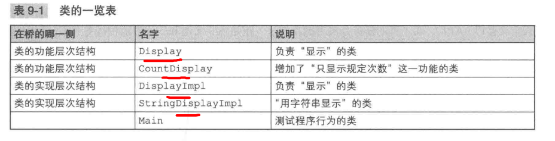
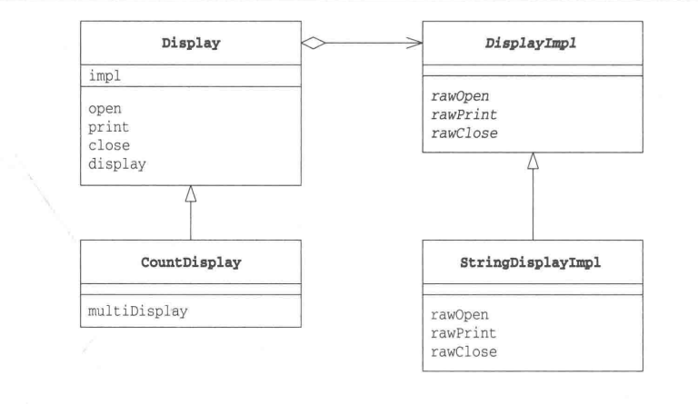
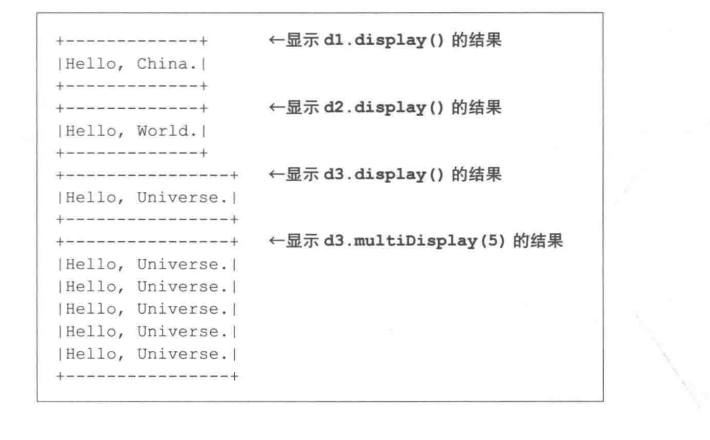
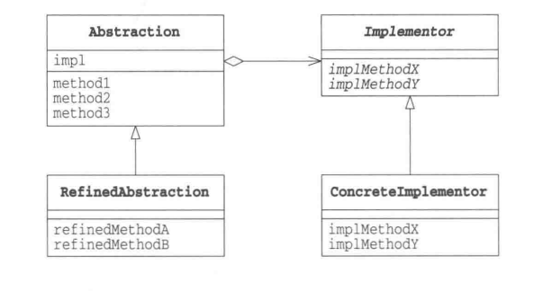
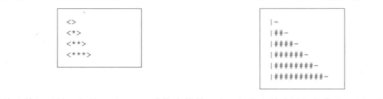

# 桥接模式
将类的功能层次结构与实现层次结构分离
Bridge将类的功能层次结构和类的实现层次结构连接起来
### 类的层次结构的两个作用
##### 希望增加新功能时
有一个Something，增加新功能（一个具体方法），实现一个子类SomethingGood
```
Something
    ->SomethingGood
```
增加新功能而产生的层次结构
+ 父类具有基本功能
+ 在子类中增加新的功能
“类的功能层次结构”

继续在SomethinGood类基础上增加新功能，编写一个SomthingGood类的子类SomthingBetter
```java
Something
    ->SomethingGood
        ->SomethingBetter
```
从各个层次的类中找到最符合自己需求的类，以它为父类编写子类，在子类中增加新的功能 -> “类的功能层次结构”
> 通常，类的层次结构关系不应当过深
##### 希望增加新的实现

模板方法也存在层次结构，但这种层次结构不是用于增加功能，而是实现下面这样的任务分担
+ 父类通过声明抽象方法来定义接口(API)
+ 子类通过实现具体方法来实现接口(API)
“类的实现层次结构”
```java
AbstractClass
    ->ConcreteClass

// 以其他方式实现AbstractClass，比如AnotherConcreateClass，层次结构会发生一些变化
AbstractClass
    ->ConcreteClass
        ->AnotherConcreteClass

```

##### 类的层次结构的混杂与分离

编写子类要确认“是增加功能”? 还是“增加实现”？
当类的层次结构只有一层时，功能层次结构与实现层次结构是混杂在一个层次结构中，容易使类层次结构复杂，难以理解，难以确定究竟应该在类的哪一个层次结构中取增加子类。需要将“类的功能层次结构”与“类的实现层次结构”分离为两个独立的类层次结构。在其中搭建桥梁增加联系

### 示例程序




***类的功能层次结构：Display类***
Display： 功能是抽象的，负责“显示一些东西”，位于“类的功能层次结构”最上层，impl中保存是实现了Display类的具体功能的实现
open、print、close是Display提供的接口，表示“显示的步骤”
+ open显示前的处理
+ print显示处理
+ close显示后处理
三个方法都调用了impl字段的实现方法，Display的接口（API）转换成了DisplayImpl的接口（API）

```java
// Display
public class Display{
    private DisplayImpl impl;
    public Display(DisplayImpl impl){
        this.impl = impl;
    }

    public void open(){
        impl.rawOpen();
    }

    public void print(){
        impl.rawPrint();
    }

    public void close(){
        impl.rawClose();
    }

    public final void display(){
        open();
        print();
        close();
    }
}
```

***类的功能层次结构：CountDisplay类***
CountDisplay在Display类的基础上增加了一个新功能。具有“只显示规定的次数”的功能
```java
public class CountDisplay extends Display{
    public CountDisplay(DIsplayImpl impl){
        super(impl);
    }

    public void multiDisplay(int times){// 循环显示times次
        open();
        for(int i = 0; i < times; i ++){
            pirnt();
        }
        close();
    }
}
```
***类的实现层次结构：DisplayImpl类***
DisplayImpl类位于“类的实现层次结构”最上层
```java
public abstract class DisplayImpl {
    public abstract void rawOpen();
    public abstract void rawPrint();
    public abstract void rawClose();    
}
```

***类的实现层次结构：StringDIsplayImpl类***
不是直接地显示字符串，继承了DisplayImpl
```java
public class StringDisplayImpl extends DisplayImpl{
    private String string; // 要显示的字符串
    private int width; // 以字节单位计算出的字符串的宽度
    public StringDisplayImpl(String string){
        this.string = string; // 将它保存在字段中 
        this.width = string.getBytes().length; // 把字符串的宽度也保存在字段中，以供使用

        public void rawOpen(){
            printLine();
        }

        public void rawPrint(){
            System.out.println("|" + String + "|"); // 前后加上"|"并显示

        }

        public void rawClose(){
            printLine();
        }

        private void printLine(){
            System.out.print("+");// 显示用来表示方框的角的"+"
            for(int ij = 0; i< width; i++){ // 显示width个"-"
                System.out.print("-"); // 将其用作方框的边框
            }
            System.out.println("+"); // 显示用来表示方框的角的“+”
        }
    }
}
```
DisplayImpl和StringDisplayImpl相当于“类的实现层次结构”

***Main类***
```java
public class Main{
    public static void main(String[] args){
        Display d1 = new Display(new StringDisplayImpl("Hello, China."));
        Display d1 = new CountDisplay(new StringDisplayImpl("Hello, World."));
        Display d1 = new CountDisplay(new StringDisplayImpl("Hello, Universe."));
        d1.display();
        d2.display();
        d3.display();
        d3.multiDisplay(5);
    }
}
```


### Bridge模式中的角色
##### Abstraction(抽相化)
位于“类的功能层次结构”最上层。使用Implementor角色方法定义基本的功能，保存Implementor角色的实例。Display扮演该角色
##### RefinedAbstraction(改善后的抽象化)
在Abstraction的基础上新增加新的角色。CountDisplay扮演此角色
##### Implementor(实现者)
“类的实现层次结构”的最上层。定义用于实现Abstraction角色的接口的方法。DisplayImpl扮演此角色
##### ConcreteImplementor(具体实现者)
实现在Implementtor角色中定义的接口。StringDisplayImpl扮演此角色

左侧代表“类的功能层次结构”，右侧代表“类的实现层次结构”


### 拓展
##### 分开考虑更容易扩展
将两个层次分开有利于独立低对它们进行扩展
增加功能：在“类的功能层次结构”一侧增加类，不必修改“类的实现层次”，增加后的功能可以被“所有的实现”使用

例子：软件分为Windows版，Maccintosh版、Unix版，用“类的实现”层次结构表现这些依赖操作系统的部分。无论在“类的功能层次结构”增加多少个功能，都可以工作于这三个操作系统。
##### 继承是强关联，委托是弱关联
```java
// SomethingGood是Something的子类，只要不修改代码，就无法改变这种关系，是强关联
class SomethingGood extends Something{
    ...
}
```
使用委托可以实现弱关联，Display类中使用“委托”，impl字段保存了实现的实例，类的任务就发生了转移。

+ open()调用impl.rawOpen()
+ print()调用impl.rawPrint()
+ close()调用impl.rawClose()
只有Display类实例生成时，才与作为参数被传入的类构成关联。通过传递不同的Implementor实例改变实现，Display无需做改变，改变的是Main

### 相关的设计模式

##### Template Method模式
使用了“类的实现层次结构”，父类调用抽象方法，子类实现抽象方法
##### Abstract Factory模式
根据需要设计良好的ConcreteImplementor，会使用Abstract Factory模式

##### Adapter模式
Adapter模式可以结合哪些功能上相似但是接口（API）不同的类

### 本章所学
“类的功能层次结构”和“类的实现层次结构”分离
委托

### 练习
##### 增加一个类，实现“显示字符串若干（随机）次”的功能
用于显示的方法是 void randomDisplay(int times)，将字符串随机显示0~times次
##### 增加一个类，实现“显示文本文件的内容”的功能
##### 增加类，实现下面的输出效果

增加一种新的显示方式，好像在“类的功能层次结构”和“类的实现层次结构”中增加都可以，该如何选择看情况。