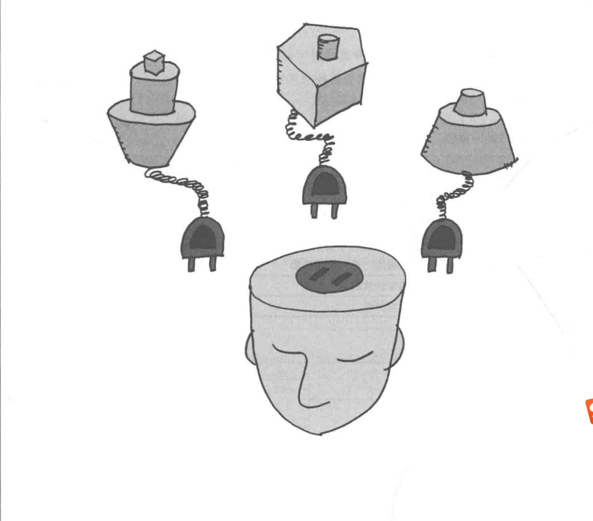
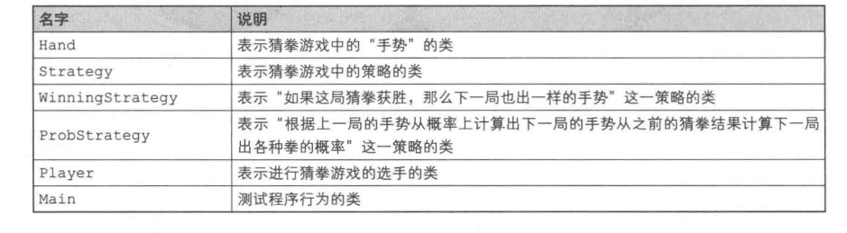
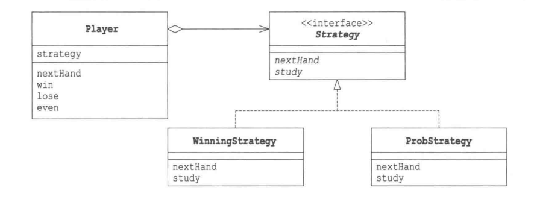
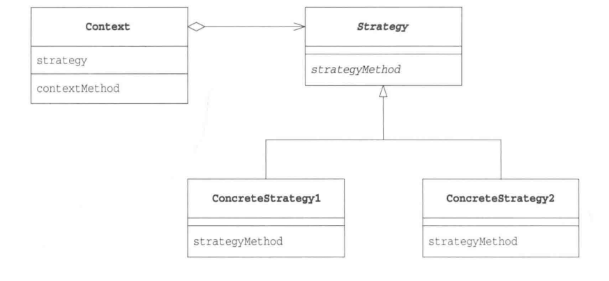
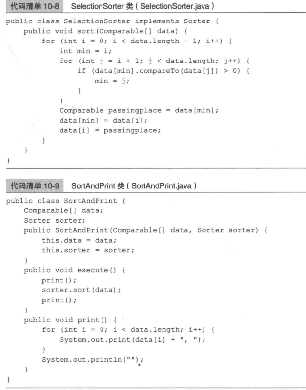
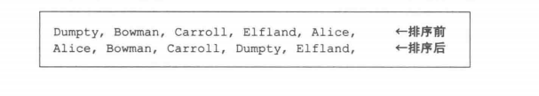

# 策略模式-整体替换


### Strategy 模式
程序中，“策略”可以理解为“算法”
整体的替换算法，用不同的算法解决同一个问题

### 实例程序
猜拳策略:
1. 如果这局猜拳获胜，下一句也出一样的手势(WinningStrategy)
2. 根据上一局的手势从概率上计算出下一局的手势(ProbStrategy)



Hand类是“手势类”, 被其他类(Player, WinningStrategy, ProbStrategy)使用，但并不是Strategy模式中的角色
```java
public class Hand{
    public static final int HANDVALUE_GUU = 0; // 表示石头的值
    public static final int HANDVALUE_CHO = 1; // 表示剪刀的值
    public static final int HANDVALUE_PAA = 2; // 布的值

    public static final Hand[] hand = { // 表示猜拳中三种手势的实例，单例模式，因为Hand的对象是有限的所以全部初始化好
        new Hand(HANDVALUE_GUU),
        new HAND(HANDVALUE_CHO),
        new HAND(HANDVALUE_PAA),
    };
    private static String[] name = { // 表示猜拳中手势对应的字符串
        "石头", "剪刀", "布"
    };
    private int handValue; // 猜拳中手势的值
    
    private Hand(int handValue){
        this.handValue = handValue;
    }

    public static Hand getHand(int handValue) // 根据手势的值获取其对应的实例

    public boolean isStrongerThan(Hand h){ // 如果this胜了h则返回true
        return fight(h) == 1;
    }

    public boolean isWeakerThan(Hand h){ // 如果this输给了h则返回true
        return fight(h) == -1;
    }

    private int fight(Hand h){ //计分：平0， 胜1，负-1
        if(this == h){
            return 0;
        }else if((this.handValue + 1) % 3 == h.handValue){
            return 1;
        }else{
            return -1;
        }
    }

    public String toString(){ // 转换为手势值所对应的字符串
        return name[handValue];
    }
}
```

Strateg接口
```java
public interface Strategy{
    public abstract Hand nextHand(); // 获取下一局要出的手势，实现Strategy的类会计算出下一局出什么
    public abstract void study(boolean win); // 学习“上一局手势是否获胜了”，如果上一局调用nextHand获胜了，接着就调用study(true)，如果输了，接着调用study(false)。Strategy实现类改变自己的内部状态，为下一次nextHand提供判断依据
}
```
WinningStategy类
```java
public class WinningStrategy implements Strategy{
    private Random random;
    private boolean won = false; // 保存上局是输还是赢
    private Hand prevHand; // 上一局的手势
    public WinningStrategy(int seed){
        random = new Random(seed);
    }

    public Hand nextHand(){ //
        if(!won){
            preHand = Hand.getHand(random.nextInt(3)); // 上局没有赢，使用随机手势
        }
        return preHand; // 如果上局赢了，下局继续使用上局手势
    }
    
    public void study(boolean win){
        won = win;
    }
}
```

ProbStrategy类，根据过去的胜负来计算概率
history[上一局出的手势][这一局出的手势]，值越大概率越高
假设上一局出石头:
history[0][0] 两局分别出石头、石头时胜了的次数
history[0][1] 两局分别出石头、剪刀胜了的次数
history[0][2] 两局分别出石头、步时胜了的次数
先计算三个表达式的值的和(getSum方法)，然后从0与这个和之间的一个随机数，据此决定下一局出什么(nextHand)
例如：如果
history[0][0]是3
history[0][1]是5
history[0][2]是7
下一局出什么就以石头、剪刀和步的比率为3:5:7来决定，在0至15(不含15(3+5+7))之间取一个随机数:
随机数在[0, 3)之间，出石头
随机数在[3, 8)之间，出剪刀
随机数在[8, 15)之间，出布

study方法根据nextHand方法返回的手势的胜负结果更新history字段中的值
> 此策略的大前提是对方只有一种猜拳模式
```java
public class ProbStrategy implements Strategy{
    private Random random;
    private int preHandValue = 0; // 上一局出的手势
    private int currentHandValue = 0; // 这一局出的手势
    private int[][] history = {
        {1, 1, 1},
        {1, 1, 1},
        {1, 1, 1}
    }

    public ProbStrategy(int seed){
        random = new Random(seed);;
    }

    public Hand nextHand() {
        int bet = random.nextInt(getSum(currentHandValue));
        int handValue = 0;
        if(bet < history[currentHandValue][0]){
            handValue = 0;
        }else if(bet < history[currentHandValue][0] + history[currentHandValue][1]){
            handValue = 1;
        }else {
            handValue = 2;
        }
        preHandValue = currentHandValue;
        currentHandValue = handValue;
        return Hand.getHand(handValue);
    }

    private int getSum(int hv){
        int sum = 0;
        for(int i = 0; i < 3; i++){
            sum += history[hv][i]
        }
        return sum;
    }

    public void study(boolean win){
        if(win){
            history[preHandValue][currentHandValue]++;
        }else{
            history[preHandValue][(currentHandValue + 1) % 3] ++;
            history[preHandValue][(currentHandValue + 2) % 3] ++;
        }
    }
}
```
Player类
```java
private String name;
private Strategy strategy;
private int winCount; // 记录猜拳结果
private int loseCount; // 记录猜拳结果
private int gameCount; // 记录猜拳结果
public Player(String name, Strategy strategy){ // 赋予姓名和策略
    this.name = name;
    this.strategy = strategy;
}

public Hand nextHand(){ // 策略决定下一局要出的手势，委托给了策略strategy
    return strategy.nextHand(); 
}

public void win(){ // 胜
    strategy.study(true);
    winCount ++;
    gameCount ++;
}

public void lose() { // 负
    strategy.study(false);
    loseCount ++;
    gameCount ++;
}

public void even() { // 平
    gameCount ++;
}

public String toString(){
    return "[" + name + ":" + gameCount + " games, "  + winCount + " win, " + loseCount + " lose" + "]";
}
```

Main
```java
    public class Main{
        public static void main(String[] args){
            if(args.length != 2){
                System.out.println("Usage: java Main randomseed1 randomseed2");
                System.out.println("Example: java Main 314 15");
                System.exit(0);
            }
            int seed1 = Integer.parseInt(arg[0]);
            int seed2 = Integer.parseInt(args[1]);
            Player player1 = new Player("Taro", new WinningStrategy(seed1));
            Player player2 = new Player("Hana", new ProbStrategy(seed2));
            for(int i = 0; i < 10000; i++){
                Hand nextHand1 = player1.nextHand();
                Hand nextHand2 = player2.nextHand();
                if(nextHand1.isStrongerThan(nextHand2){
                    System.out.println("Winner:" + player1);
                    player1.win();
                    player2.lose();
                }else if(nextHand2.isStrongerThan(nextHand1)){
                    System.out.println("Winner:" + player2);
                    player1.lose();
                    player2.win();
                }else{
                    System.out.println("Even...");
                    player1.even();
                    player2.even();
                }
                System.out.println("Total result:");
                System.out.println(player1.toString());
                System.out.println(player2.toString());
            }
        }
    }
```


### Strategy模式中的角色
##### Strategy(策略)
决定实现策略所必须的接口
##### ConcreateStrategy(具体的策略)
实现负责Strategy角色的接口，实现具体的策略(战略、方向、方法和算法)
##### Context(上下文)
使用Strategy，保存ConcreateStrategy角色实例，使用ConcreteStrategy实现需求，使用委托，Player扮演此角色

### 拓展
Strategy模式将算法和其他部分分离，只定义了算法相关的接口，用委托方式使用算法
如果需要改变算法，使用委托这种弱关联关系可以很方便的整体替换算法。
<font color="#ff0000">使用Strategy模式时，可以方便地根据棋手的选择切换AI程序的水平</font>

##### 程序运行中也可以切换策略
例如：在内存容量少的运行环境中可以使用SlowButLessMemoryStrategy(速度慢但省内存的策略)，在内存容量多的运行环境中可以使用FastButMoreMemoryStrategy(速度快但耗内存策略)

可以用某种算法“验算”另外一种算法，例如：假设要在某个表格计算软件的开发版本中进行复杂的计算。准备两种算法：“高速但计算上可能有Bug的算法”和“低速但计算准确的算法”，让后者去验算前者的计算结果

### 相关的设计模式
##### Flyweight模式
有时会使用Flyweight模式让多个地方可以共用ConcreteStrategy角色
##### Abstract Factory模式
使用Strategy模式可以整体地替换算法
使用Abstract Factory可以整体地替换具体工厂、零件和产品

##### State模式
都可以替换被委托对象，类之间的关系很相似，但是<font color="#ff0000">目的不同</font>
Strategy模式：ConcreateStrategy表示算法的类，在Strategy模式中，可以替换被委托对象的类。如果没有必要，也可以不替换
State模式：ConcreteState表示“状态”的类，每次状态变化，被委托对象的类都必定会被替换

### 本章所学
借助委托、算法的替换，动态替换称为可能

### 练习题
##### 编写一个随机出手势的RandomStrategy类
##### 计算平局this.handValue == h.value而是this == h 为什么
##### 用于排序的类和接口，
```java
public interface Sorter{
    public abstract void sort(Comparable[] data);
}
```


```java
public class Main{
    public static void main(String[] args){
        String[] data = {
            "Dumpty", "Bowman", "Carroll", "Elfland", "Alice",
        };
        SortAndPrint sap = new SortAndPrint(data, new SelectionSorter());
        sap.execute();
    }
}
```
