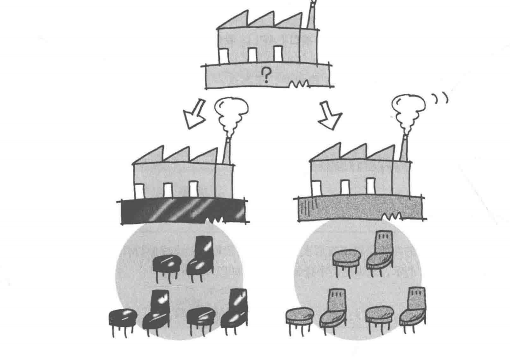
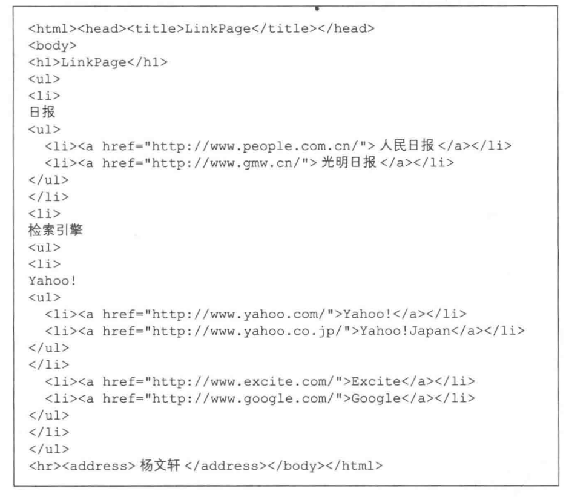
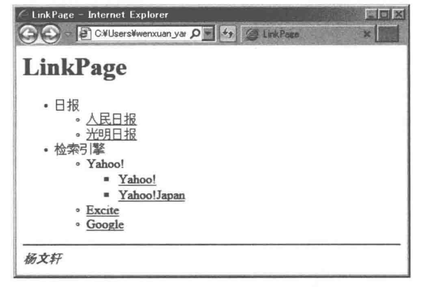
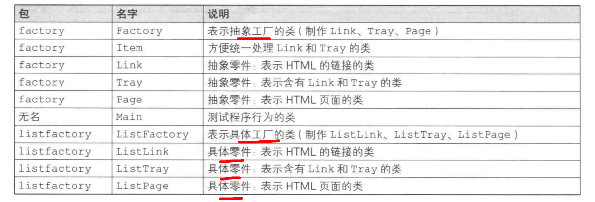
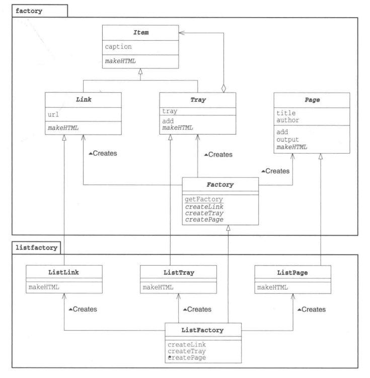
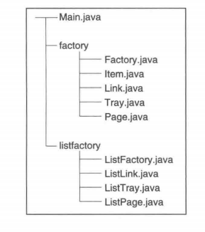
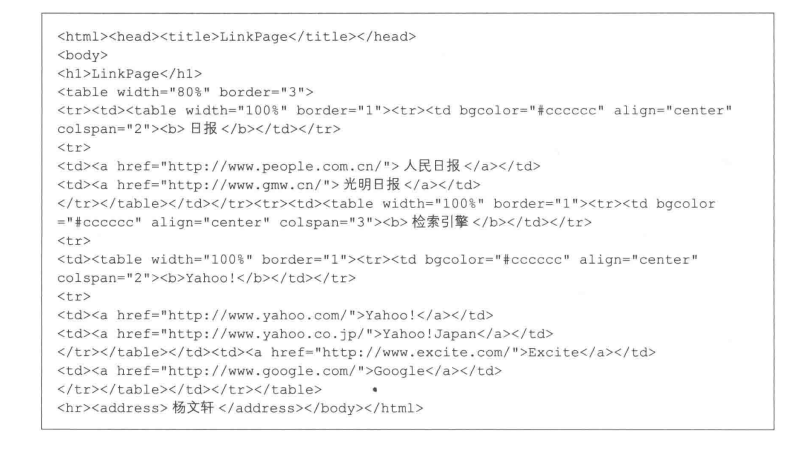
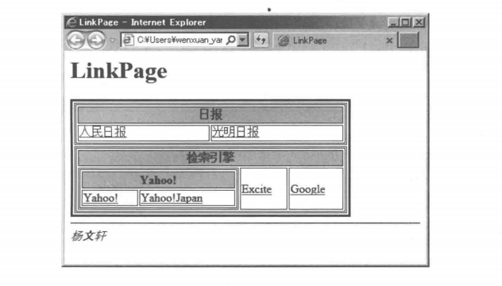
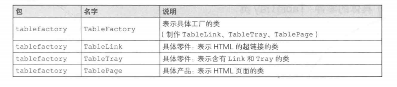
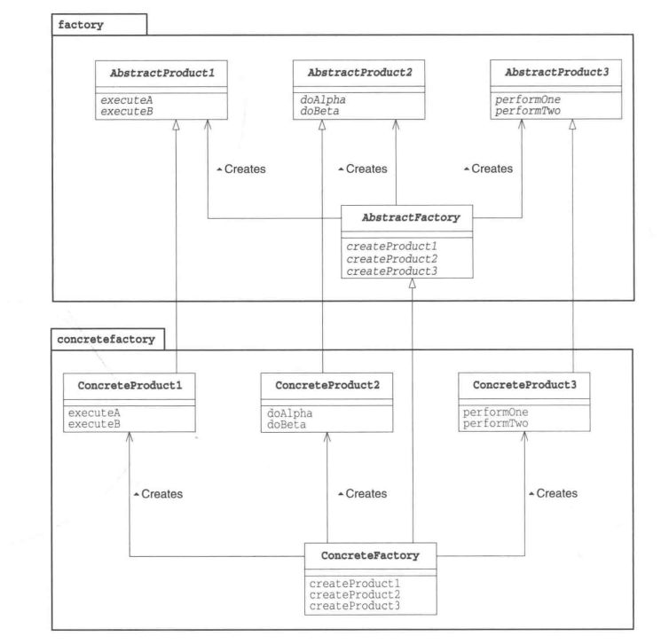

### 抽象工厂

抽象工厂的工作是将“抽象零件”组装为“抽象产品”，不必关心零件的具体实现，只关心接口(API)，仅使用该接口(API)将零件组装称为产品。由子类工厂具体实现

抽象：不考虑具体怎么实现，进关注接口（API）的状态
抽象方法(Abstract Method: 不定义方法的具体实现，仅仅只确定了方法的名字和签名(参数的类型和个数)

##### 实例程序 - 将带有层次关系的链接的集合制作成HTML文件



+ factory包：包含抽象工厂、零件、产品的包
+ 无名包：包含Man类的包
+ listfactory包：包含具体工厂、零件、产品的包(这里使用<ul>标签输出为HTML文件)



```
javac Main.java listfactory/ListFactory.java
java Main listfactory.ListFactory // 需要单独编译listfactory的包
LinkPage.html 编写完成
```
抽象零件类Item

```java
public abstract class Item {
    protected String caption;

    public Item(String caption){
        this.caption = caption;
    }

    public abstract String makeHTML();
}


```

抽象零件Link类抽象地表示HTML的超链接, url保存超链接指向的地址

```java
public abstract class Link extends Item{
    protected String url;
    public Link(String caption, Stirng url){
        super(caption);
        this.url = url;
    }
}
```

抽象零件类Tray表示含有多个Link类和Tray类的容器

```java
public abstract class Tray extends Item{
    protected ArrayList tray = new ArrayList();
    public Tray(String caption){
        super(caption);
    }

    public void add(Item item){ // 增加Link或Tray
        tray.add(item);
    }
}
```

抽象产品Page类，表示HTML页面

```java
public abstract class Page{
    protected String title;
    protected String author;
    protected ArrayList content = new ArrayList();
    public Page(String title, String author){ // 传入title和author
        this.title = title;
        this.author = author;
    }

    public void add(Item item){ // 增加零件
        content.addItem(item);
    }

    public void output(){// 输出
        try{
            String filename = title + ".html";
            Write write = new FileWriter(filename);
            writer.write(this.makeHTML());
            writer.close();
            System.out.println(filename + "编写完成。");
        }catch(IoException e){
            e.printStackTrace();
        }
    }

    public abstract String makeHTML(); // 具体如何构造HTML由子类实现
}
```

抽象工厂：Factory类

```java
public abstract class Factory{
    public static Factory getFactory(String classname){
        Factory factory = null;
        try{
            factory = (Factory)Class.forName(classname).newInstance();
        }catch(ClassNotFoundException e){
            System.out.println("没有找到" + classname + " 类。");
        }catch(Exception e){
            e.printStackTrace();
        }
        return factory;
    }
    public abstract Link createLink(String caption, String url); // 在抽象工厂中生成零件和产品的方法，具体实现交给子类，这里确定方法的名字和签名
    public abstract Tray createTray(String caption);
    public abstract Page createPage(String title, String author);
}
```

Main类使用抽象工厂生产零件并将零件组装成产品，该类没有使用任何具体零件、产品和工厂
具体工厂的类名是通过命令行指定的：
java Main listfactory.ListFactory
```java
public class Main{
    public static void main(String[] args){
        if(args.length != 1){
            System.out.println("Usage: java Main class.name.of.ConcreteFactory");
            System.out.println("Example 1: java Main listfactory.ListFactory");
            Systme.out.println("Example 2: java Main tableFactory.TableFactory");
            System.exit(0);
        }
        Factory factory = Factory.getFactory(args[0]);

        Link people = factory.createLink(" 人民日报", "http://www.people.com.cn/");
        Link gmw = factory.createLink("光明日报", "http://www.gmw.cn/");

        Link us_yahoo = factory.createLink("Yahoo!", "http://www.yahoo.com/");
        Link jp_yahoo = factory.createLink("Yahoo!Japan", "http://www.yahoo.co.jp/");
        Link google  = factory.createLink("Google", "http://www.google.com/");

        Tray traynews = factory.createTray(" 日报");
        traynews.add(people);
        traynews.add(gmw);

        Tray trayyahoo = factory.createTray("Yahoo!");
        trayyahoo.add(us_yahoo);
        trayyahoo.add(jp_yahoo);

        Tray traysearch = factory.createTray("检索引擎");
        traysearch.add(trayyahoo);
        traysearch.add(excite);
        traysearch.add(google);

        Page page = factory.createPage("LinkPage", " 杨文轩");
        page.add(traynews);
        page.add(traysearch);
        page.output();
    }
}
```

具体工厂：ListFactory类
```java
public class ListFactory extends Factory{ // 可能需要原型模式
    public Link createLink(String caption, String url){
        return new ListLink(caption, url);
    }

    public Tray createTray(String caption){
        return new ListTray(caption);
    }

    public Page createPage(String title, String author){
        return new ListPage(title, author);
    }
}
```

具体零件：ListLink类，可供ListTray和ListPage使用

```java
public class ListLink extends Link{
    public ListLink(String caption, String url){
        super(caption, url);
    }

    public String makeHTML(){ // 构造html
        return " <li><a href=\"" + url + "\">" + caption + "</a></li>\n";
    }
}
```

具体的零件：ListTray类，保存了所有需要以HTML格式输出的Item，不关心item是ListList还是ListTray，只是调用makeHTML()语句
不使用switch语句或if语句去判断变量item中保存的实例的类型，否则就是非面向对象编程
item怎么处理只有item知道，这就是面向对象优点

```java
public class ListTray extends Tray{
    public ListTray(String caption){
        super(caption);
    }

    public String makeHTML(){
        StringBuffer buffer = new StringBuffer();
        buffer.append("<li>\n"); // 输出标题
        buffer.append(caption + "\n");
        buffer.append("<ul>\n");
        Iterator it = tray.iterator();
        while(it.hasNext()){ // 一个个输出li
            Item item = (Item)it.next();
            buffer.append(item.makeHTML());
        }
        buffer.append("</ul>\n");
        buffer.append("</li>\n");
        return buffer.toString();
    }
}
```

具体的产品：ListPage类, 将字段保存的内容输出为HTML格式，author使用\<address\>标签输出
ListLink和ListTray的makeHTML()最外侧都有\<li\>标签，就像“螺栓”和“螺母”的接头

```java
public class ListPage extends Page{
    public ListPage(String title, String author){
        super(title, author);
    }

    public String makeHTML(){
        StringBuffer buffer = new StringBuffer();
        buffer.append("<html><head><title>" + title + "</title></head>\n"); // title
        buffer.append("<body>\n");
        buffer.append("<h1>" + title + "</h1>\n");
        buffer.append("<ul>\n");
        Iterator it = content.iterator();
        while(it.hasNext()){
            Item item = (Item)it.next();
            buffer.append(item.makeHTML());
        }
        buffer.append("</ul>\n");
        buffer.append("<hr><address>" + author + "</address>"); // 地址
        buffer.append("</body></html>\n");
        return buffer.toString();
    }
}
```

##### 增加其他工厂
当只有一个具体工厂的时候，完全没有必要划分“抽象类”与“具体类”

编写含有其他内容的HTML格式的文件
ListFactory是将超链接以条目形式展示出来
新编写类将超链接以表格形式展示出来

```
javac Main.java tablefactory/TableFactory.java
java Main tablefactory.TableFactory

```





具体工厂：TableFactory类

```java
public class TableFactory extends Factory{
    public Link createLink(String caption, String url){
        return new TableLink(caption, url);
    }

    public Tray createTray(String caption){
        return new TableTray(caption);
    }

    public Page createPage(String title, String author){
        return new TablePage(title, author);
    }
}
```

具体的零件：TableLink类

```java
public class TableLink extends Link{
    public TableLink(String caption, String url){
        super(caption, url);
    }

    public String makeHTML(){
        return "<td></a href=\"" + url + "\">" + caption + "</a></td>\n";
    }
}
```

具体的零件：TableTray类

```java
public class TableTray extends Tray{
    public TableTray(String caption){
        super(caption);
    }

    public String makeHTML(){
        StringBuffer buffer = new StringBuffer();
        buffer.append("<td>");
        buffer.append("<table width=\"100%\" border=\"1\"><tr>");
        buffer.append("<td bgcolor=\"#cccccc\" align=\"center\" colspan=\"" + tray.size() + "\"><b> + caption + </b></td>");
        buffer.append("</tr>\n");
        buffer.append("<tr>\n");
        Iterator it = tray.iterator()
        while(it.hasNext()){
            Item item = (Item)it.next();
            buffer.append(item.makeHTML());
        }
        buffer.append("</tr></table>");
        buffer.append("</td>");
        return buffer.toString();
    }
}
```

具体产品：TablePage类

```java
public class TablePage extends Page{
    public TablePage(String title, String author){
        super(title, author);
    }

    public String makeHTML(){
        StringBuffer buffer = new StringBuffer();
        buffer.append("<html><head><title>" + title + "</title></head>\n");
        buffer.append("<body>\n");
        buffer.append("<h1>" + title + "</h1>\n");
        buffer.append("<table with=\"80%\" boder=\"3\"\n");
        Iterator it = content.iterator();
        while(it.hasNext()){
            Item item = (Item)it.next();
            buffer.append("<tr>" + item.makeHTML() + "</tr>");
        }
        buffer.append("</table>\n");
        buffer.append("<hr><address>" + author + "</address>");
        buffer.append("</body></html>\n");
        return buffer.toString();
    }
}
```

##### Abstract Factory 角色
AbstractProduct：定义AbstractFactory角色所生成的抽象零件和产品的接口，Link、Tray、Page

AbstractFactory：定义用于生成抽象产品的接口，Factory

Client(委托者): 仅调用AbstractFactory和AbstractProduct角色的接口(API)进行工作，对于具体零件、产品和工厂一无所知，Main


ConcreateProduct(具体产品)
listfactory包: ListLink类、ListTray类和ListPage类
tablefactory包: TableLink类、TableTray类和TablePage类

ConcreteFactory(具体工厂)
listfactory包: ListFactory类
tablefactory包: TableFactory类

##### 拓展
AbstractFactory增加具体工厂很容易：需要编写哪些类和需要哪些方法很清楚，都无需修改抽象工厂和Main部分

难以增加新的零件：
增加一个新的零件如图像的Picture零件，必须对所有的具体工厂进行相应的修改才行，如listfactory包中：
+ 在ListFactory中加入createPicture方法
+ 新增ListPicture类
已经编写完的具体工厂越多，修改的工作量越大

##### 相关设计模式
+ Builder模式
AbstractFactory通过调用抽象产品的接口来组装抽象产品，生成具有复杂结构的实例
Builder则是分阶段地制作复杂实例

+ FactoryMethod模式
AbstractFactory中零件和产品的生成会使用到FactoryMethod

+ Composite模式
有时在AbstractFactory模式在制作产品时会使用Composite模式

+ Singleton模式
有时在AbstractFactory模式在制作产品时会使用Singleton模式

##### 延伸阅读：各种生成实例的方法和介绍

+ new
+ clone Prototype模式，根据现有实例复制出新实例
```java
class Something{
    public Something createClone(){
        Something obj = null;
        try{
            obj = (Something)clone();
        }catch(CloneNotSupportedException e){
            e.printStackTrace();
        }
        return obj;
    }
}
```
+ newInstance 可能导致InstantiationException或IllegalAccessException

总结：抽象工厂是很难的模式，出厂角色太多