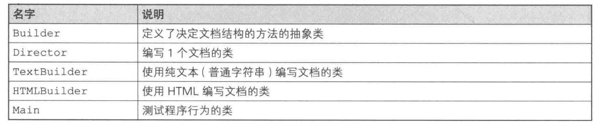
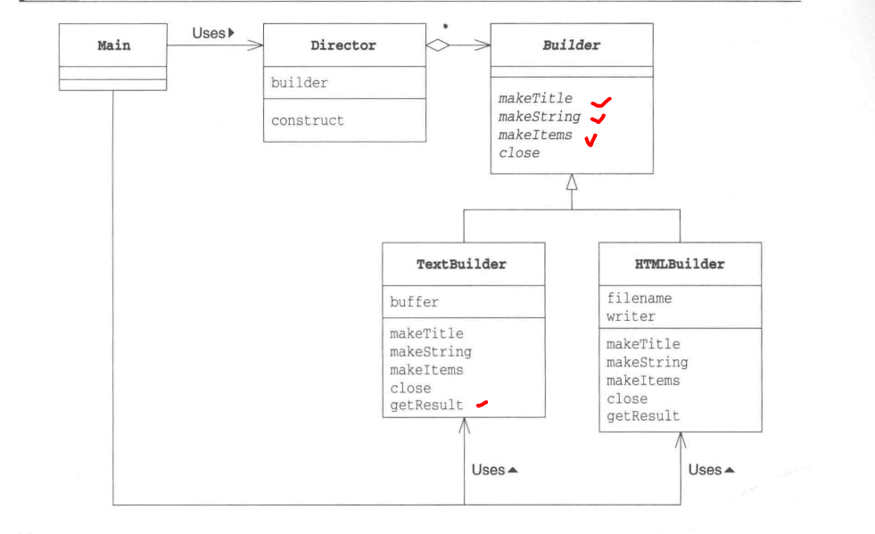
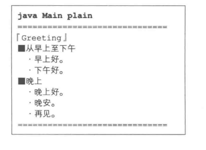
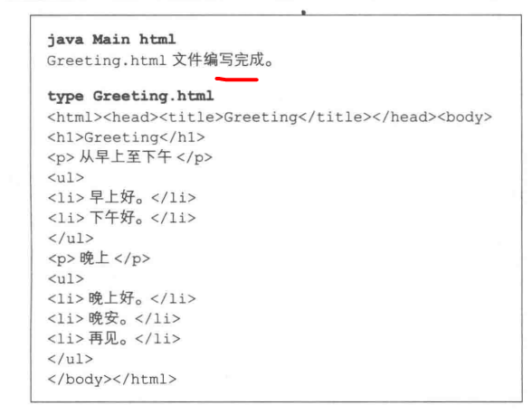
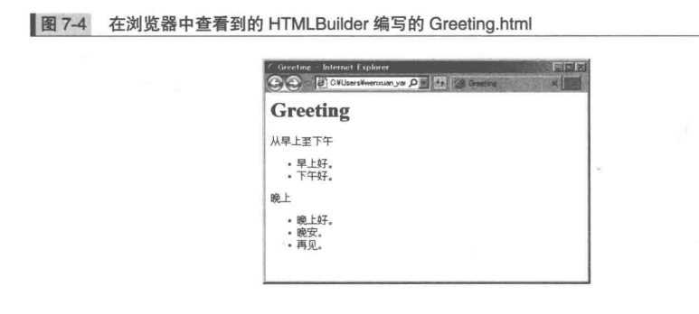
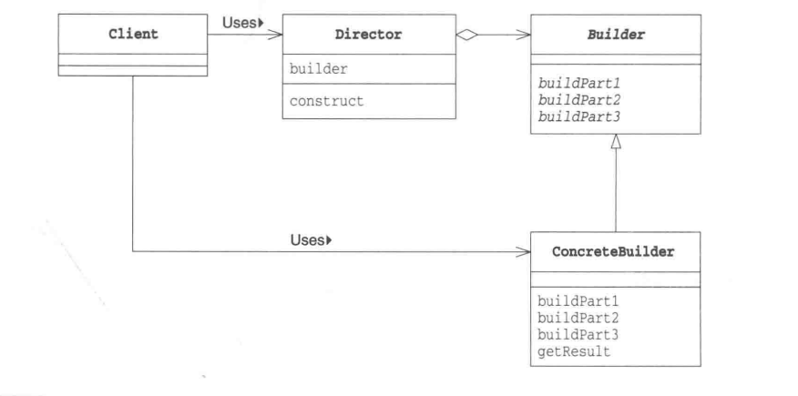
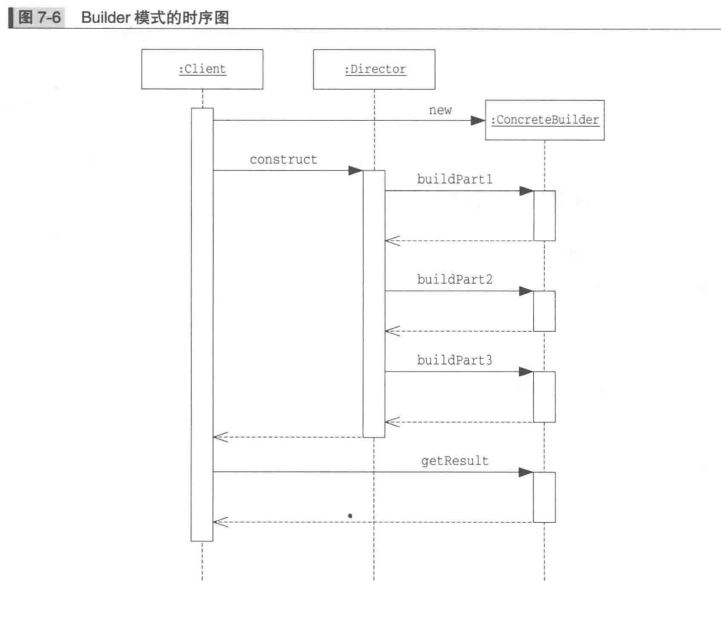

# Builder模式
组装复杂结构
Builder模式编写"文档"的程序
+ 含有一个标题
+ 含有几个字符串
+ 含有条目项目



Builder.java

```java
public abstract class Builder{
    public abstract void makeTitle(String title);
    public abstract void makeString(String str);
    public abstract void makeItems(String[] items);
    public abstract void close();
}
```
Director.java

```java
public class Director{
    public Builder builder;
    public Director(Builder builder){ // 实际传给Director的是Builder的子类
        this.builder = builder;
    }

    public void contruct(){
        builder.makeTitle("Greeting"); // 标题 
        builder.makeString("从早上至下午 "); // 字符串
        builder.makeItems(new String[]{ // 条目
            "早上好。",
            "下午好。"
        });
        builder.makeString("晚上 ")
        builder.makeItems(new String[]{
            "晚上好。",
            "晚安。",
            "再见。"
        });
        builder.close();
    }
}
```
TextBuilder.java
```java
public class TextBuilder extends Builder{
    private StringBuffer buffer = new StringBuilder(); // 文档内容保存在buffer中
    public void makeTitle(String title){ // 纯文本的标题
        buffer.append("===================================\n"); // 装饰线
        buffer.append("【" + title + "】\n"); // 为标题添加【】
        buffer.append("\n"); // 换行
    }

    public void makeString(String str){ // 纯文本的字符串
        buffer.append("■" + str + "\n"); // 为字符串添加■
        buffer.append("\n"); // 换行
    }

    public void makeItems(String[] items){ // 纯文本条目
        for(int i = 0; i < items.length; i++){
            buffer.append("  ." + items[i] + "\n");  // 为条目添加.
        }
        buffer.append("\n"); // 换行
    }

    public void close(){ //完成文档
        buffer.append("====================================\n"); // 装饰线
    }

    public String getResult(){ // 完成的文档
        return buffer.toString(); // 将StringBuilder转换成String
    }
}
```

HTMLBuilder类

```java
public class TextBuilder extends Builder{
    private String fileName; // 文件名
    private PrintWriter writer; // 用于编写文件的PrintWriter
    public void makeTitle(String title){ // HTML文件的标题
        fileName = title + ".html";
        try{
            writer = new PrintWriter(new FileWriter(fileName)); // 生成PrintWriter
        }catch(IOException e){
            e.printStackTrace();
        }
        writer.println("<html><head><tile>" + title + "</title></head><body>");
        // 输出标题
        writer.println("<h1>" + title + "</h1>");
    }

    public void makeString(String str){ // HTML文件中的字符串
        writer.println("<h1>" + tile + "</h1>"); // 用<p>标签输出
    }

    public void makeItems(String[] items){ // HTML文件中的字符串
        writer.println("<ul>"); // 用<ul>和<li>输出
        for(int i = 0; i < items.length; i++){
            writer.println("<li>" + items[i] + "</li>");
        }
        writer.println("</ul>");
    }

    public void close(){ //完成文档
        writer.println("</body></html>"); // 关闭标签
        writer.close(); // 关闭文件
    }

    public String getResult(){ // 编写完成的文档
        return fileName; // 返回文件名
    }
}
```

Main.class
```java
public class Main(String[] args){
    if(args.length != 1){
        usage();
        System.exit(0);
    }
    if(args[0].equls("plain")){
        TextBuilder textbuilder = new TextBuilder();
        Director director = new Director(textBuilder);
        director.contruct();
        String result = textBuilder.getResult();
        System.out.println(result);
    }else if(args[0].equals("html")){
         HTMLBuilder htmlBuilder = new HTMLBuilder();
        Director director = new Director(htmlBuilder);
        director.contruct();
        String fileName = htmlBuilder.getResult();
        System.out.println(fileName + " 文档编写完成");
    }
}
```




## 角色
### Builder(建造者)
### ConcreteBuilder(具体建造者)
### Director(监工)
只调用在Builder中定义的方法
### Client(使用者)



## 相关设计模式
### Template Method模式
### Composite模式
### Abstract Factory
### Facade模式
Builder中，Director通过组合Builder角色中的复杂方法向外部提供可以简单生成实例的接口(API)(construct)
Facade模式中的Facade角色通过组合内部模块向外部提过可以简单调用的接口(API)

## 拓展思路
面向对象中，"谁知道什么"很重要
编程时需要知道哪个类可以使用哪些方法以及这个方法到底好不好

Main类不知道(没有调用)Builder类，只调用了Direct类的construct方法，Director类就开始工作(Main类对此一无所知)，完成文档编写

Director类知道Builder，调用Builder类的方法编写文档，但不知道“真正”使用的是哪个类

只有不知道子类才能替换，“可替换性”

## 设计时能决定和不能决定的事
Builder类需要声明编辑文档所必须所有方法
Builder必须应对将来子类可能增加的需求

## 代码的阅读方法和修改方法
在现有代码的基础上进行增加和修改，需要准确理解抽象和实现

## 总结 
组装具有复杂结构的实例Builder模式，组装的具体过程则被隐藏在Director模式中

## 习题
1. 将Builder修改为接口，并修改其他类
2. 在HTMLBuilder中，需首先调用makeTitle方法，TextBuilder中方法调用没有要求，修改Builder类及其子类，确保调用makeXXX和close方法前必须且只能调用一次makeTitle方法
3. 编写Builder子类，扮演ConcreateBuilder角色，实现可以编写纯文本文档、HTML文件以外的任意一种文档的功能
4. 在TextBuilder类中，编写的文档被保存在buffer字段中，但buffer字段并非是String类型的，而是StringBuilder的，为什么呢，使用String有什么问题？