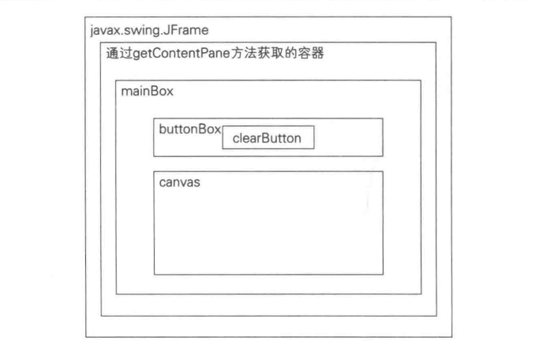

### Command模式

用一个类，来表示“请进行这项工作”的命令，每一项工作不再是“方法的调用”这种动态的处理，而是一个表示命令的类的实例，可以用“物”来表示
管理工作的历史记录，只需要管理这些实例的集合即可，还可以随时再次执行过去的命令，或将多个过去的命令整合为一个新命令并执行

Command也被称为事件(event)。与“事件驱动编程”中的“事件”是一样的意思
当发生点击鼠标、按下键盘灯事件时，可以将这些事件作成实例，然后按照发生顺序放入队列中，接着再依次处理它们。GUI编程中事件很常见

##### 示例程序
一个画图软件，功能很简单，拖动鼠标时程序会绘制出红色圆点，点击clear按钮会清除所有的圆点

每次拖动鼠标，都会为“在这个位置画一个点”这条命令生成一个DrawCommand类的实例，保存这个示例，在有需要时可以重新绘制


***Command接口***
“命令”接口，定义了一个方法execute(执行)，具体的执行取决于子类

```java
public interface Command{
    public void execute();
}
```

***MacroCommand类***
“由多条命令整合成的命令”，实现了Command接口。Macro有“大量的”的意思

commands: java.util.Stack，保存了多个Command的集合，为了轻松实现undo方法，用Stack实现

execute: 所有的Command都被执行

append: 向macroCommand类中添加新的Command，可以使MacroCommand类的实例

undo: 删除commands中最后一条命令

clear: 删除所有命令

```java
public class MacroCommand implements Command{
    // 命令的集合
    private Stack Commands = new Stack();

    // 执行
    public void execute(){
        Iterator it = commands.iterator();
        while(it.hasNext()){
            ((Command)it.next()).execute();
        }

        // 添加命令
        public void append(Command cmd){
            if(cmd != this){ // 防止把自己添加进去造成死循环
                commands.push(cmd);
            }
        }

        // 删除最后一条命令
        public void undo(){
            if(!commands.empty()){
                commands.pop();
            }
        }

        // 删除所有命令
        public void clear(){
            commands.clear();
        }
    }
}
```

***DrawCommand类***
“绘制一个点的命令”

```java
public class DrawCommand implements Command{
    // 绘制对象
    protected Drawable drawable;

    // 绘制对象
    private Point position;
    
    // 构造函数
    public DrawCommand(Drawable drawable, Point position){ // 接受Drawable和Point
        this.drawable = drawable;
        this.pisition = position;
    }

    // 执行
    public void execute(){
        drawable.draw(position.x, position.y);
    }
}
```

***Drawable接口***
“绘制对象”，不考虑点的大小和颜色

```java
public interface Drawable{
    public void draw(int x, int y);
}
```

***DrawCanvas类***
实现了Drawable接口，是java.awt.Canvas的子类

```java
public class DrawCanvas extends Canvas implements Drawable{
    // 颜色
    private Color color = Color.red;

    // 要绘制的圆点的半径
    private int radius = 6;

    // 命令的历史记录
    private MacroCommand history;   

    // 构造函数
    public DrawCanvas(int width, int height, MacroCommand history){ // 接受宽高和绘制内容
        setSize(width, height); // 指定Canvas大小
        setBackground(Color.white); // 指定Canvas背景颜色
        this.history = history;
    }

    // 重新全部绘制
    public void paint(Graphics g){  
        history.execute();
    }

    // 绘制
    public void draw(int x, int y){
        Graphics  g = getGraphics();
        g.setColor(color); // 指定颜色
        g.fillOval(x - radius, y - radius, radius * 2, radius * 2); // 画圆点
    }
}
```

***Main类***
Main类与DrawCanvas共享绘制历史记录


将布局弄得复杂。

```java
public class Main extends JFrame implements ActionListener, MouseMotionListener, WindowListener{
    // 绘制的历史记录
    private MacroCommand history = new MacroCommand();
    // 绘制区域
    private DrawCanvas canvas = new DrawCanvas(400, 400, history);
    
    // 删除按钮
    private JButton clearButton =  new JButton("clear");

    // 构造函数
    public Main(String title){
        super(title);
        
        this.addWindowListener(this);
        canvas.addMouseMotionListener(this);
        clearButton.addActionListener(this);


        Box buttonBox = new Box(BoxLayout.X_AXIS);
        buttonBox.add(clearButton);
        Box mainBox = new Box(BoxLayout.Y_AXIS);
        mainBox.add(buttonBox);
        mainBox.add(canvas);
        getContentPane().add(mainBox);

        pack();
        show();
    }

    // ActionListener接口中的方法
    public void actionPerformed(ActionEvent e){
            if(e.getSource() == clearButton){
            history.clear();
            canvas.repaint()
        }

    }

    // MouseMotionListener接口中的方法
    public void mouseMoved(MouseEvent e){

    }

    public void MouseDragged(MouseEvent e){
        Command cmd = new DrawCommand(canvas, e.getHeight())
        history.append(cmd);
        cmd.execute();
    }

    // WindowListener接口中的方法
    pubilc void windowClosing(WindowEvent e){
        System.eixt(0);
    }

    public void windowActivated(WindowEvent e){}
    public void windowClosed(WindowEvent e){}
    public void windowDeactivated(WindowEvent e){}
    public void windowDeiconified(WindowEvent e){}
    public void windowIconified(WidowEvent e){}
    public void windowOpened(WindowEvent e){}

    public static void main(String[] args){
        new Main("Command Pattern Sample");
    }

}
```


##### Command模式中登场的角色

+ Command(命令)
负责定义命令的接口

+ ConcreteCommand(具体的命令)
实现Command角色中定义的接口，由MacroCommand和DrawCommand

+ Receiver(接收者)
Command角色执行命令时的对象，DrawCanvas类接受DrawCommand命令

+ Client(请求者)
生成ConcreteCommand角色并分配Receiver角色，Main，鼠标拖拽生成DrawCommand类实例，将扮演Receiver角色的DrawCanvas类的实例传递给DrawCommand类的构造函数

+ Invoker(发动者)

开始执行命令的角色，会调用Command中的接口，由Main类和DrawCanvas扮演此角色，这两个类都调用了Command接口中的execute方法。
Main同时扮演了Client和Invoker


##### 拓展

***命令中应该包含哪些信息***
DrawCommand中还可以添加颜色和大小，加上时间戳，可以重现用户鼠标操作的缓急

ConcreteCommand中如果有多个Receiver时，Client就不必关心Receiver了，Client或者Invoker只是调用命令的execute，具体谁接受不关注

***保存历史记录***
如果将history字段保存在文件中，就可以永久保存历史记录

***适配器***
使用MouseMotionAdapter可以不必实现MouseMotionListener中所有方法

##### 相关设计模式

+ Composite模式
会使用Composite模式实现宏命令(macrocommand)
+ Memento模式
会使用Memento模式保存Command角色的历史记录
+ Protype模式
使用Protype模式复制发生的事件(生成的命令)

##### 本章所学
通过用对象表示“命令”来保存命令历史记录和重复执行命令的Command模式，用对象表示我们没有意识到是“物”的东西会带来意想不到的效果


##### 练习题
