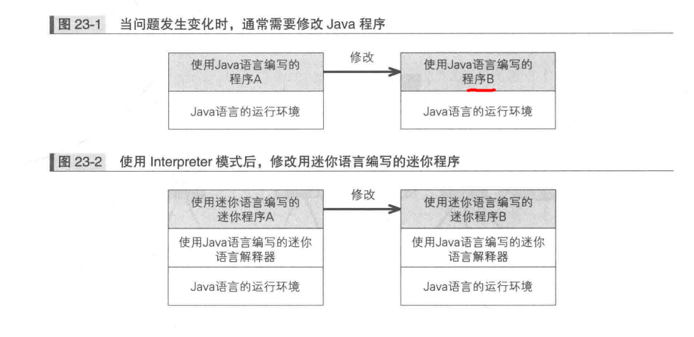
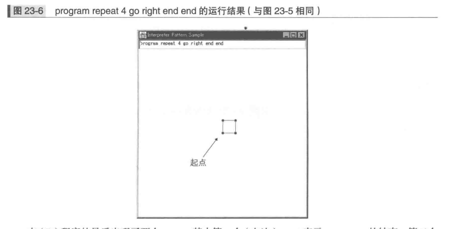
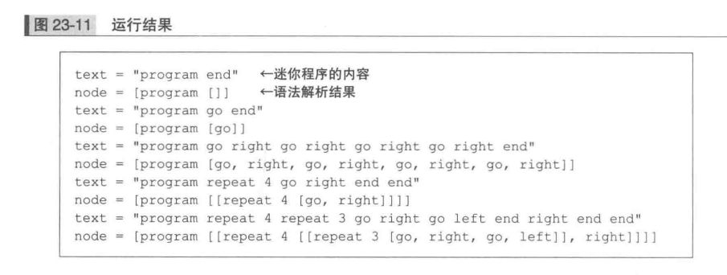

### Interpreter模式


Interpreter模式中，程序要解决的问题会用非常简单的“迷你语言”表示
用“迷你语言”编写的“迷你程序”把具体的问题表述出来，需要一个“翻译”程序，称为解释器
当解决的问题发生改变时，只需要修改迷你语言程序即可，无需修改Java语言程序



##### 迷你语言
***迷你语言的命令***
迷你语言的用途是控制无限玩具车，有以下命令
+ 前进1米(go)
+ 右转(right)
+ 左转(left)
+ 重复(repeat): 可以连续执行某个指令


***迷你程序语言***
program go end 

加了program和end关键字作为命令开头和结尾


接下来让无限玩具车先前进一米，接着让它右转两次再返回来
program go right right go end

在接下来是按照正方形路径行进
program go right go right go right go right end ......(A)

用repeat来表示重复的命令：
program repeat 4 go right end end ......(B)

程序结构：


按照锯齿形状路线前进
program repeat 4 repeat 3 go right go left end right end end
有两个repeat：


***迷你语言的语法***
描述方法是BNF的一个变种，BNF是描述语法


\<program> ::= program \<command list>
定义了程序\<program>，后面跟着命令列表
“::=”左边表示定义的名字，右边表示定义的内容

<command list> ::= <command>* end
重复0次以上<command>后，接着一个end关键字， *表示0次以上

<command> ::= <repeat command> | <primitive command>
\<command>指\<repeat command>或者\<primitive command>

<repeat command> ::= repeat <number><command list>
循环命令，<number>表示循环次数，数字后面是循环的命令列表
在定义某个东西时，它自身又出现在了定义的内容中，称为递归定义

<primitive command> ::= go | right | left
基本命令

***终结符表达式与非终结符表达式***
<primitive command>这样不会被进一步展开的表达式被称为“终结符表达式”
<program>和<command>可以进一步展开的叫“非终结符表达式”

##### 示例程序

迷你程序的语法解析器


***Node类***
Node类是语法树中各个部分(节点)中的最顶层类
parse: 进行语法解析处理，具体实现交给子类实现，接受参数Contexst表示语法解析上下文类

```java
public abstract class Node{
    public abstract void parse(Context contexst)throws ParseException;
}
```

***ProgramNode类***
ProgramNode类中定义了一个Node类型的CommandListNode字段，保存\<command list> 对应的节点

语法解析时的处理单位为标记（token），词法分析(lex)是con欧冠文字中得到标记、语法解析(parse)是根据标记推导出语法树

```java
// <program> ::=  program <command list>
public class ProgramNode extends Node{
    private Node commandListNode;
    public void parse(Context context) throws ParseException{
        context.skipToken("program"); // <program>定义中先开始出现的是program这个单词，因此先跳过该单词标记，如果没有该标记抛出异常
        commandListNode = new CommandListNode();
        commandListNode.parse(context);// 在ProgramNode类中实现的内容，并没有超过下面的BNF所描述的范围
    }

    public String toString(){
        return "[program " + commandListNode + "]";
    }
}
```

***CommandListNode类***
\<command list> ::= \<command>* end
重复0次以上\<command>，end结尾
```java
// <command list> ::= <command>* end
public class CommandListNode extends Node{
    private ArrayList list = new ArrayList();
    public void parse(Context context) throws ParseException{
        while(true){
            if(context.currentToken() == null){ // 判断当前是否有标记，否则是到末尾了，没有end抛异常
                throw new ParseException("Missing 'end'");
            }else if(context.currentToken().equals("end")){ // 到了end
                context.skipToken("end"); // 跳过end
                break;
            }else{
                Node commandNode = new CommandNode();
                commandNode.parse(context); // 解析
                list.add(commandNode); // 添加进list
            }
        }
    }

    public String toString(){
        return list.toString();
    }
}
```

***CommandNode类***
\<command> ::= \<repeat command> | \<primitive command>

```java
// <command> ::=  <repeat command> | <primitive command>
public class CommandNode extends Node{
    private Node node; // 保存的是与<repeat command>对应的RepeatCommandNode类的实例或与<primitive command>对应的PrimitiveCommandNodes类实例
    public void parse(Context context) throws ParseException{
        if(context.currentToken().equals("repeat")){
            node = new RepeatCommandNode();
            node.arse(context);
        }else {
            node = new PrimitiveCommandNode();
            node.parse(context);
        }
    }

    public String toString(){
        return node.toString();
    }
}
```

***RepeatCommandNode类***
对应\<repeat command>的类
\<repeat command> ::= repeat \<number>\<command list>

\<number>被保存在int型字段number中，\<command list>保存在Node字段commandListNode中
```java
// <repeat command> ::= repeat <number> <command list>
public class RepeatCommandNode extends Node{
    private int number;
    private Node commandListNode; 

    // CommandNode类的parse方法中，程序不会一直进入if语句的RepeatCommandNode处理分支中，最终总是进入PrimitiveCommandNode处理分支，并且不会再调用其他类的parse方法。BNF描述语法一定会结束于终结符表达式
    public void parse(Context context) throws ParseException{
        context.skipToken("repeat");
        number = context.currentNumber();
        context.nextToken();
        commandListNode = new CommandListNode(); // 生成CommandListNode实例
        commandListNode.parse(context); // 调用CommandListNode的parse方法，会生成CommandNode实例，然后调用它的parse方法，CommandNode类的parse会生成RepeatCommandNode实例，调用它的parse方法，然后一直循环，终点是end
    }

    public String toString(){
        return "[repeat " + number + " " + commandListNode + "]";
    }
}
```

***PrimitiveCommandNode类***
\<primitive command> ::= go | right | left
PrimitiveCommandNode类中的parse方法没有调用其他类的parse方法

```java
// <primitive command> ::= go | right | left
public class PrimitiveCommandNode extends Node{
    private String name;
    public void parse(Context context) throws ParseException{
        name = context.currentToken();
        if(!name.equals("go") && !name.equals("right") && !name.equals("left")){
            throw new ParseException(name + " is undefined");
        } 
    }

    public String toString()
}
```

***Context类***

使用java.util.StringTokenizer类简化程序，将接收到的字符串分割为标记，在分割字符串时使用的分隔符是"''"、"\t"、"\n"、回车符"\r"、换页符"\f"


```java
public class Context{
    private StringTokenizer tokenzer;
    private String currentToken;
    public Context(String text){
        tokenizer = new StringTokenizer(text);
        nextToken();
    }

    public String nextToken(){
        if(tokenizer.hasMOreTokens()){
            currentToken = tokener.extToken();
        }else{
            currentToken = null;
        }
        return currentToken;
    }

    public String currentToken(){
        return currentToken;
    }
    
    public void skipToken(String token) throws ParseException{
        if(!token.equals(currentToken)){
            throw new ParseException("Warning: " + token + " is expected, but " + currentToken + " is found.");
        }
        nextToken();
    }

    public int currentNumber() throws ParseException{
        int number = 0;
        try{
            number = Integer.parseInt(currentToken);
        }catch(NumberFormatException e){
            throw new ParseException("Warning: " + e);
        }
        return number;
    }
}
```

***ParseException类***
```java
public class ParseException extends Exception{
    public ParseException(String msg){
        super(msg);
    }
}
```

***Main类***
读取program.txt，解析迷你程序，显示结果
显示结果："text ="开头部分是迷你程序语句，"node="是语法解析结果。
语法解释器识别出列program ... end 并加上了[]，表示语法解释器正确理解了迷你语言

```java
public class Main{
    public static void main(String[] args){
        try{
            BufferedReader reader = new BufferedReader(new FileReader("program.txt"));
            String text;
            while((text = reader.readline()) != null){
                System.out.println("text = \"" + text + "\"");
                Node node = new ProgramNode();
                node.parse(new Context(text));
                System.out.println("node = " + node);
            }
            reader.close();
        }catch(Exception e){
            e.printStackTrace();
        }
    }
}
```

```
迷你程序program.txt
program end
program go end
program go right go right go right go right end
program repeat 4 go right end end
program repeat 4 repeat 3 go right go left end right end end
```


###### Interpreter模式汇中的登场角色
+ AbstractExpression(抽象表达式)
AbstractExpression定义了语法树的共同接口，Node共同接口的名字是parse，也可以叫interpreter

+ TerminalExpression(终结符表达式)
对应BNF中的终结符表达式，PrimitiveCommandNode

+ NonterminalExpression(非终结符表达式)
对应BNF中的非终结符表达式，ProgramNode、CommandNode类、RepeatCommandNode类和CommandListNode类

+ Context(上下文)
为解释器进行语法解析提供必要的信息


##### 拓展思路
***还有哪些其他迷你语言***
+ 正则表达式
raining & (dogs | cats) *
在raining后重复出现0次以上dogs或cats
+ 检索表达式
表示单词组合的Little Language模式
garlic and not onions
包含garlic但不包含oinions

+ 批处理语言
Interpreter模式可以处理批处理语言，将基本命令组合在一起，按顺序执行或是循环执行

***跳过标记还是读取标记***
制作解释器，经常出现多多了一个标记或是漏读了一个标记的Bug，在编写各个终结符表达式对应的方法时，必须时刻注意“进入这个方法时已经读至哪个标记了？ 出了这个方法时应该读至哪个标记？”

##### 相关设计模式
+ Composite模式
NonterminalExpression 角色多事递归结构，因此常使用Composite模式实现NonterminalExpression角色
+ Flyweight模式
使用Flyweight共享TerminalExpression角色
+ Vistor模式
推导出语法树后，会使用Visitor模式访问语法树的各个结点

##### 本章所学知识和结束语
用迷你语言解决问题的Interpreter模式，使用BNF递归定义语言的方法和推导语法树的方法

从“设计模式”的角度去看程序的方法，
抽象类和接口的作用、继承和委托的使用方法、类与方法的可加性、类的可替代性、不用修改代码即可将类作为组件复用的方法

##### 练习题

