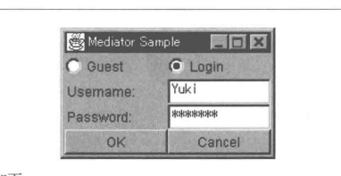
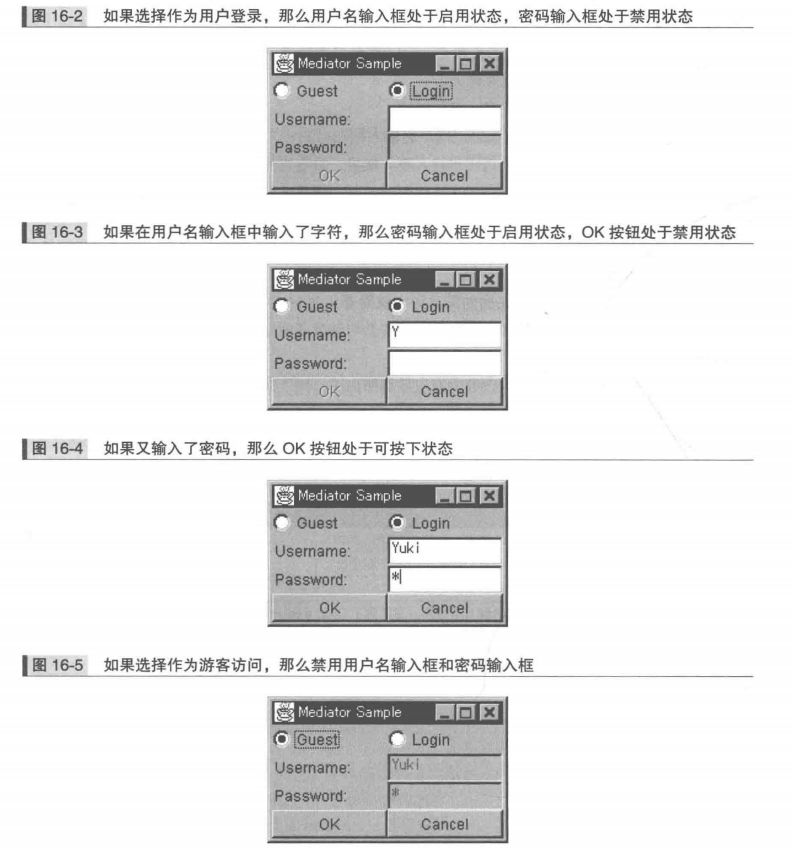
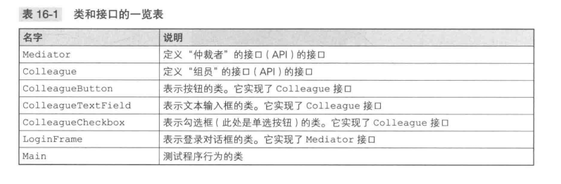
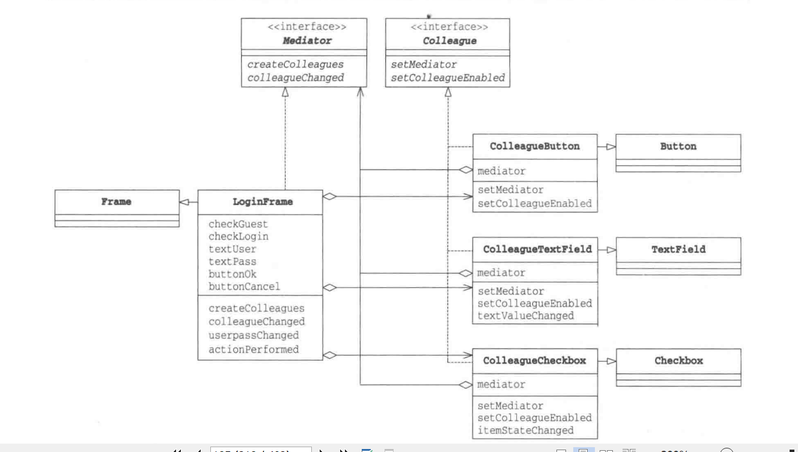
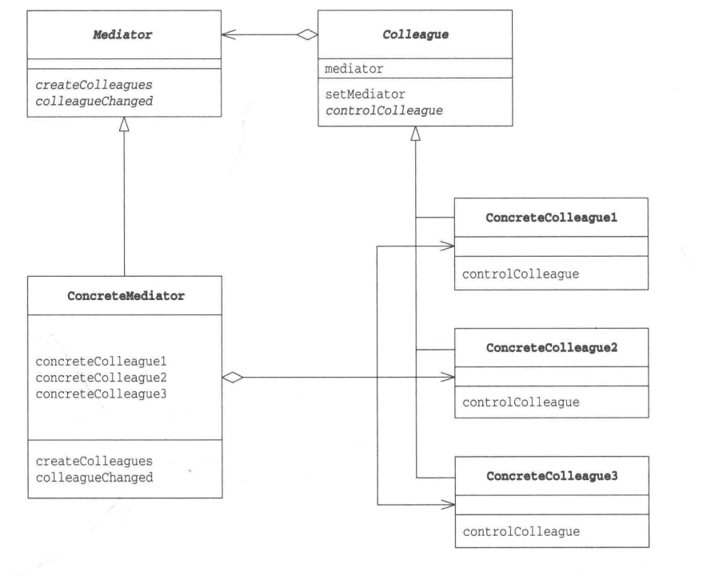

### Mediator模式


乱糟糟开发小组工作状态:
10个成员虽然一起系统工作，但意见难以统一，总是互相指挥，工作始终滞后。十分在意编码细节，经常为此争执不下。这是需要一个中立的仲裁者：将情况报告给他，由他负责仲裁。从团队整体出发进行考虑，下达指标，不会评价大家工作细节

团队交流过程变为：组员向仲裁者报告，仲裁者向组员下达指标

Mediator模式：
1. 发生麻烦事的时候，通知仲裁者
2. 当发生涉及全体组员的事情时，通知仲裁者
3. 仲裁者下达指标时，组员会立即执行
组员之间不再互相沟通私自做决定，发生任何事情都向仲裁者报告
4. 仲裁者站在整个团队角度对组员上报事情做决定

##### 示例程序
一个登陆对话框，用户输入正确用户名和密码后可登陆


+ 可选作为游客访问(Guesst)或用户登录(Login)
+ 用户登录时，需要输入正确的用户名和密码
+ 点击OK按钮可以登录，点击Cancel按钮可以取消登录

看似简单，实际的程序行为:
+ 作为游客访问时，需要禁止用户名输入框和密码输入框，使用户无法输入
+ 选择用户登录时，启用用户名输入和密码输入框，使用户可以输入
+ 如果在用户名输入框中一个字符都没有输入，那么禁用密码输入框，使用户无法输入密码
+ 如果在用户名输入框中输入了至少一个字符，那么启用密码输入框，使用户可以输入密码
+ 只有当用户名输入框和密码输入框中都至少输入一个字符后，OK按钮才处于启用状态，否则不可按下
+ Cancel按钮总是处于启用状态



要调整多个对象之间的关系，需要用到Mediator模式。将控制显示的逻辑处理交给仲裁者负责



***Medaitor接口***
具体的仲裁者LoginFrame实现该类
createColleagues方法生成Mediator要管理的组员
colleagueChanged方法会被各个Colleague组员调用

```java
public interface Mediator{
    public abstract void createColleagues();
    public abstract void colleaguechanged();
}
```

***Colleague接口***
向仲裁者进行报告的组员的接口
LoginFrame类实现了Mediator接口，会首先调用setMediator方法，通知组员:"我是仲裁者"
让Mediator角色和Colleague角色之间进行更加详细的通信，需要定义更多的方法
```java
public interface Colleague{
    public abstract void setMediator(Mediator mediator); // 通知组员
    public abstract void setColleagueEnabled(boolean enabled); // 这里会用到mediator实例，enabled为true表示自己需要变为“启用状态”，反之为“禁用状态”，具体哪种状态由仲裁者决定
}
```

***ColleagueButton类***
java.awt.Button子类，实现Colleague接口，与LoginFrame(Mediator接口)共同工作

```java
public class ColleagueButtong extends Buttong implements Colleague{
    private Mediator mediator;
    public ColleagueButtong(String caption){
        super(caption);
    }

    public void setMediator(Mediator mediator){ // 保存Mediator
        this.mediator = mediator;
    }

    public void setColleatueEnabled(boolean enabled) {  // Mediator下达启用/ 禁用的指示
        setEnabled(enabled);
    }
}
```

***ColleagueTextField类***
java.awtTextField子类，实现了Colleague接口和java.awt.event.TextListener接口
```java
public class ColleagueTextField extends TextField implements TextListener, Colleague{
    private Mediator mediator;
    public CollagueTextField(String text, int columns){
        super(text, columns);
    }

    public void setMediator(Mediator mediator){ // 保存Mediator
        this.mediator = mediator;
    }

    public void setColleagueEnabled(boolean enabled){ // Mediator下达启用/禁用的指示
        setEnabled(enabled);
        setBackground(enabled ? Color.white : Color.lightGray);
    }

    public void textValueChanged(TextEvent e){ // 当文字发生变化时通知Mediator
        mediator.colleagueChanged();
    }
}
```

***ColleagueCheckbox类***
java.awwt.Checkbox子类，也实现了java.awt.event.ItemListener接口

```java
public class ColleagueCheckbox extends Checkbox implements ItemListener, Colleague{
    private Mediator mediator;
    public ColleagueCheckbox(String caption, CheckboxGroup group, boolean state){
        super(caption, group, state);
    }

    public void setMediator(Mediator mediator){
        this.mediator = mediator;
    }

    public void setColleagueEnabled(boolean enabled){ // Mediator下达启用/禁用指示
        setEnabled(enabled);
    }

    public void itemSteateChanged(ItemEnvent e){ // 当状态发生变化时通知Mediator
        mediator.colleagueChanged();
    }
}
```

***LoginFrame类***
Java.awt.Frame子类，实现了Mediator接口
+ 设置背景色
+ 设置布局管理器
+ 调用createColleagues方法生成Colleague
+ 配置Colleage
+ 设置初始状态
+ 显示

```java
public class LoginFrame extends Frame implements ActionListener, Mediator{
    private ColleagueCheckbox checkGuest;
    private ColleagueCheckbox checkLogin;
    private ColleagueTextField textUser;
    private ColleagueTextField textPass;
    private ColleagueButton buttonOk;
    private ColleagueButtong buttonCancel;
    // 生成并配置各个Colleague后，显示对话框
    public LoginFrame(String title){
        super(title);
        setBackground(Color.lightGray);
        // 使用布局管理器生成4X2窗格
        setLayout(new GridLayout(4, 2));
        // 生成各个Colleague
        creteColleagues();
        // 配置
        add(checkGuest);
        add(checkLogin);
        add(new Label("Username:"));
        add(textUser);
        add(new Label("Password:"));
        add(textPass);
        add(buttonOk);
        add(buttongCancel);
        // 设置初始的启用/禁用状态
        colleagueChanged();
        // 显示
        pack();
        show();
    }

    // 生成各个Colleague
    public void createColleagues(){
        // 生成
        CheckboxGroup g = new CheckboxGroup();
        checkGuest = new ColleagueCheckbox("Guest", g, true);
        checkLogin = new ColleagueCheckbox("Login", g, false);
        textUser = new ColleagueTextField("", 10);
        textPass = new ColleagueTextField("", 10);
        textPass.sestEchoChar('*');
        buttonOk = new ColleagueButtong("OK");
        buttonCancel = new CollagueButton("Cancel");

        // 设置Mediator
        checkGuest.setMediator(this);
        checkLogin.setMediator(this);
        textUser.setMediator(this);
        textPass.setMediator(this);
        buttonOk.setMediator(this);
        buttonCancel.setMediator(this);

        // 设置Listener
        checkGuest.addItemListener(checkGuest);
        checkLogin.addItemListener(checkLogin);
        textuser.addTextListener(textUser);
        textPass.addTextListener(textPass);
        buttonOk.addActionListener(this);
        buttonCancel.addActionListener(this);
    }

    // 接受来自于Colleage的通知然后判断各Colleage的启用/禁用状态
    public void colleagueChanged(){
        if(checkGuest.getState()){ // Guest mode
            textUser.setColleagueEnabled(false);
            textPass.setColleagueEnabled(false);
            buttonOk.setColleagueEnabled(true);
        }else{ // Login mode
            textuser.setColleagueEnabled(true);
            userpassChanged();
        }
    }

    // 当textUser或textPass文本输入框中的文字发生变化时
    // 判断各Colleage的启用/禁用状态
    private void userpassChanged(){
        if(textUser.getText().length() > 0){
            textPass.setColleagueEnabled(true);
            if(textPass.getText().length() > 0){
                buttonOk.setColleagueEnabled(true);
            }else{
                buttonOk.setColleagueEnabled(false);
            }
        }else{
            textPass.setColleagueEnabled(false);
            buttonOk.setColleagueEnabled(false);
        }
    }

    public void actionPerformed(ActionEvent e){
        System.out.println(e.toString());
        System.exit(0);
    }
}
```

***Main类***
生成LoginFrame类实例
```java
public class Main{
    public static void main(String[]args){
        new LoginFrame("Mediator Sample");
    }
}
```

##### Mediator登场的角色
+ Mediator(仲裁者、中介者)
为与各个角色通信和做出决定定义了接口，Mediator

+ ConcrateMediator(具体的仲裁者)
负责实现Mediator的接口，负责实际做出决定，LoginFrame

+ Colleague(同事)
负责定义与Mediator角色进行通信的接口

+ ConcreateColleague(具体的同事)
负责实现Colleague角色的接口


##### 拓展思路
+ LoginFrame的colleagueChanged方法比较复杂，容易出现bug，但其他地方并没有控制控件的启用/禁用状态的逻辑处理，因此只需要测试该方法即可
否则如果分散在各个Colleague，将很难调试和修改代码

+ 如果有很多实例，需要相互通信，就需要使用中介者，否则实例很少无需使用Mediator模式，但需考虑后续实例变多可能

+ 哪些角色可复用
ConcreteColleague角色可以复用，ConcreteMediator角色很难复用
如果需要制作新的对话框，ConcreateColleage可适用新的对话框，因为没有任何依赖特定对话框的代码

依赖特定应用程序的部分封装在ConcreteMediator角色LoginFrame，<strong>依赖特定应用程序就意味着难以复用</strong>


##### 相关设计模式
+ Facade模式
Mediator模式中，Mediator角色与Colleage角色进行交互
Facade模式中，Facade角色单方面使用其他角色对外提供高层接口，Mediator是双向的，Facade是单向的

+ Observer模式
会使用Observer模式来实现Mediator角色与Colleague角色之间的通信

##### 本章所学
值得信赖的仲裁者作为主角的Mediator模式，不让互相关联的对象之间进行任何直接通信，而是让它们向仲裁者进行报告，特别是GUI应用中，该模式具有非常好效果

##### 练习题
+ 修改示例程序，实现“仅当用户名和密码的长度都大于4个字符（包含4个字符）的时候，OK按钮才有效”的需求，思考需要修改哪个类
+ ConcreateColleague中都定义了mediator，而且它们的setMediator实现都一样，可以在Colleague接口中定义mediator字段和实现setMediator方法吗