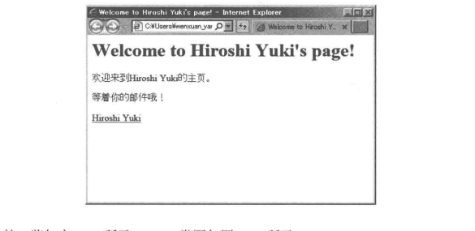
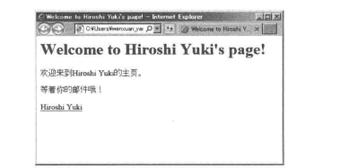
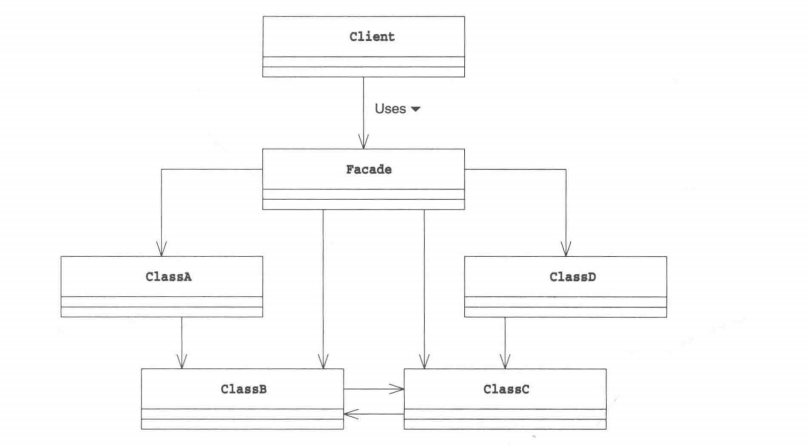
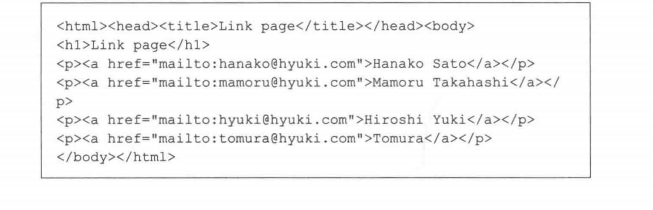
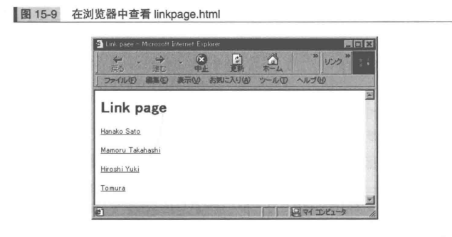

### Facade模式
程序越变越大，类越来越多，相互关联，结构越来越复杂。使用之前先弄清楚它们之间的关系，注意正确顺序

调用大型程序进行处理，格外注意那些数据庞大的类之间错综复杂的关系。因此需要为大型程序准备一个窗口。客户端就不必单独关注每个类了，只需要对“窗口”提出请求

Facede为相互关联在一起的错综复杂的类整理出高层接口。考虑到系统内部各个类之间责任关系和依赖关系，提供简单接口


##### 示例程序
DataBase: 从邮件地址获取用户名字的数据库类
HtmlWriter: 用于编写HTML文件的类
PageMaker：扮演Facade角色提供高层接口的类


***Database类***
获取指定数据库名（如maildata）对应的Proterties

```java
public class Database{
    private Database(){ // 防止外部new出Database的实例，所以声明为private


    }
    public static Properties getProperties(String dbname){ // 根据数据库名获取Properties
        String filename = dbname + ".txt";
        Properties prop = new Properties();
        try{
            prop.load(new FileInputStream(filename));

        }catch(IOException e){
            System.out.println("Warning: " + filename + "is not found.");
        }
        return prop;
    }
}

hyuki@hyuki.com = Hiroshi yuki
hanako@hyuki.com = Hanako Sato
tomura@hyuki.com = Tomura
mamoru@hyuki.com = Mamoru Takahashi
```

***HtmlWriter类***
编写简单的Web页面。用Writer输出HTML
限制条件：必须首先调用title方法，PageMaker使用HtmlWriter需严格遵守

```java
public class HtmlWriter{
    private Writer writer;
    public HtmlWriter(Writer writer) {
        this.writer = writer;
    }

    public void title(String title)throws IOException { // 输出标题
        writer.write("<html>");
        writer.write("<head>");
        writer.write("<title>" + title + "</title>");
        writer.write("</head>");
        writer.write("<body>\n");
        writer.writer("<h1>" + title + "</h1>\n");

    }

    public void paragraph(String msg) throws IOException{ // 输出段落
        writer.write("<p>" + msg + "</p>\n");
    }

    public void link(String href, String caption) throws IOException{ // 输出超链接
        paragraph("<a href=\"" + href + "\"" + caption + "</a>");
    }

    public void mailto(String mailaddr, String username) throws IOException { // 输出地址
        link("mailto:" + mailaddr, username);
    }

    public void close() throws IOException{ // 结果输出HTML
        writer.write("</body>");
        writer.write("</html>\n");
        writer.close();
    }
}
```

***PagerMaker类***
使用Database和HtmlWrier生成指定用户Web页面
对外部只提供makeWelcomePage接口

```java
public class PageMaker{
    private PageMaker(){ // 防止外部new出PageMaker的实例

    }

    public static void makeWelcomePage(String mailaddr, String filename){ // 根据指定的邮件地址和文件名生成相应的Web页面
        try{
            Properties mailprop = Databse.getProperties("maildata");
            String username = mailprop.getProperty(mailaddr);
            HtmlWriter writer = new HtmlWriter(new FileWriter(filename));
            wwriter.title("Welcome to " + username + "'s page!");
            writer.paragraph("等着你的邮件哦！");
            writer.maito(mailaddr, username);
            writer.close();
            System.out.println(filename + " is created for " + mailaddr + " (" + username + ")");
        }catch(IOException e){
            e.printStackTrace();
        }
    }
}
```

***Main类***
调用PageMaker.makeWelcomePage("hyuki@hyuki.com", "welcome.html")方法
获取hyuki@hyuki.com的名字，编写一个名为welcome.html的Web页面

```java
public class Main{
    public static void main(String[] args){
        public static void main(String[] args){
            PageMaker.makeWelcome("hyuki@hyuki.com", "welcome.html");
        }
    }
}
```
javac Main.java
java Main


##### Facede登场的角色
+ Facade 窗口
向系统外部提供高层接口(API)。PageMaker
+ 构成系统的许多其他角色
Facade调用的角色，Database, HtmlWriter
+ Client请求者
并不包含在Facae模式中


##### 拓展思路
简化后台工作的这些复杂的类关系的使用，客户端不必关注这些复杂性
接口变少了（客户端），程序与外部的关联关系弱化了
设计时要考虑方法的可见性

##### 递归地使用Facade模式
Facade可以继续整合其他Facade，递归的使用Facade模式。

开发人员为什么不使用外观，因为开发人员对复杂系统很了解了，不愿意简化整合
所以不应该去记忆复杂性，而是使用外观将复杂的代码顺序记录下来作为外观使用

##### 相关设计模式

+ Abstract Factory模式
作为生成复杂实例时的Facede模式
+ 使用Singleton创建Facade
+ Mediator
Facade模式中，Facade角色单方面使用其他角色来提供高层接口
Mediator作为Colleague角色间的仲裁者负责调停，Facade是单项的，Mediator是双向的

##### 本章所学
为复杂系统创建外观

##### 练习题
+ 将Pagemaker包外部的程序只能使用PageMaker，不能使用Database和HtmlWriter，该如何做
+ 在Pagemaker中增加一个makeLinkPage方法，可以根据maildata.txt中的用户的邮件地址制作出邮件出邮件地址超链接集合
```
public class Main{
    public static void main(String[] args){
        PageMaker.makeLinkPage("linkpage.html");
    }
}
```

javac Main.java
java Main


