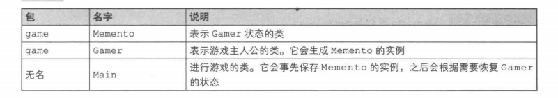
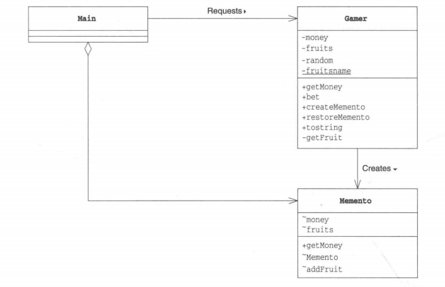
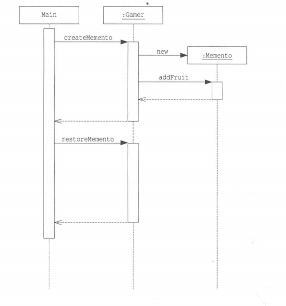
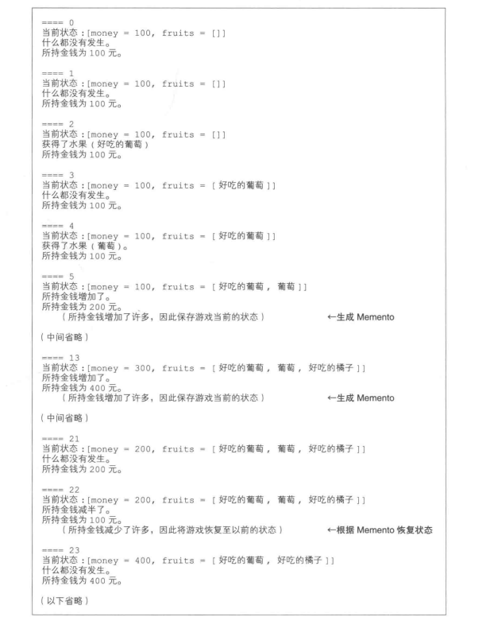
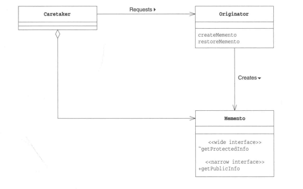

### Memento模式
文本编辑器回撤功能，多次撤销，恢复很久之前版本等

想要恢复实例，需要一个可以自由访问实例内部结构的权限，但容易将依赖于实例内部结构的代码分散地编写在程序各个地方，破坏了封装性

引入表示实例状态的角色，可以在保存和恢复实例时有效防止对象封装性的破坏

Memento模式可以实现程序如下功能
+ Undo(撤销)
+ Redo(重做)
+ History(历史记录)
+ Snapshot(快照)

将某个时间点的实例状态保存下来，之后必要情况恢复

##### 示例程序

一个搜集水果和获取金钱数的掷骰子游戏
+ 游戏是自动进行的
+ 游戏的主人公通过掷骰子来决定下一个状态
+ 当骰子点数为1的时候，主人公的金钱会增加
+ 当骰子点数为2的时候，主人公的金钱会减少
+ 当骰子点数为6的时候，主人公会得到水果
+ 主人公没有钱时游戏就会结束

程序中，如果金钱增加，为了方便将来恢复状态，会生成Memento类的实例，将现在的状态保存起来。
保存的数据为当前持有的金钱和水果
如果不断掷出会导致金钱减少的点，为防止金钱为0游戏结束，使用Memento的实例将游戏恢复至之前的状态




***Memento类***
Memento表示Gamer(主人公)状态的类
Memento和Gamer位于game包下
Memento两个字段，money和fruits
Memento构造函数不是public，因为只有同一包下类才调用Memento类构造函数，这里是Gamer
无法从game包外部改变Memento内部状态

```java
public class Memento{
    int money; // 所持有金钱
    ArrayList fruits; // 获得的水果
    public int getMoney(){ // 获取当前所持金钱(narrow interface)
        return money;
    }

    Memento(int money){ // 构造函数(wide interface), 不是public的，非game包下类无法访问
        this.money = money;
        this.fruits = new ArrayList();
    }

    void addFruit(String fruit){ // 添加水果(wide interface)
        fruits.add(fruit);
    }

    List getFruits(){ // 获取当前所持有的所有水果(wide interface)
        return (List)fruits.clone();
    }
}
```

***Gamer类***
代表主人公的类
三个字段：所持金钱(money)、获得水果(fruits)以及一个随机数生成器(random)，还有一个fruitsname的静态字段

bet()：只要主人公没有破产，就一直掷骰子，格局骰子结果改变所持有的金钱数目和水果个数

createMemento保存当前的状态(拍摄快照)。根据当前在时间点所持有的金钱和水果生成一个Memento类实例，表示当前Gamer的状态，返回给调用者

restoreMemento与createMemento相反，根据收到的Memento类实例将Gamer恢复为以前状态

```java
public class Gamer{
    private int money; // 所持金钱
    private List fruits = new ArrayList(); // 获得的水果
    private Random random = new Random(); // 随机数生成器
    private static String[] fruitsname = { // 表示水果种类的数据
        "苹果", "葡萄", "香蕉", "橘子"
    };

    public Gamer(int money){ 
        this.money = money;
    }

    public int getMoney(){ // 获取当前所持金额
        return money;
    }

    public void bet(){ // 掷骰子进行游戏
        int dice = random.nextInt(6) + 1;   // 掷骰子
        if(dice == 1){  // 骰子结果为1时，增加所持金额
            money += 100;
            System.out.println("所持金额增加了。");
        }else if(dice == 2){ // 骰子结果为2时，所持金额减半
            money /= 2;
            System.out.println("所持金额减半了。");
        }else if(dice == 6){ // 骰子结果为6时，获得水果
            String f = getFruit();
            System.out.println("获得了水果(" + f ")。");
            fruits.add(f);
        }else{ // 骰子结果为3，4，5则什么都不发生
            System.out.println("什么都没有发生。");
        }
    }

    public Memento createMemento(){ // 拍摄快照
        Memento m = new Memento(money);
        Iterator it = fruits.iterator();
        while(it.hasNext()){
            String f = (String)it.next();
            if(f.startsWith("好吃的")){ // 只保存好吃的水果
                m.addFruit(f);
            }
        }
        return m;
    }

    public void restoreMemento(Memento memento){ 撤销
        this.money = memento.money;
        this.fruits = memento.getFruits();
    }

    public String toString(){   // 用字符串表示主人公状态
        return "money = " + money + ", fruits = " + fruits + "]";
    }

    private String getFruit(){ // 获得一个水果
        String prefix = "";
        if(random.nextBoolean()){
            prefix = "好吃的";
        }
        return prefix + fruitsname[random.nextInt(fruitsname.length)];
    }
}
```

***Main类***
生成一个Gamer类实例进行游戏，重复调用Gamer的bet方法，并显示Gamer的所持金钱
运气好，金钱增加会调用createMemento保存现在状态，运气不好，金额不足，会调用restoreMemento方法将钱还给Memento

```java
public class Main{
    public static void main(String[] args){
        Gamer gamer = new Gamer(100); // 最初所持金额为100
        Memento memento = gamer.createMemento(); // 保存最初状态
        for(int i = 0; i < 100; i++){
            System.out.println("==== " + i); // 显示掷骰子的次数
            System.out.println("当前状态：" + gamer); // 显示主人公现在的状态

            gamer.bet(); // 进行游戏

            System.out.println("所持金额为" + gamer.getMoney() + "元");
            // 决定如何处理Memento
            if(gamer.getMoney > memento.getMoney()){
                System.out.println("   (所持金额增加了许多，因此保存游戏当前的状态)");
                memento = gamer.createMemento();
            }else if(gamer.getMoney() < memento.getMoney() / 2){
                System.out.println("   (所持金额减少了许多，因此将游戏恢复至以前的状态)");
                gamer.restoreMemento(memento);
            }

            // 等待一段时间
            try{
                Thread.sleep(1000);
            }catch(InterruptedException e){
                
            }
            System.out.println("");
        }
    }
}
```





##### Memento登场角色

+ Originator(生成者)
保存自己的最新状态时生成Memento角色，能够利用以前的Memento恢复至该Memento时状态

+ Memento(纪念品)
将Originator角色内部信息整合一起，Memento角色中保存了Originator角色信息，但不会向外部公开
Memento两种接口：
wide interface- 宽接口
指所有用于获取恢复对象状态信息的方法的集合，宽接口会暴露所有Memento角色的内部信息，因此能使用宽接口的只有Originator角色

narrowinterface- 窄接口
Memento角色为外部Caretaker角色提供了“窄接口”，通过窄接口获取Memento角色的内部信息非常有限，可以有效防止信息泄露
提供两种接口防止对象封装性破坏

+ Caretaker(负责人)
Caretaker角色只能使用Memento角色两种接口中的窄接口，无法访问Memento内部所有信息。只是将Originator角色生成的Memento角色当做一个黑盒子保存起来
Originator与Memento是强关联，Caretaker与Memento是弱关联



##### 拓展
java可见性修饰符

Memento中getMoney是public的，Main能获取的数据很少，所以是窄接口

***需要多少个Memento***
Main中使用数组可以保存多个Memento
***Memento有效期多少***
程序升级会导致以前保存的Memento与当前应用程序不匹配
***划分Caretaker角色和Originator角色的意义***
Caretaker角色是决定何时拍摄快照，何时撤销及保存Memento
Originator是生产Memento和利用接受的Memento恢复自己状态

Caretaker和Originator的角色分担。需求变更时，可以完全不用修改Originator
+ 变更为多次可以撤销
+ 变更为不仅可以撤销，还可以将现在的状态保存在文件中

##### 相关设计模式
+ Command模式
使用Command模式时，可以使用Memento模式实现撤销功能
+ Protype模式
Memento模式中，为了快速实现快照和撤销功能，保存了对象当前的状态。
Protype模式会生成一个完全相同的另外一个实例

+ State模式
Memento模式中，是用“实例”表示状态
State模式中，使用“类表示”状态

##### 本章所学
保存对象状态
尽可能不公开对象内部状态的前提下保存对象状态

Caremaker让Originator生成Memento，Caremaker不必知道Memento内部状态，必要时Caremaker用Memento让Originator恢复以前状态


##### 练习题
+ Caretaker角色只能通过窄接口操作Memento角色，如果可以随意操作，会发生什么
+ 如果有大量的数据需要保存，需要花费大量内存空间和磁盘空间，有没有好的解决办法
+ 假设在Memento类中加入一个新的字段

int number;
如何加可见性
1. Memento类可以获取和改变number的值
2. Gamer类可以获取number的值，但不能改变它
3. Main类既不能获取也不能改变number的值

+ 使用序列化(Serialization)功能可以将Memento类的实例保存为文件，修改示例程序实现以下功能
1. 在应用程序启动时，如果发现不存在game.dat文件时，以所持金额数目为100开始游戏
2. 当所持金额大量增加后，将Memento类的实例保存为文件game.dat
3. 在应用程序启动时，如果发现game.dat已经存在，则以文件中所保存的状态开始游戏

修改示例程序时，参考以下提示信息：
a. 要保存的Memento类需要实现java.io.Serializablejiek
b. 在保存对象时，需要调用ObjectOutputStream的writeObject方法
c. 在恢复对象时，需要调用ObjectInputStrem的readObject方法
d. 参考java API