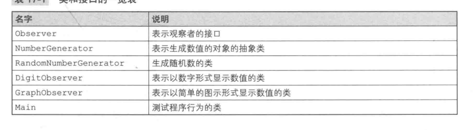
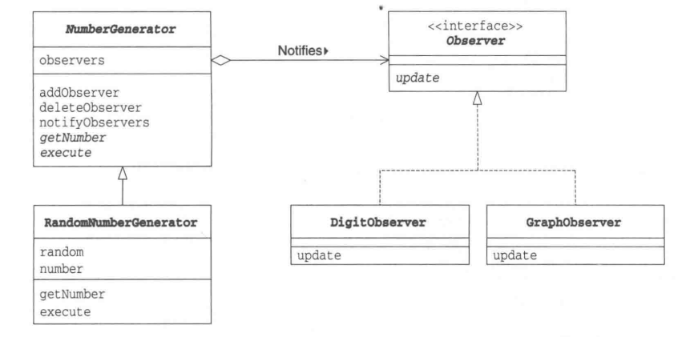
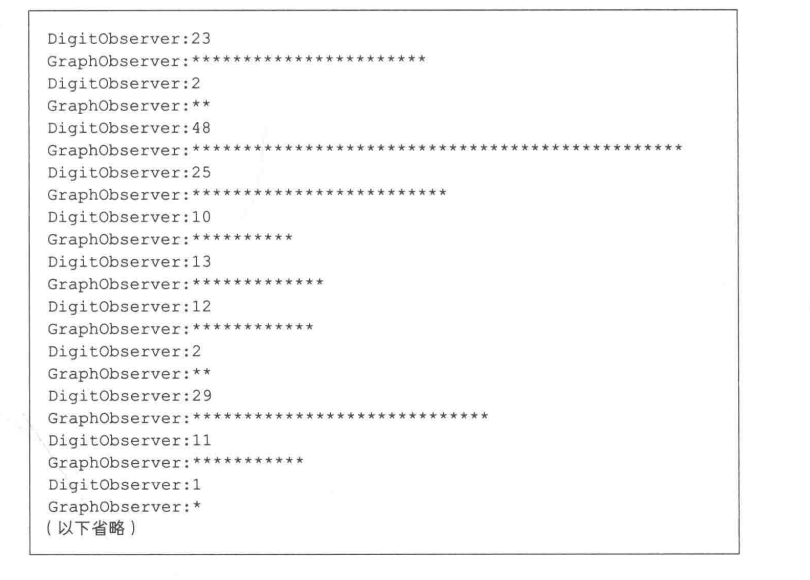
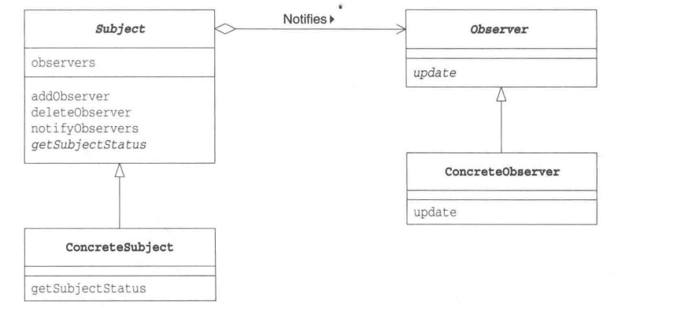
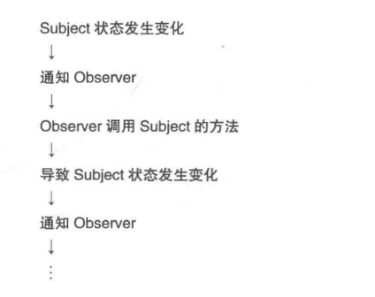
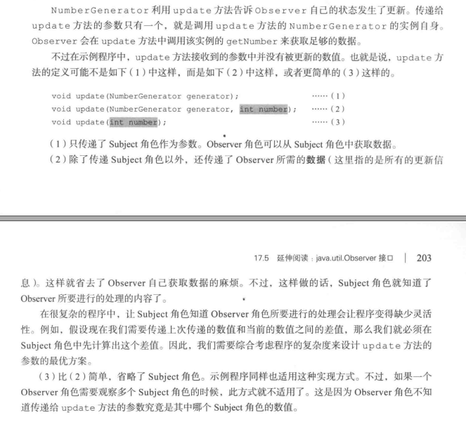
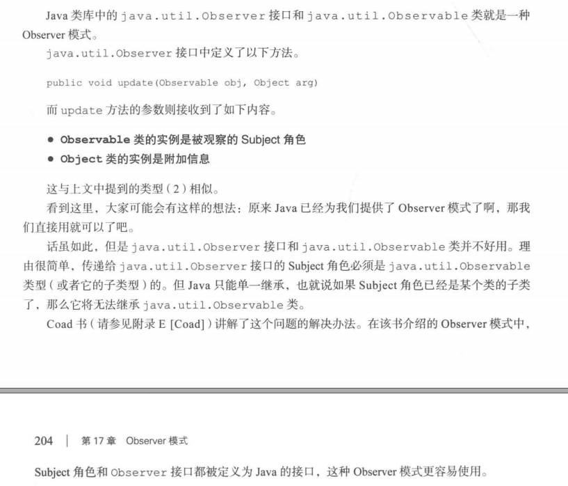
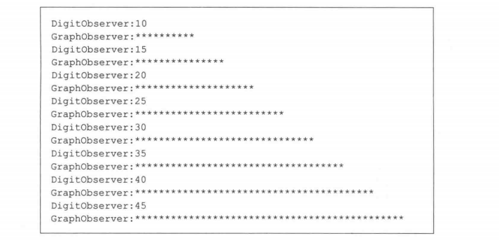

### Observer模式


***Observer接口***
NumberGenerator类会调用update方法，将“生成的数值发生变化”的通知发送给Observer


```java
public interface Observer{
    public void update(NumberGenerator generator); 
```

***NumberGenerator类***
用于生成数值的抽象类
execute：生成数值
getNumber()获取数值
都是抽象方法，需要子类实现

observers字段中保存有观察NumberGenerator的Observer
addObserver方法用于注册Observer，deleteObserver用于删除Observer
notifyObservers方法向所有的Observer发送通知，该方法调用每个Observer的update方法
```java
public abstract class NumberGenerator{
    private ArrayList observers = new ArrayList(); // 保存Observer们
    public void addObserver(Observer observer){ // 注册Observer
        observers.add(observer);
    }

    public void deleteObserver(Observer observer){ // 删除Observer
        observers.remove(observer);
    }

    public void notifyObservers(){ // 向Observer发送通知
        Iterator it = observers.iterator();
        while(it.hasNext()){
            Observer o = (Observer)it.next();
            o.update(this);
        }
    }

    public abstract int getNumber(); // 获取数值
    public abstract void execute();  // 生成数值
}
```

***RandomNumberGenerator类***
NumberGenerator子类，生成随机数
random字段保存有java.util.Random类的实例(随机数生成器)。number字段保存是当前生成的随机数
getNumber()获取number字段值
execute方法生成20个随机数(0-49的整数)，notifyObservers()把每次生成结果通知给观察者

```java
public class RandomNumberGenerator extends NumberGenerator{
    private Random random = new Random(); // 随机数生成器
    private int number;
    public int getNumber(){
        return number;
    }

    public void execute(){
        for(int i = 0; i < 20; i++){
            number = random.nextInt(50);
            notifyObservers();
        }
    }
}
```

***DigObserver类***
实现Observer接口，以数字形式显示观察到的值，update方法接受NumberGestureDetetor实例，调用该实例getNumber方法获取当前的值
```java
public class DigitObserver implements Observer{
    public void update(NumberGenerator generator){
        System.out.println("DigitObserver:" + generator.getNumber());
        try{
            Thread.sleep(100);
        }catch(InterruptedException e){

        }
    }
}
```

***GraphObserver类***
实现了Observer接口，将数值以****简单的图示形式显示出来

```java
public class GraphObserver implements Observer{
    public void update(NumberGenerator generator){
        Sytem.out.println("GraphObserver:");
        int count = generator.getNumber();
        for(int i = 0; i < count; i++){
            System.out.print("*");
        }
        Sytem.out.println("");
        try{
            Thread.sleep(100);
        }catch(InterruptedException e){

        }
    }
}
```

***Main类***
生成一个RandomNumberGenerator类的实例和两个观察者
```java
public class Main{
    public static void main(String[] args){
        NumberGenerator generator = new RandomNUmberGenerator();
        Observer observer1 = new DigitObserver();
        Observer observer2 = new GraphObserver();
        generator.addObserver(observer1);
        generator.addobserver(observer2);
        generator.execute();
    }
}
```



***Obserser模式中登场的角色***
+ Subject(观察对象)
注册观察者，删除观察者，获取现在状态。NumberGenerator
+ ConcreteSubject(具体的观察者对象)
自身状态发生变化后，通知所有已经注册的Observer对象， RandomNumberGenerator
+ Observer(观察者)
接受来自Subject角色的状态变化的通知，声明了update方法
+ ConcreteObserver(具体的观察者)
update方法被调用后，获取观察对象的最新状态。DigitObserver、GraphObserver类



##### 拓展
Observer中，带有状态的ConcreteSubject角色和接受状态变化通知的ConcreteObser角色，通过他们的接口Subject和Obserser连接

RandomNumberGenerator无需在意观察自己的对象到底是哪个具体Observer

DigitObserver无需知道正在观察的对象是哪个具体的Subject

可替代性设计思想：面向接口编程
+ 利用抽象类和接口从具体类中抽象出抽象方法
+ 在将实例作为参数传递至类中，或者在类的字段中保存实例时，不使用具体类型，而是使用抽象类型和接口


***Observer的顺序***
不能因为Observer的调用顺序导致其他Observer调用出问题，保证每个Observer的独立性

***当Observer的行为会对Subject产生影响时***
GUI程序中，通常是用户按下按钮导致update方法被调用

Observer也可能会触发Subject调用update
可能会导致循环调用


***传递更新信息的方式***


***从观察变为通知***
Observer本意是观察者，但实际并非主动去观察，而是被动接受来自Subject角色的通知，也成为了Publish_Subscribe(发布-订阅)模式

***Model/View/Controller(MVC)
MVC中Model和View的关系与Subject角色和Observer角色的关系对应。Model是指操作“不依赖于显示形式的内部模型”的部分，View则是管理Model“怎样显示”的部分，通常一个Model对应多个View

##### 延伸：java.util.Observer接口


##### 相关设计模式
Mediator模式
Mediator模式中，有时会使用Observer模式实现Mediator角色与Colleague角色之间的通信

就“发送状态变化通知”而言，Mediator与Observer类似。但两种模式中，通知的目的和视角不同
在Mediator模式中，虽然也发送通知，不过是为了对Colleague角色进行<strong>仲裁</strong>而已
Observer模式中，将Subject角色的状态变化通知给Observer的目的则是为了使Subject角色和Observer角色<strong>同步</strong>

##### 本章所学
将对象的状态变化通知给其他对象的Observer模式

##### 练习题

+ 编写一个继承NumberGenerator类，具有数值递增功能的子类IncrementalNumberGenerator
构造函数3个int参数
+ 初始数值
+ 结束数值(不包含数值自身)
+ 递增步长

接着请编写程序让DigitObserver和GraphObserver观察IncrementalNumberGenerator的变化

如下：初始值为10， 结束值为50， 递增步长5时运行结果
```java
public class Main{
    public static void main(String[] args){
        NumberGenerator generator = new IncrementalNumberGenerator(10, 50, 5);
        Observer observer1 = new DigitObserver();
        Observer observer2 = new GraphObserver();
        generator.addObserver(observer1);
        generator.addObserver(observer2);
        generator.execute();
    }
}
```



+ 增加一个新的ConcreteObserver，修改Main，使用新的ConcreteObserver接受通知