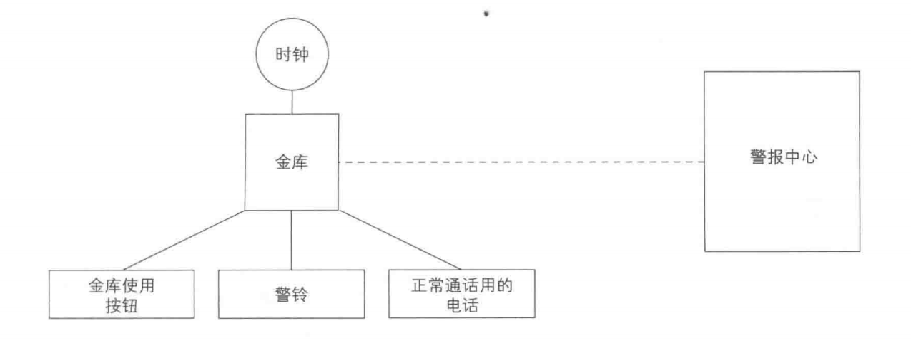

### State模式
类对应的东西可能存在于真实世界，也可能不存在于真实世界
State模式：用类来表示状态，显示世界中几乎不会把状态当做“东西”看待
通过切换类改变对象状态

##### 金库警报系统
警戒状态每小时会改变一次的警报系统。
在程序中假设用一秒替代真实世界一小时。警报不会真的呼叫警报中心，只是在页面上显示呼叫状态





***不使用State模式的伪代码

“每小时改变系统的行为，当发生使用金库、按下警铃和正常通话这三个事件的时候，会有某种通知到达警报中心，然后通知的内容会根据时间发生改变”

```
警报系统的类{
    使用金库时被调用的方法(){
        if(白天){
            向警报中心报告使用记录
        }else if(晚上){
            向警报中心报告紧急事态
        }

    }

    警铃响起时被调用的方法(){
        向警报中心报告紧急状态
    }

    正常通话时被调用的方法(){
        if(白天){
            呼叫警报中心
        }else if(晚上){
            呼叫警报中心的留言电话
        }
    }
}
```

***使用了State模式的伪代码***
```
表示白天的状态的类{
    使用金库时被调用的方法(){
        向警报中心报告使用记录
    }

    警铃响起时被调用的方法(){
        向警报中心报告紧急事态
    }

    正常通话时被调用的方法(){

    }


}

表示晚上的状态的类{
    使用金库时被调用的方法(){
        向警报中心报告紧急事态
    }

    警铃响起时被调用的方法(){
        向警报中心报告紧急事态
    }

    正常通话时被调用的方法(){
        呼叫警报中心的留言电话
    }
}
```

用类来表示白天和晚上，无需if判断了
1. 用方法判断对象  2. 用类判断对象


***State接口***
表示金库状态的接口
+ 设置时间
+ 使用金库
+ 按下警铃
+ 正常通话

```java
public interface State{
    public abstract void doClock(Context context, int hour); // 设置时间
    public abstract void doUse(Context context); // 使用金库
    public abstract void doAlarm(Context context); // 按下警铃
    public abstract void doPhone(Context context); // 正常通话
}
```

***DayState类***
```java
public class DayState implements State{
    private static DayState singleton = new DayState();
    private DayState(){

    }

    public static State getInstance(){ // 获取唯一实例
        return singleton;
    }

    public void doClock(Context context, int hour){// 设置时间
        if(hour < 9 || 17 <=hour){
            context.changeState(NightState.getInstance());
        }
    }

    public void doUse(Context context){ // 使用金库
        context.recordLog("使用金库(白天)");
    }

    public void doAlarm(Context context){ // 按下警铃
        context.callSecurityCenter("按下警铃(白天)");
    }

    public void doPhone(Contex context){ // 正常通话
        context.callSecurrityCenter("正常通话(白天)");

    }

    public String toString(){   // 显示表示类的文字
        return "[白天]";
    }
}
```

***NightState类***
```java
public class NightState implements State{
    private static NightState singleton = new NightState();
    private NoghtState(){

    }

    public static State getInstance(){ // 获取唯一实例
        return singleton;

    }

    public void doClock(Context context, int hour){ //设置时间
        if(9 <= hour && hour < 17){
            context.changeState(DayState.getInstance());
        }
    }

    public void doUse(Context context){ // 使用金库
        context.callSecurityCenter("紧急: 晚上使用金库！");
     
    }

    public void doAlarm(Context context){ // 按下警铃
        context.callSecurrityCenter("按下警铃(晚上)");

    }

    public void doPhone(Context context){ // 正常通话
        context.recordLog("晚上的通话录音");
    }

    public String toString(){ // 显示表示类的文字
        return "[晚上]";
    }
}
```

***Context接口***
```java
public interface Context{
    public abstract void setClock(int hour); // 设置时间
    public abstract void changeState(State state); // 改变状态
    public abstract void callSecurityCenter(String msg); // 联系警报中心
    public abstract void recordLog(String msg); // 在警报中心留下记录

}
```

***SafeFrame类***
有TextField、TextArea、Button等控件，也有state字段

SafeFrame构造函数如下处理
+ 设置背景色
+ 设置布局管理器
+ 设置控件
+ 设置监听器

给代表状态的字段赋予表示当前状态的类的实例，就是进行状态迁移

```java
public class SafeFrame extends Frame implements ActionListener, Context{
    private TextField textClock = new TextField(60); // 显示当前时间
    private TextArea textScreen = new TextArea(10, 60); // 显示警报中心的记录
    private Button buttonUse = new Buttong("使用金库"); // 使用金库按钮
    private Button buttonAlarm = new Button("按下警铃"); // 按下警铃按钮
    private Button buttonPhone = new Button("正常通话"); // 正常通话按钮
    private Button buttonExit = new Button("结束"); // 结束按钮

    private State state = DayState.getInstance(); // 当前的状态

    
    public SafeFrame(String title){
        super(title);
        setBackground(Color.lightGray);
        setLayout(new BorderLayout());

        // 配置textClock
        add(textClock, BorderLayout.NORTH);
        textClock.setEditable(false);
        // 配置textScreen
        add(textScreen, BorderLayout.CENTER);
        textScreen.setEditable(false);
        // 为界面添加按钮
        Panel panel =  new Panel();
        panel.add(buttonUse);
        panel.add(buttonAlarm);
        panel.add(buttonPhone);
        panel.add(buttonExit)
        // 配置界面
        add(panel, BorderLayout.SOUTH);
        // 显示
        pack();
        show();
        // 设置监听器
        buttonUse.addActionListener(this);
        buttonAlarm.addActionListener(this);
        buttonPhone.addActionListener(this);
        butonExit.addActionListener(this);
    }

    // 按钮被按下后该方法会被调用
    public void actionPerfored(ActionEvent e){
        System.out.println(e.toString());
        if(e.getSource() == buttonUse){ // 金库使用按钮
            state.doUse(this);
        }else if(e.getSource() == buttonAlarm){ // 按下警铃按钮
            state.doAlarm(this);

        }else if(e.getSource() == buttonPhone){ // 正常通话按钮
            state.doPhone(this);
        }else if(e.getSource() == buttonExit){ // 结束按钮
            System.exit(0);
        }else{
            System.out.println("?");
        }
    }

    // 设置时间
    public void setClock(int hour){
        String clockstring = "现在时间是";
        if(hour < 10){
            clockstring += "0" + hour + ":00";
        }else{
            clockstring += hour + ":00";
        }
        System.out.println(clockstring);
        textClock.setText(clockstring);
        state.doClock(this, hour);
    }

    // 改变状态
    public void changeState(State state){
        System.out.println("从" + this.state + "状态变为了" + state + "状态。");
        this.state = state;
    }

    // 联系警报中心
    public void callSecurityCenter(String msg){
        textScreen.append("call!" + msg + "\n");
    }

    // 在警报中心留下记录
    public void recordLog(String msg){
        textScreen.append("record ... " + msg + "\n"); 
    }
}
```


***Main类***
生成一个SafeFrame每秒调用一次setClock方法，对该实例设置一次时间，真实世界一小时
```java
public class Main{
    public static void main(String[] args){
        SafeFrame frame = new SafeFrame("State Sample");
        while(true){
            for(int hour = 0; hour < 24; hour++){
                frame.setClock(hour); // 设置时间
                try{
                    Thread.sleep(1000);
                }catch(InterruptedException e){

                }
            }
        }
    }
}
```


##### State模式种登场角色
+ State模式
是那些处理内容依赖于状态的方法的集合

+ ConcreateState (具体状态)
实现State，扮演具体状态

+ Context(状况、前后关系、上下文)
持有表示当前状态的ConcreteState角色，提供外部调用者使用State模式的接口

Context接口定义了供外部调用者使用State模式的接口，SafeFrame持有表示当前状态的ConcreteState


##### 拓展
+ 分而治之
大规模的复杂处理，将问题分为多个小问题，逐个解决

State模式中，用类表示状态，为每一种具体状态都定义一个相应的类，问题被分解

+ 依赖于状态的处理
State接口中声明的所有方法都是“依赖于状态的处理”，“状态不同处理不同”

State中，如何实现“依赖于状态的处理”
1. 定义接口，声明抽象方法
2. 定义多个类，实现具体方法

+ 应当是谁来管理状态迁移
示例程序中，Context角色的SafeFrame类实现实际进行状态迁移的changeState方法，但实际调用该方法的是ConcreteState
“状态迁移”看作是“依赖状态的处理”：
优点：这种处理方式将“什么时候从一个状态迁移到其他状态”的信息集中在一个类中，“什么时候会从DayState类变为其他状态时”，只需要阅读DayState类
缺点：每个ConcreteState角色都需要知道其他ConcreateState角色，DayState类的doClock方法就使用了NightState类
如果需求变更需要删除NightState也要修改DayState类代码。各个State依赖关系加强

也可将所有的状态迁移的代码交给SafeFrame负责，提高ConcreateState独立性。Context角色需要知道所有的ConcreateState，可以使用Mediator


可以不使用State模式，而是使用状态迁移表设计程序：根据“输入和内部状态”得到“输出和下一个状态”的一览表，状态迁移遵循这个规则时，可使用状态迁移表

状态数量太多时，可以用程序生成代码而不是手写

+ 不会自相矛盾
不使用State模式，需要使用多个变量的值的集合表示系统状态，需要十分小心不让变量的值之间相互矛盾
State模式中，用类表示状态。就只需要一个标识系统状态的变量即可，不存在自相矛盾状态

+ 易于增加新的状态
但修改状态迁移部分代码需要仔细。

在State模式中增加其他“依赖于状态”的处理很困难。需要在State接口中增加新方法，所有的ConcreateState都需要实现
如果不使用State，增加状态需要用if语句判断，很难在编译代码时检测出“忘记实现方法”这种错误(运行时检测简单，只需要在事先每个方法内部都加上一段“当检测到没有考虑到的状态时就报错”的代码即可)

+ 实例的多面性
this

##### 相关的设计模式
+ Singleton模式
Singleton模式常常出现在ConcreteState角色中，因为在表示状态的类中并没有定义任何实例字段

+ Flyweight模式

在表示状态的类中并没有定义任何实例字段，因此，可以使用Flyweight模式在多个Context角色之间共享ConcreteState模式

##### 本章所学
切换表示状态的类的实例实现状态迁移

##### 练习题
