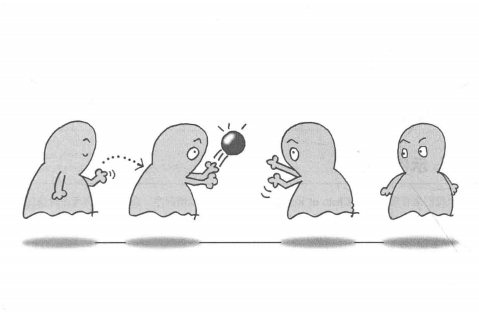
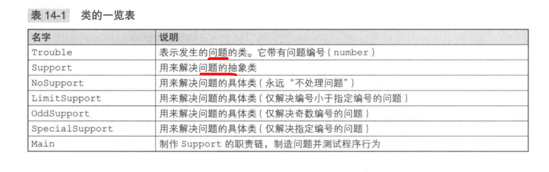
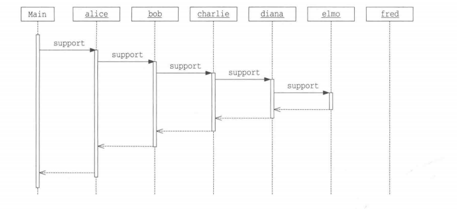
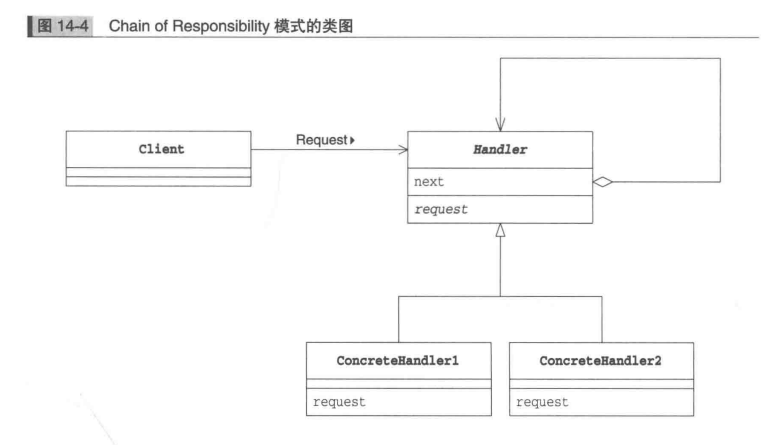
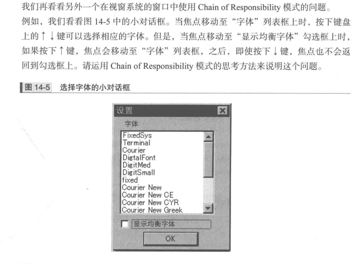

### 职责链模式


在找到合适的办事人之前，被不断地踢给一个有一个人-“推卸责任”

将多个对象组成一条职责链，然后按照它们在职责链上的顺序一个一个地找出到底应该谁来负责处理-Chain of Responsibility模式

Chain of Responsibility弱化“请求方”和“处理方”之间的关联关系，双方都各自称为独立复用的组件。情况不同，负责处理的对象也会发生变化的需求

自己做就自己做，不能做就给别人做-Android的事件分发

##### 示例程序



***Touble类-发生问题的类。number问题编号，getNumber获取编号***
```java

public class Touble{
    private int number;  // 问题编号
    public Trouble(int number){  // 生成问题
        this.number = number;
    }

    public int getNumber(){ // 获取问题编号
        return number;
    }

    public String toStrig(){  // 代表问题的字符串
        return "[Touble " + number + "]";
    }
}
```


***Support类，解决问题的抽象类***
next：要推卸的对象，setNext设置
resolve: 子类实现的抽象类，resolve返回true，问题以解决，false需要推卸给下个对象
support: 调用resolve，resolve返回false，support将问题转交给下一个对象。如果已经达到职责链中最后一个对象，表示没有人处理，显示处理失败（抛出异常）
support调用抽象resolve属于Template Method模式

```java
public abstract class support{
    private String name; // 解决问题的实例的名字
    private Support next; // 要推卸给的对象
    public Support(String name){ // 生成解决问题的实例
        this.name = name;
    }

    public Support setNext(Support next) { // 设置要推卸给的对象
        this.next = next;
    }

    public final void support(Trouble trouble){ // 解决问题步骤
        if(resolve(trouble)){
            done(trouble);
        }else if(next != null){
            next.support(trouble);
        }else{
            fail(trouble);
        }
    }

    public String toString(){
        return "[" + name + "]";
    }

    protected abstract boolean resolve(Trouble trouble); // 结局问题的方法

    protected void done(Trouble trouble){ // 解决
        System.out.println(trouble + " is resolved by " + this + ".");
    }

    protected void fail(Trouble trouble){ // 未解决
        System.out.println(trouble + " cannot be resolved.");
    }
}
```

***NoSupport类***
resolve方法总是返回false，永远“不解决问题”

```java
public class NoSupport extends Support{
    public NoSupport(String name){
        super(name);
    }

    protected boolean resolve(Trouble trouble){ // 解决问题的方法
        return false; // 自己什么也不处理
    }
}
```

***LimitSupport类***
解决编号小于limit值的问题, resolve判断编号小于limit后，这里只是简单返回true
```java
public class LimitSupport extends Support{
    private int limit; // 可以解决编号小于limit的问题
    public LimitSupport(String name, int limit){ // 构造函数
        super(name);
        this.limit = limit;
    }

    protected boolean resolve(Trouble trouble){ // 解决问题的方法
        if(trouble.getNumber() < limit){
            return true;
        }else{
            return false;
        }
    }
}
```

***OddSupport类***
解决奇数编号的问题

```java
public class OddSupport extends Support{
    public OddSupport(String name){ // 构造函数
        super(name);
    }

    protected boolean resolve(Trouble trouble){ // 解决问题的方法
        if(trouble.getNumber() % 2 == 1){
            return true;
        }else {
            return false;
        }

    }
}
```

***SpecialSupport类***
只解决指定编号的问题

```java
public class SpecialSupport extends Support{
    private int number; // 只能解决指定编号的问题
    public SpecialSupport(String name, int number){ // 构造函数
        super(name);
        this.number = number; 
    }

    protected boolean resolve(Trouble trouble){ // 解决问题的方法
        if(trouble.getNumber() == number){
            return true;
        }else{
            return false;
        }
    }
}
```

***Main类***
定义Support类型的6个解决问题的实例

调用setNext将Alice至Fred 6个实例串联在职责链上，再逐个生成问题，传递给alice，显示谁最终解决问题
问题编号0开始，步长33没有特别意思

```java
public class Main{
    public static void main(String[] args){
        Support alice = new NoSupport("Alice");
        Suppport bob = new LimitSupport("Bob", 100);
        Support charlie =  new SpecialSupport("Charlie", 429);
        Support diana = new LimitSupport("Diana", 200);
        Support elmo = new OddSupport("Elmo");
        Support fred = new LimitSupport("Fred", 300);
        // 形成职责链
        alice.setNext(bob).setNext(chrlie).setNext(diana).setNext(elmo).setNext(fred);
        // 制造各种问题
        for(int i = 0; i <500; i += 33){
            alice.support(new Trouble(i));
        }
    }
}
```

Bob开始解决几个问题，后来交给Diana，Alice始终不解决问题，编号超过300，LimitSupport无法解决了，只要编号为奇数，OddSupport都可以解决，SpecialSupport只负责解决编号429的问题

Trouble363的实例程序时序图


##### Chain of Responsibility模式中角色
+ Handler(处理者)
定义了处理请求的接口，知道下一个处理者是谁，自己无法解决给下一个处理者，Support

+ ConcreteHandler(具体处理者)
NoSupport、LimitSupport等

+ Client(请求者)
向第一个ConcreteHandler角色发送请求的角色。Main



##### 拓展
+ 弱化了发出请求的人和处理请求的人之间的关系
Client角色向第一个ConcreteHandler角色发出请求，请求在职责链传播，直到某个ConcreteHandler角色处理

如果不适用该模式，就必须有某个伟大的角色知道“谁应该处理什么请求”，类似中央集权。让“发出请求的人”知道“谁应该处理该请求”不明智，如果Client不得不知道处理请求的人各自责任分担情况，这会降低其作为可复用组件的独立性

+ 可以动态地改变职责链
示例中问题问题解决是从Alice到Fred固定顺序进行，但还需要考虑负责处理的各个ConcreteHandler角色之间的关系可能会发生变化的情况
Chain of Responsibility模式通过委托根据情况动态重组职责链

如果不适用职责链，而是程序中固定写明“某个请求谁处理”的对应关系，很难在程序运行中取改变请求的处理者

视窗系统中自由添加控件使用Chain of Responsibility

***专注自己的工作***
“推卸”可以使每个对象更专注自己的工作，每个ConcreteHandler角色都专注于自己所负责的处理，自己无法处理，就交给下一个处理。每个ConcreteHandler只处理它应该负责的请求

否则需要编写一个“决定谁应该负责什么样的处理”的方法，或每个ConcreteHandler角色自己负责“任务分配”工作：自己不能处理就转交给另一个人，如果他不能处理，就根据系统情况将请求再转发给另一个人。

***推卸请求会导致处理延时吗***
与“事先确定哪个对象负责什么样的处理，接受请求后立刻让相应对象去处理请求”相比，Chain of Responsibility确实导致处理请求发生了延迟
这是一个权衡问题，如果请求和处理者之间是确定的，而且需要很快处理速度，就不使用

##### 相关设计模式
+ Composite
Handler角色会使用Composite模式

+ Command模式
有时会使用Command模式向Handler角色发送请求

##### 本章所学
将处理请求串联在职责链上，接受到请求后，按顺序去确认每个实例是否可以处理请求，如果不能处理就推卸请求

##### 练习题
视窗系统窗口中，有按钮和文本输入框、勾选框等组件（部件或控件），当点击鼠标时，事件如何传播



示例程序中的Support类，support方法的可见性是public的，resolve方法是protected的，为什么

将示例程序中的Support类修改为不使用递归调用，而是循环