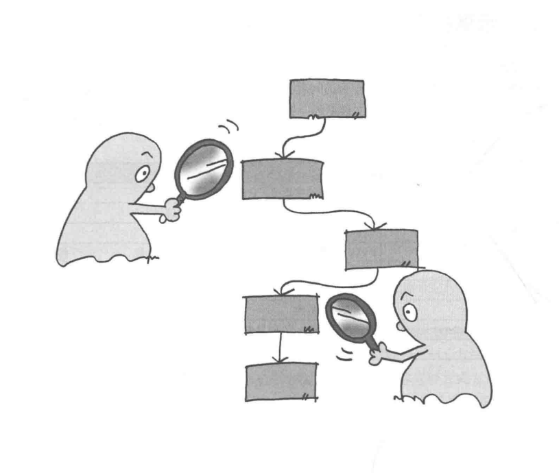
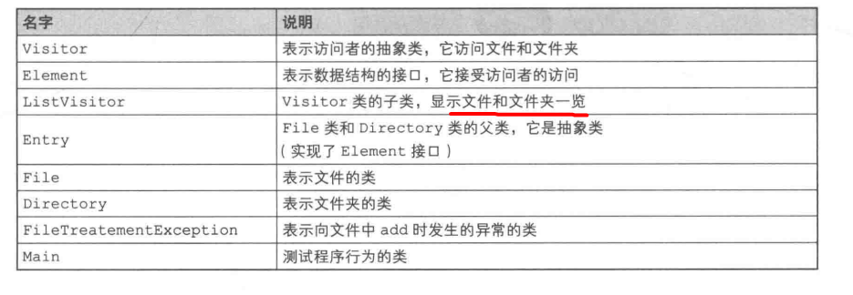
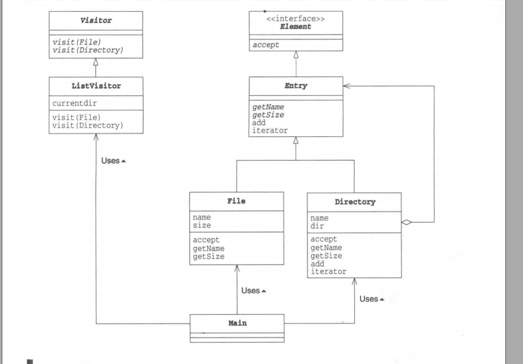
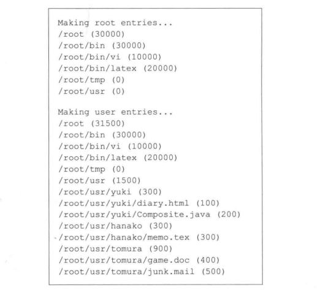
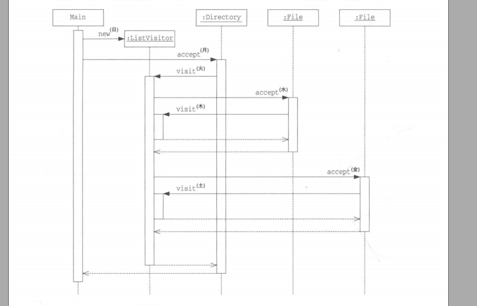
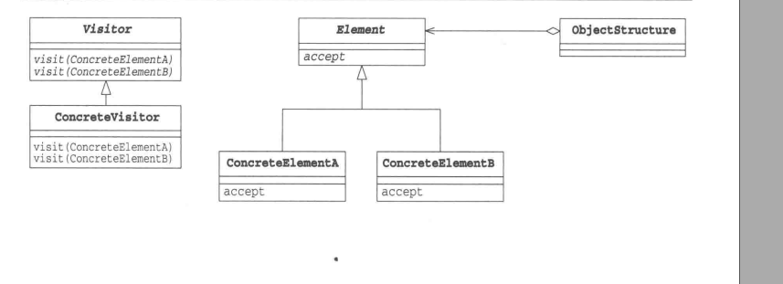
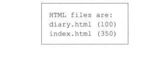
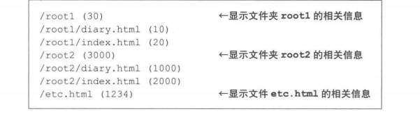

### 访问数据结构并处理数据


数据结构与处理被分离开来，

“访问者”访问数据结构中的元素，并处理元素。增加新的处理只需要编写新的访问者让数据结构接受

##### 示例程序
使用Composite模式中用到的那个文件和文件夹的例子作为访问者要访问的数据结构




***Vistor类***
Visitor依赖访问的数据结构,File和Directory

```java
public abstract void visit(File file); // 访问数据结构
public abstract void visit(Directory directory); 
```

***Element接口***
Element接受访问者

```java
public interface Element{
    public abstract void accept(Visitor v);
}
```

***Entry类***
Composite中的类，但是实现Element接口，让Entry类适用Vistor模式

```java
public abstract class Entry implements Element{}
```

File类
```java
public class File extends Entry{
    public void accept(Visitor v){
        v.visit(this);
    }
}
```

***Directory类***
增加iterator方法，返回Iterator，遍历所有文件夹中的目录条目
增加accept

```java
public class Directory extends Entry{
    private String name;    // 文件夹名字
    private ArrayList dir =  new ArrayList(); // 目录条目集合

    public Directory(String name){ // 构造函数
        this.name = name;
    }

    public String getName(){    // 获取名字
        return name;
    }

    public int getSize(){      // 获取大小
        int size = 0;
        Iterator it = dir.iterator();
        while(it.hasNext()){
            Entry entry = (Entry)it.next();
            size += entry.getSize();
        }
        return size;
    }

    public Entry add (Entry entry){ // 增加条目
        dir.add(entry);
        return this;
    }

    public Iterator iterator(){     // 生成Iterator
        return dir.iterator();
    }

    public void accept(Visitor v){  // 接受访问者的访问
        v.visit(this); 
    }
}
```

***ListVisitor类***
Visitor子类，访问数据结构并显示元素一览

accept方法调用visit方法，visit又调用accept方法，形成非常复杂的递归调用。
Visitor模式中，accept方法与visit方法之间相互递归调用
```java
public class ListVisitor extends Visitor{
    private String currentDir = ""; // 当前访问的文件夹的名字
    public void visit(File file){
        System.out.println(currentdir + "/" + file);    // 在访问文件时背调调用
    }

    public void visit(Directory directory){ // 在访问文件夹时被调用
        System.out.println(currentdir + "/" + directory);
        String savedir = currentdir;
        currentdir = currrentdir + "/" + directory.getName();
        Iterator it = directory.iterator();
        while(it.hasNext()){
            Entry entry = (Entry)it.next();
            entry.accept(this);
        }
        currentdir = savedir;
    }
}
```

***Main类***
```java
public class Main{
    public static void main(String[] args){
        try{
            System.out.println("Making root entries...");
            Directory rootdir = new Directory("root");
            Directory bindir = new Directory("bin");
            Directory tmpdir = new Directory("tmp");
            Directory usrdir = new Directory("usr");
            rootdir.add(bindir);
            rootdir.add(tmpdir);
            rootdir.add(usrdir);
            bindir.add(new File("vi", 10000));
            bindir.add(new File("latex", 20000));
            rootdir.accept(new ListVisitor());

            System.out.println("");
            System.out.println("Making usr entries...");
            Directory yuki = new Directory("yuki");
            Directory hanako = new Directory("hanako");
            Directory tomura = new Directory("tomura");
            usrdir.add(yuki);
            usrdir.add(hanako);
            usrdir.add(tomura);
            yuki.add(new File("diary.html", 100));
            yuki.add(new File("Compsite.java", 200));
            yuki.add(new File("memo.tex", 300));
            tomura.add(new File("game.doc", 400));
            tomura.add(new File("junk.mail", 500));
            rootdir.accept(new ListVisitor());
        }catch(FileTreatmentException e){
            e.printStackTrace();
        }
    }
}
```



时序图直观表达

Visitor将处理集中在Visitor中

##### Vistor登场角色
+ Visitor(访问者)

+ ConcreateVisitor

visit处理的进行，ConcreteVisitor角色内部状态也不断发生变化

+ Element(元素)

+ ConcreteElement

+ ObjectStruture(对象结构)

Visitor模式类图


##### 拓展

***双重分发***
Visitor模式中方法的调用关系
accept方法调用：
element.accept(vistor);
visit调用：
vistor.visit(element);
ConcreteElement和ConcreteVisitor两个角色共同决定实际进行的处理
这种消息分发方式叫双重分发

+ 为什么弄那么复杂
Visitor模式的目的是将处理从数据结构中分离出来
保存数据结构与以数据结构为基础进行处理是两种不同的东西

ConcreteVisitor角色的开发独立于File类和Directory类，Visitor模式提高了File类和Directory类作为组件的独立性
如果将处理的方法定义在File和Directory，每次扩展功能，增加新的“处理”时，不得不修改File类和Directory类

+ 开闭原则——对扩展开放，对修改关闭
对扩展（extension）是开放（open）的

对修改（modification）是关闭（close）的
设计类，若无特殊理由，必须考虑将来可能会扩展类，不能毫无理由地禁止扩展类，这就是“对扩展是开放的”的意思

每次扩展类就修改类很麻烦，所以不用修改现有类前提也能扩展，就是“对修改是关闭的”


提倡扩展，但如果需要修改现有代码就不行。在不修改现有代码的前提下进行扩展，就是开闭原则


容易扩展；无需修改已经编写好和测试完成的类
高可用、组件复用

+ 易于增加ConcreteVisitor角色

不用修改ConcreteElement

+ 难以增加ConcreteElement角色
因为需要修改ConcreteVisitor

+ Visitor工作所需条件
要达到对数据结构与处理分离的条件：Element角色必须向Visitor角色公开足够多的信息

如Directory必须提供用于获取每个目录条目的iterator方法
缺点是如果公开了不应当被公开的信息，对数据结构的改良就会变得非常困难

##### 相关设计模式

+ Iterator
Iterator模式和Visitor都是在某种数据结构上进行处理
Iterator模式用于逐个遍历保存在数据结构中的元素
Visitor用于对保存在数据结构中的元素进行某种特定的处理

+ Composite模式
有时访问者所访问的数据结构会使用Composite模式

+ Interpreter模式
有时会使用visitor模式，在生成了语法树后，可能会使用Visitor模式访问语法树的各个结点进行处理

##### 本章所学
访问数据结构

##### 练习题
在本章示例程序中增加一个FileFindVisitor类，将带有指定后缀名的文件汇集起来，FileFindVisitor类的使用方法如代码清单所示。运行结果如所示，后缀名.html汇集
```java
public class Main{
    public static void main(String[] args){
        try{
            Directory rootdir = new Directory("root");
            Directory tmpdir = new Directory("bin");
            Directory usrdir = new Directory("usr");
            rootdir.add(bindir);
            rootdir.add(tmpdir);
            rootdir.add(usrdir);
            bindir.add(new File("vi", 10000));
            bindir.add(new File("latex", 20000));

            Directory yuki = new Directory("yuki");
            Directory hanako = new Directory("hanako");
            Directory tomura = new Directory("tomura");

            usrdir.add(yuki);
            usrdir.add(hanako);
            usrdir.add(tomura);
            yuki.add(new File("diary.html", 100));
            yuki.add(new File("Composite.java", 200));
            yuki.add(new File("memo.tex", 300));
            yuki.add(new File("index.html", 350));
            yuki.add(new File("game.doc", 400));
            yuki.add(new File("junk.mail", 500));

            FileFindVisitor ffv = new FileFindVistor(".html");
            rootdir.accept(ffv);

            System.out.println("HTML files are:");
            Iterator it = ffv.getFoundFiles();
            wihhle(it.hasNext()){
                File file = (File)it.next();
                System.out.println(file.toString());
            }
        }catch(FileTreatmentException e){
            e.printStackTrace();
        }
    }
}
```


+ 编写一个获取大小的SizeVisitor，替换getSize

+ 基于ArrayList编写一个具有Element接口的ElementArrayList类，是的Directory类和File类可以被add至ElementArrayList中，而且它还可以接受ListVisitor实例访问它
```java
public class Main{
    public static void main(String[] args){
        try{
            Directory root1 = new Directory("root1");
            root1.add(new File("diary.html", 10));
            root1.add(new File("index.html", 20));

            Directory root2 = new Directory("root2");
            root2.add(new File("diary.html", 1000));
            root2.add(new File("index.html", 2000));

            ElementArrayList list = new ElementArrayList();
            list.add(root1);
            list.add(root2);
            list.add(new File("etc.html", 1234));
            
            list.accept(new ListVisitor());
        }catch (FileTreatmentException e){
            e.printStackTrace();
        }
    }
}
```


+ String是final的无法继承，String似乎违背开闭原则，但是是有正当理由的，为什么