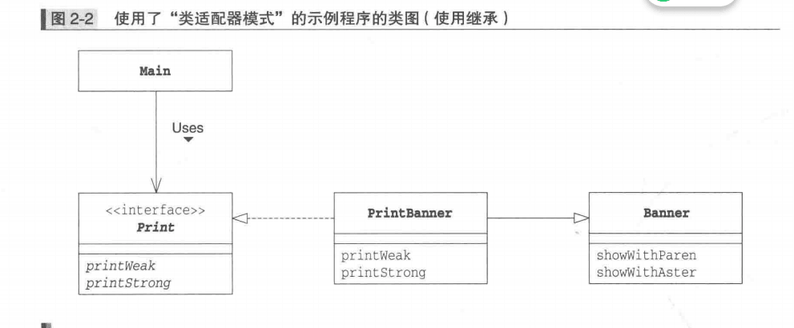
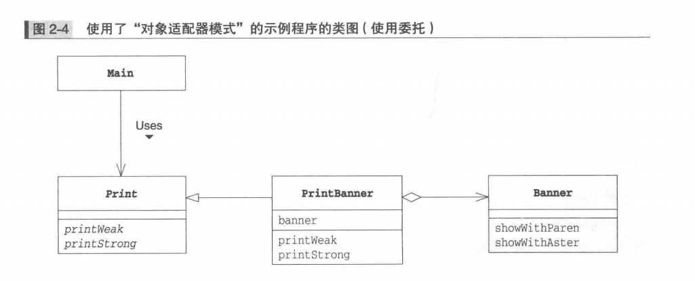
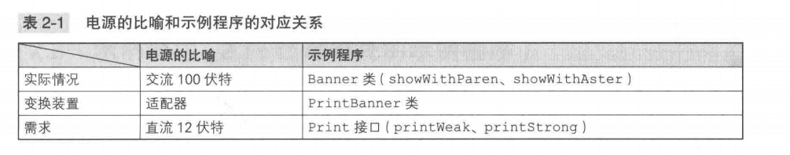
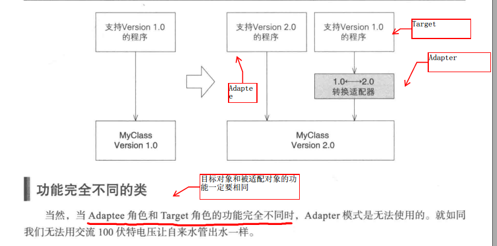

# Adapter模式
> 适配器模式是用于填补"现有的程序"和“所需的程序”之间的设计模式
> Adapter模式也被称为Wrapper模式，“包装器”
> Adapter模式分为: 1. 类适配器模式(使用继承的适配器) 2. 对象适配器模式(使用委托的适配器)
### 示例程序类图



### 示例程序1和接口的一览表


### 示例程序实现
Banner
package adapter;
```
/**
 * Created by Simon on 2019/10/7.
 */
public class Banner {
    private String string;

    public Banner(String string){
        this.string = string;
    }

    public void showWithParen(){
        System.out.println("(" + string + ")");
    }

    public void showWithAster(){
        System.out.println("*" + string + "*");
    }
}

```

------------------------------------

Print
```
package adapter;

/**
 * Created by Simon on 2019/10/7.
 */
public interface Print {
    void printWeak();
    void printStrong();
}

```

--------------------------------------------

PrintBanner

```
package adapter;

/**
 * Created by Simon on 2019/10/7.
 */
public class PrintBanner extends Banner implements Print{
    public PrintBanner(String string) {
        super(string);
    }

    @Override
    public void printWeak() {
        showWithParen();
    }

    @Override
    public void printStrong() {
        showWithAster();
    }
}

```

Main

```
package adapter;

/**
 * Created by Simon on 2019/10/7.
 */
public class Main {
    public static void main(String[] args) {
        Print p = new PrintBanner("Hello");
        p.printWeak();
        p.printStrong();
    }
}

```
> 在Main类中，使用Print接口(即调用printWeak方法printStrong)方法编程，对Main类的代码而言，Banner类、showWithParen方法和showWithAster方法被完全隐藏起来了
> Main类并不知道PrintBanner类是如何实现的，这样就可以不用对Main类进行修改的情况下改变PrintBanner类的具体实现

##### 示例代码使用委托

Print2
```
package adapter;

/**
 * Created by hasee on 2019/10/7.
 */
abstract public class Print2 {
    public abstract void printWeak();
    public abstract void printStrong();
}

```

PrintBanner2

```java
package adapter;

/**
 * Created by Simon on 2019/10/7.
 */
public class PrintBanner2 extends Print2{
    private Banner banner;
    public PrintBanner2(String string){
        banner = new Banner(string);
    }
    @Override
    public void printWeak() {
        banner.showWithParen();
    }

    @Override
    public void printStrong() {
        banner.showWithAster();
    }
}

```

> 使用委托，这里假设Print不是接口而是类，Java无法使用多继承，因此在PrintBanner中持有Banner类的实例，这样就形成了一种委托关系

### 使用委托
“委托”通俗点说就是“交给别人”
利用Banner类实现一个类，但类的方法要和Paint类的方法相同，Java不允许多继承，只能实现接口或者持有Banner。

### Adapter模式中的登场角色
##### Target
定义所需的方法，Print类
##### Main 客户端调用
##### Adaptee 被适配
是一个持有既定方法的角色，Banner类，如果Banner与Target的方法相同，就不需要Adapter
##### Adapter 适配器
使用Adaptee角色的方法来满足Target角色的需求

### 拓展
什么时候使用适配器?
很多时候我们并非从零开始编程，经常会用到现有类，特别是现有类被充分测试过bug少，被大量应用，则可以把这些类作为组件重复利用

使用Adapter对现有类进行适配、生成新的类，创建我们需要的方法群，有问题可以去查找Adapter，而不是Adaptee

> 如果没有现成的代码
Adapter可以在完全不改变现有代码的前提下使现有代码适配于新的接口(API)
Adapter并不一定需要现有的代码，只需要现有类的功能，就可以写出新代码

### 版本升级与兼容
版本升级的思路
今后只维护新版本，让新版本扮演Adaptee角色，旧版本扮演Target，Adapter使用新版本类实现旧版本的类中的方法

为什么新版本是Adaptee，因为老程序调用的是Target的方法，最终需要转化为Adaptee的方法。

### 相关设计模式
+ Bridge模式
Adapter用于连接接口(API)不同的类，Bridge用于连接类的功能层次结构与实现层次结构
+ Decorator模式
Adapter模式用于填补不同接口(API)之间的缝隙，而Decorator模式则是在不改变接口(API)的前提下增加功能。

### 练习
1. 为什么使用超类保存
2. Java.util.Properties
void load(InputStream in)throws IOException
从InputStream中取出属性集合
void store(OutputStream out, String header)throws IOException
向OutputStream写入属性集合。header是注释文字

```Java
Target类
public interface FileIO{
    public void readFromFile(String fileName)throws IOException;
    public void writeToFile(String fileName)throws IOException;
    public void setValue(String key, String value);
    public String getValue(String key);
}
```
```Java
public class Main{
    public static void main(String args[]){
        FileIO f = new FileProperties();
        try{
            f.readFromFile("file.txt");
            f.setValue("year", "2020");
            f.setValue("month", "7")
            f.setValue("day", "18");
            f.writeToFile("newFile.txt");
        }
    }
}
输入文件file.txt
year=2019
输出文件
newfile.txt
day=21
year=2020
month=7
```