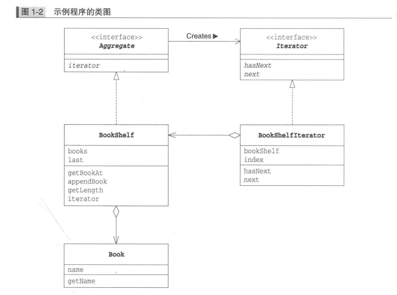
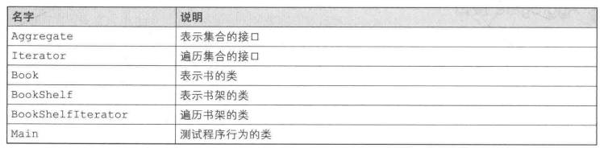
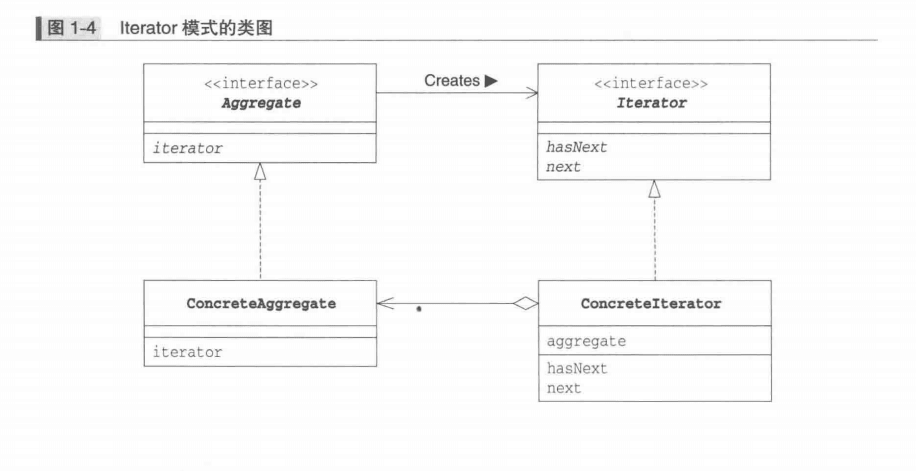

# Iterator模式

### 示例程序
+ 示例程序类图


+ 示例程序类和接口的一览表


+ 示例程序实现

Aggreate
```
package iterator;

/**
 * Created by Simon on 2019/9/22.
 */
public interface Aggregate {
    Iterator iterator();
}
```
---------------------------------------------------

Iterator

```
package iterator;

/**
 * Created by Simon on 2019/9/22.
 */
public interface Iterator {
    boolean hasNext();
    Object next();
}

```
---------------------------

Book
```
package iterator;

/**
 * Created by Simon on 2019/9/22.
 */
public class Book {
    private String name;

    public Book(String name){
        this.name = name;
    }

    public String getName() {
        return name;
    }
}

```
-----------------

BookShelf
```
package iterator;

/**
 * Created by Simon on 2019/9/22.
 */
public class BookShelf implements Aggregate{
    private Book[] books;
    private int last = 0;

    public BookShelf(int maxSize){
        this.books = new Book[maxSize];
    }

    public Book getBookAt(int index){
        return books[index];
    }

    public void appendBook(Book book){
        this.books[last] = book;
        last ++;
    }

    public int getLength(){
        return last;
    }

    @Override
    public Iterator iterator() {
        return new BookShelfIterator(this);
    }
}

```
------------------------------------

BookShelfIterator
```
package iterator;

/**
 * Created by Simon on 2019/9/22.
 */
public class BookShelfIterator implements Iterator{
    private BookShelf bookShelf;
    private int index;
    public BookShelfIterator(BookShelf bookShelf){
        this.bookShelf = bookShelf;
    }
    @Override
    public boolean hasNext() {
        if(index < bookShelf.getLength()){
            return true;
        }
        return false;
    }

    @Override
    public Object next() {
        Book book = bookShelf.getBookAt(index);
        index ++;
        return book;
    }
}
```
-----------------------------------

Main
```
package iterator;

/**
 * Created by Simon on 2019/9/22.
 */
public class Main {
    public static void main(String[] args) {
        BookShelf bookShelf = new BookShelf(4);
        bookShelf.appendBook(new Book("Around the World in 80 days"));
        bookShelf.appendBook(new Book("Bible"));
        bookShelf.appendBook(new Book("Cinderella"));
        bookShelf.appendBook(new Book("Daddy-Long-Legs"));
        Iterator it = bookShelf.iterator();
        while (it.hasNext()){
            Book book = (Book) it.next();
            System.out.println(book.getName());
        }
    }
}

```

### Iterator 模式中登场的角色
+ Iterator(迭代器)
该角色负责定义按顺序逐个遍历元素的接口(API)。一般有hasNext()和next()方法。
+ ConcreteIterator(具体的迭代器)
该角色负责实现Iterator所定义的接口(API)。包含了遍历集合所必须的信息。示例程序中,BookSelf的实例保存在bookShelf字段中;被指向的书的下标保存在index字段中。
+ Aggreate(集合)
该角色负责定义创建Iterator角色的接口(API), 即返回实现实现Aggreate的ConcreteAggregate的ConcreteIterator。
+ ConcreteAggregate(具体的集合)
该角色负责实现Aggregate角色所定义的接口(API)。本例中的BookShelf。

### Iterator模式的类图


### 总结
+ Iterator模式的优点
    - 引入Iterator后可以将遍历和实现分离开来。
```
while(it.hasNext()){
    Book book = (Book)it.next();
    System.out.println(book.getName());
}
1. 这里只使用了Iterator的hasNext()和next()方法，并没有调用BookShelf的方法。即这里的while循环并不依赖于BookShelf的实现。
2. 如果BookShelf中使用java.util.Vector来代替数组来管理书本, 不管BookShelf怎么变化, 只要BookShelf的iterator能正确的返回Iterator实例。那么即使不对上面的循环做修改, 代码依然可以正常工作。
```
+ 抽象类和接口
    - 如果只使用具体的类来解决问题, 很容易导致类之间的强耦合, 这些类难以被其他组件再次利用。
    - 不要只使用具体类来编程, 要优先使用抽象类和接口编程。 

+ Iterator.next()方法
next()方法应该表达的意思是  
returnCurrentElementAndAdvanceToNextPosition (返回当前的元素, 并指向下一个元素)

+ Iterator.hasNext()
hasNext()方法在返回最后一个元素前会返回true;当返回了最后一个元素后则返回false。
即: "确认接下来是否可以调用next()方法"

+ 多个iterator
"将多个遍历功能置于Aggregate角色之外"是Iterator模式的一个特性。根据这个特性, 可以针对一个ConcreteAggregate角色编写多个ConcreteIterator角色。

+ 迭代器的种类多种多样
示例中Iterator只是很简单的从前向后遍历集合。其他遍历方法:  
    - 从最后开始向前遍历
    - 即可以从前向后遍历, 也可以从后向前遍历(既有next方法也有previous方法)
    - 指定下标进行"跳跃式"遍历

+ 不需要deleteIterator
在Java中没有被使用的对象实例将会自动被删除(垃圾回收, GC)。因此, 在Iterator中不需要与其对应的deleteIterator方法。

### 相关的设计模式
- Visitor模式
    Iterator模式是从集合中一个一个取出元素进行遍历, 并没有在Iterator接口中声明对取出的元素进行何种处理  
    Visitor模式则是在遍历元素集合的过程中, 对元素进行相同的处理
    在访问元素集合的过程中对元素进行相同的处理, 这种模式就是Visitor模式
- Composite模式
    Composite模式是具有递归结构的模式, 在其中使用Iterator模式比较困难
- Factory Method模式
    在Iterator方法中生成Iterator的实例时可能会使用Factory Method模式
