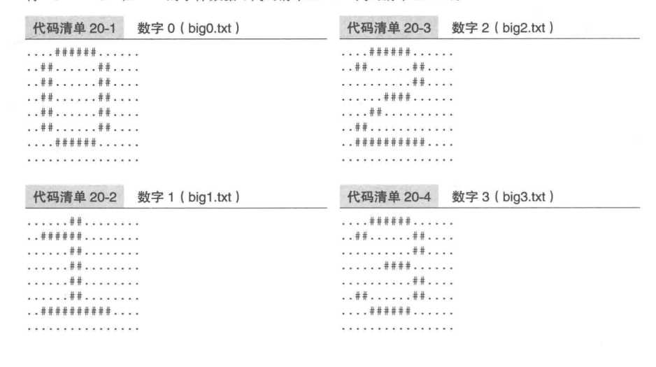
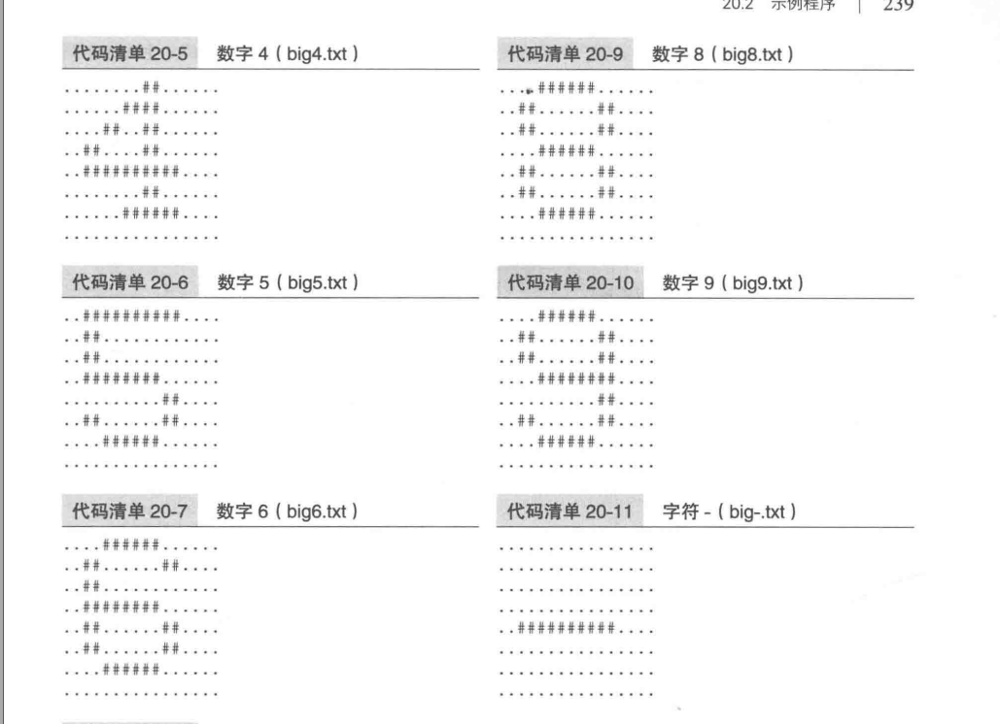
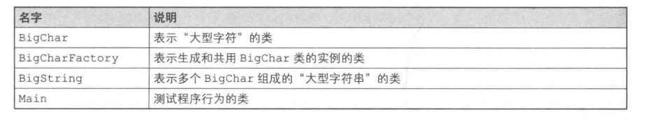
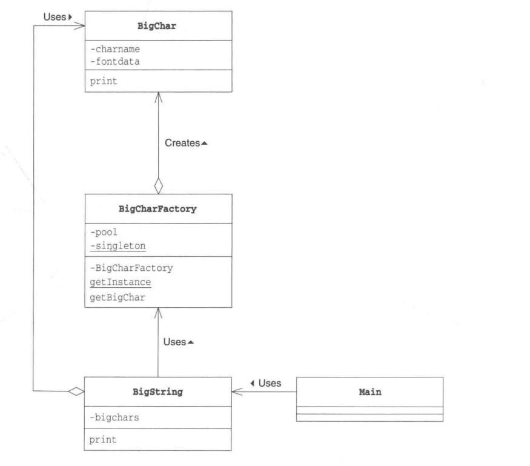
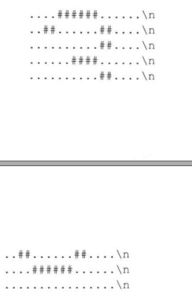
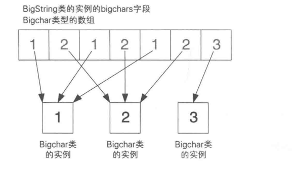
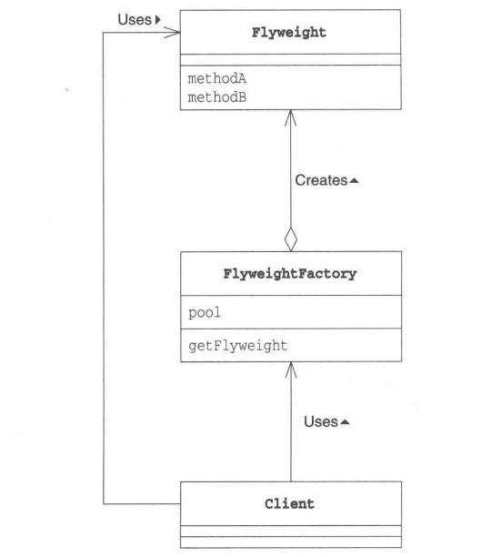
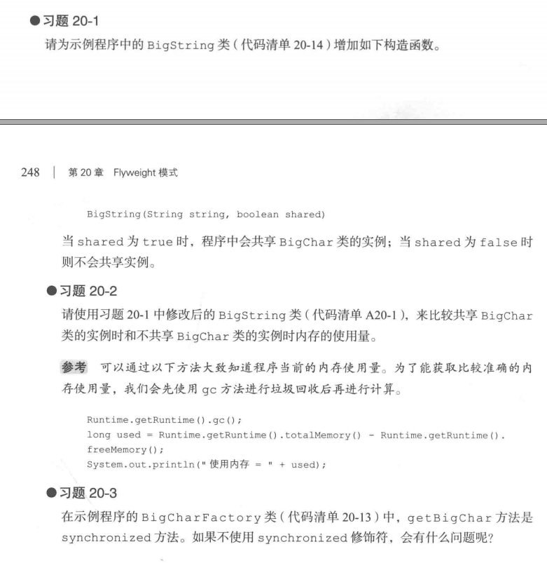

### FlyWeight模式
Flyweight是“轻量级”的意思

对象在计算机中是虚拟存在的东西，“重”和“轻”是指“所使用的的内存大小”，使用内存多就是“重对象”，内存少是“轻”对象

当程序需要大量某个对象对象时
new Something()会浪费大量内存空间
Flyweight是“通过尽量共享实例来避免new出实例”

当需要使用某个实例时，不是new，而是尽量公用已存在的实例，这就是Flyweight的核心

##### 示例程序
有一个将许多普通字符组合成为“大型字符”的类，它的实例就是重实例。
方便测试，以文件形式保存了大型字符'0'~'9'的字体数据







BitChar表示“大型字符”，从文件中读取大型字符的字体数据，保存在内存中，然后使用print输出大型字符。大型字符会消耗很多内存，因此考虑共享BitChar类实例

BigCharFactory根据需要生成BigChar类实例，如果之前已经生成了某个大型字符的BitChar实例，直接利用该实例。生成的实例全部保存在pool字段中
BigString将多个BigChar组成“大型字符串”



***BitChar类***
表示“大型字符”的类
如果构造输入“3”，则显示


```java
public class BigChar{
    // 字符名字
    private Char charname;
    // 大型字符对应的字符串(由'#' '.' '\n'组成)
    private String fontdata;
    // 构造函数
    public BigChar(char charname){
        this.charname = charname;
        try{
            BufferedReader reader = new BufferedReader(
                new FileReader("big" + charname + ".txt")
            );
            String line;
            StringBuffer buf = new StringBuffer();
            while((line = reader.readline()) != null){
                buf.append(line);
                buf.append("\n");
            }

            reader.close();
            this.fontdata = buf.toString();
        }catch(IOException e){
            this.fontdata = charname + "?";
        }
    }

    // 显示大型字符
    public void print(){
        System.out.print(fontdata);
    }
}
```

***BigCharFactory类***
生成BigCahr类的实例的工厂，实现了共享实例的功能
pool：管理已经生成的BigChar类的实例。
使用Singleton模式实现BigCharFactory
getBigChar(): 核心方法，生成接收到的字符所对应的BigChar类的实例，如果已经存在，不会再生成新的实例
使用synchronized修饰getBigChar

```java
public class BigCharFactory{
    // 管理已经生成的BigChar的实例
    private HashMap pool = new HashMap();
    // Singleton 模式
    private static BigCharFactory singleton = new BigCharFactory();
    // 构造函数
    private BigCharFactory(){

    }
    // 获取唯一的实例
    public static BigCharFactory getInstance(){
        return singleton;
    }

    // 生成(共享)BigChar类的实例
    public synchronized BigChar getBigChar(char charname){
        BigChar bc = (BigChar)poo.get("" + charname);
        if(bc == null){
            bc = new BigChar(charname); // 生成BigChar的实例
            pool.put("" + charname, bc);
        }
        return bc;
    }
}
```

***BigString类***
BigString类表示由BigChar组成的“大型字符串”的类
```java
public class BitString{
    // "大型字符"的数组
    private BigChar[] bigchars;
    // 构造函数
    public BigString(String string){
        bigchars = new BigChar[string.length()];
        BigCharFactory factory = BigCharFactory.getInstance();
        for(int i = 0; i < bigchars.length; i++){
            bigchars[i] = factory.getBigChar(stirng.charAt(i));
        }
    }

    // 显示
    public void print(){
        for(int i = 0; i < bigchars.length; i++){
            bigchars[i].print();
        }
    }
}
```



***Main类***
```java
public class Main{
    public static void main(String[] args){
        if(args.length == 0){
            System.out.println("Usage: java Main digits");
            System.out.println("Example: java Main 1212123");
            System.exit(0);
        }
        BigString bs = new BigString(args[0]);
    }
}
```


##### Flyweight模式中登场的角色
+ Flyweight(轻量级)
共享实例，减轻内存
+ FlyweightFactory(轻量级工厂)
+ Client(请求者)
使用FlyweightFactory

注意：UnsharedConcreteFlyweight

##### 拓展思路
***对多个地方产生影响***
共享实例注意点：
改变被共享实例，会对多个地方产生影响。“修改一个地方会对多个地方产生影响”
要小心选择被共享的对象

比如给字符加一个颜色，如果放在BigChar中，则所有的字符都加了颜色。如果放在BigString中，同一个字符可以有不同颜色

***Intrinsic与Extrinsic***
“应当共享的信息和不应当共享的信息”：Intrinsic信息(本质的，固有的)，无论在哪里什么情况下都不改变，不依赖于实例状态的信息。
BigChar属于Intrinsic信息

不应当共享的信息是Extrinsic信息(外在的，非本质的)。是当实例的位置、状况发生改变时会变化的信息，或依赖于实例状态的信息

BigChar的实例在BigString中第几个字符这种信息会根据BigChar在BigString中的位置变化而发生变化，不应当在BigChar中保存这个信息

前面提到的是否共享颜色其实就是将颜色分为Intrinsic信息还是Extrinsic信息


***不要让共享的实例被垃圾回收器回收了
应用程序需要长期运行或是需要以有限的内存来运行，那么需要警惕“不要让被共享的实例被垃圾回收器回收了”

***内存之外的其他资源***
节约时间：new的时间
节约内存
文件句柄（文件描述符）和窗口句柄也是一种资源。
可以同时使用的文件句柄和窗口句柄是有限制的，如果不共享实例，应用程序在运行时很容易就会达到资源的极限导致浪费

##### 相关设计模式
***代理模式***
生成实例的处理需要花较长时间，使用Flyweight提高程序处理速度
Proxy模式时通过设置代理提高程序的处理速度

***Composite模式***
使用Flyweight模式共享Composite模式中的Leaf

***Singleton模式***
结合FlyweightFactory，保证只要一个对象

##### 本章所学
通过共享实例减少内存使用量的Flyweight模式，改变被共享的对象，会对所有该实例的地方都产生影响。区分应当共享Intrinsic信息
和不应当共享的Exrinsic信息

##### 练习题
