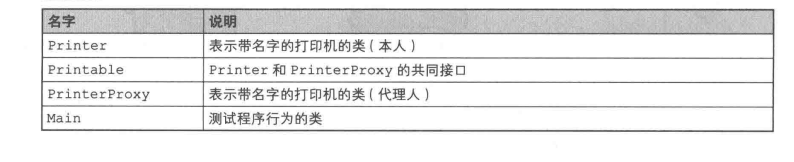
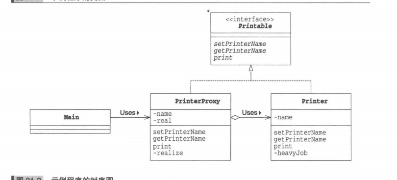
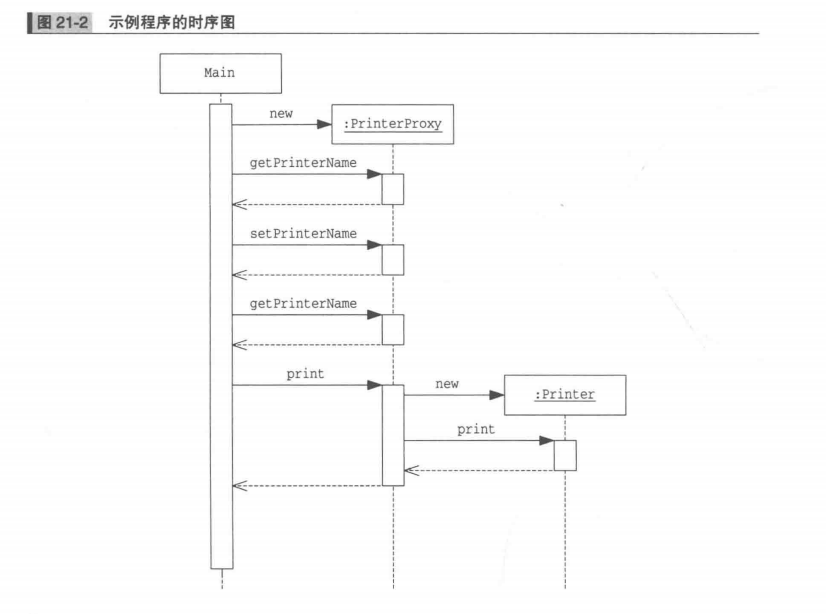
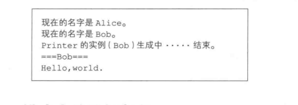
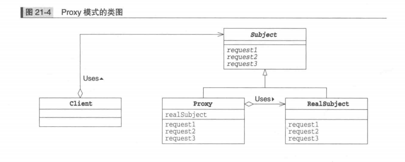
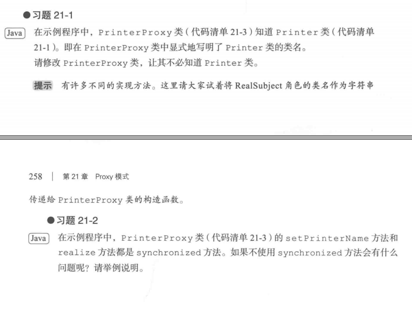

### Proxy模式
Proxy是“代理人”的意思
代理人做不了的事就会找本人解决问题
“本人”对象太忙了，有些工作无法自己亲自完成，就交给“代理人”对象负责
##### 示例程序
实现一个“带名字的打印机”，将文字显示在界面上
开始进入实际打印阶段后，PrinterProxy类才会生成Printter类的实例




***Printer类***

```java
public class Printer implements Printable{
    private String name;
    public Printer(){
        heavyJob("正在生成Printer的实例");
    }

    public Printer(String name){ // 构造函数
        this.name = name;
        heavyJob("正在生成Printer的实例(" + name + ")");

    }

    public setPrinterName(String name){ // 设置名字
        this.name = name;
    }

    public String getPrinterName(){ // 获取名字
        return name;
    }   

    public void print(String string){ // 显示带打印机名字的文字
        System.out.println("=== " + name + " ===");
        System.out.println(string);
    }

    private void heavyJob(String msg){ // 重活
        System.out.print(msg);
        for(int i = 0; i < 5; i++){
            try{
                Thread.sleep(1000);
            }catch(InterruptedException e){

            }
            System.out.print(".");
        }
        System.out.println("结束。");
    }
}
```

***Printable接口***
用于使PrinterProxy类和Printer类具有一致性
```java
public interface Printable{
    public abstract void setPrinterName(String name); // 设置名字
    public abstract void getPrinterName(); // 获取名字
    public abstract void print(String string); // 显示文字(打印输出)
}
```

***PrinterProxy类***
"代理人"的角色，实现Printable接口
name: 保存打印机名字
real: 保存“本人”

Printer类并不知道PrinterProxy类的存在，PrinterProxy知道Printer类
```java
public class PrinterProxy implements Printable{
    private String name;
    private Printer real;
    public PrinterProxy(){

    }

    public printerProxy(String name){
        this.name = name;
    }

    public synchronized void setPrinterName(String name){ // 设置名字
        if(real != null){
            real.setPrinterName(name); // 同时设置“本人”的名字
        }
        this.name = name; // 这是PrinterProxy的名字
    }

    public String getPrinterName(){ // 获取名字
        return name;
    }

    public void print(String string){ // 显示
        realize(); // 先实例化Printer
        real.print(string);
    }
 
    // 线程安全的
    private synchronized void realize(){ // 生成“本人”
        if(real == null){
            real = new Printer(name);
        }
    }
}
```

***Main类***
```java
public class Main{
    public static void main(String[] args){
        Printable p = new PrinterProxy("Alice");
        System.out.println("现在的名字是" + p.getPrinterName() + "。");
        p.setPrinterName("Bob");
        System.out.println("现在的名字是" + p.getPrinterName() + "。");
        p.print("Hello, world.");
    }
}
```



##### Proxy模式中的登场角色
+ Subject(主体)
使Proxy角色和RealSubject角色之间具有一致性的接口，Client角色不必在意它所使用的的是Proxy还是RealSubject
Pritable

+ Proxy(代理人)
尽量处理来自Client角色的请求，只有自己不能处理时，将工作交给RealSubject角色。Proxy只有必要时才生成RealSubject角色

+ RealSubject(实际的主体)
Proxy无法胜任工作时出场

+ Client(请求者)


##### 拓展思路的要点
***使用代理人来提升处理速度***
通过使用Proxy，将耗时处理（生成实例的处理）推迟至print方法被调用后才进行
大型系统的初始化，将暂时不会被使用的功能不初始化，只有需要使才初始化

文本中嵌入图形对象的文本编辑器：当用户浏览至文本中各个图片对象时，再生成它们的实例

***有必要划分代理人和本人吗***
可以在Printer类中加入惰性求值功能(只有在必要时生成实例)，
但通过划分PrinterProxy和Printer，使他们成为独立的组件，在修改时不会互相之间产生影响(分而治之)
“哪些由代理人负责处理，哪些必须本人负责处理”，无论怎么修改，不必修改Printer类

***代理与委托***
代理人只代理它能解决的问题。当不能解决的问题时，会“转交给”本人解决，就是委托

***透明性***
PrinterProxy与Printer都实现了Printable接口，Main不必在意调用的是PrinterProxy和Printer
直接使用Printer还是通过PrinterP间接使用Printer都可以，可以说PrinterP类具有“透明性”

***HTTP代理***
位于HTTP服务器（Web服务器）和Http客户端（Web浏览器），为Web页面提供高速缓存等功能的软件，是一种Proxy模式

HTTP代理高速缓存功能：
访问Web服务器，先获取HTTP代理缓存的页面，当需要最新页面内容或是缓存的页面缓冲期限过期时，才访问远程Web服务器
Web服务器就扮演的是Client角色，HTTP代理扮演的就是Proxy角色，Web服务器扮演的是RealSubject角色

***各种Proxy模式***
+ Virtual Proxy(虚拟代理)
本章所学
+ Remote Proxy(远程代理)
完全不必在意RealSubject角色是否在远程网络上，可以如同它在自己身边一样（透明地）调用它的方法，Java的RMI(RemoteMethodInvocation)

+ AccessProxy
在调用RealSubject角色的功能时设置访问限制，比如只允许指定的用户调用方法，其他用户调用时报错

##### 相关设计模式
+ Adapter模式
Adapter模式适配了两种不同接口的对象，使它们可以一同工作
Proxy模式与RealSubject角色的接口是相同的(透明性)

+ Decorator模式
Decorator模式与Proxy模式在实现上很相似，但它们使用目的不同
Decorator模式在于增加新的功能。Proxy模式与增加功能相比，更注重通过设置代理人的方式减轻本人的工作负担

##### 本章所学
让代理人负责完成工作，除非哪些工作必须由本人完成

##### 练习题
